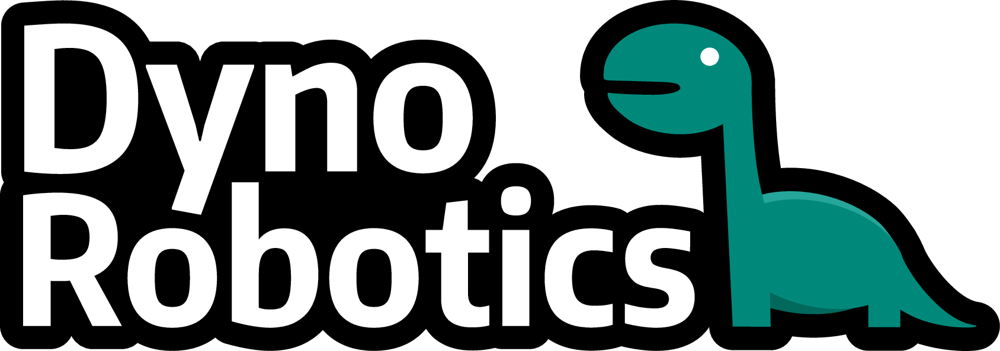

# Dyno Robotics - ROS2 Course

  

Welcome to the **Dyno Robotics ROS2 Course** repository! This comprehensive learning environment provides hands-on experience with ROS2 (Robot Operating System 2) through two progressive simulation platforms designed to take you from basic concepts to advanced robotics applications.

## 🎯 Course Overview

This course is structured as a practical journey through ROS2 development, featuring two distinct robot simulation environments that build upon each other:

### **Session 1: Dynoturtle** 🐢
Dynoturtle provides a gentle introduction to ROS2 fundamentals using a simplified multi-robot simulation environment. Built upon the standard ROS2 turtlebot tutorial, it's perfect for learning core concepts like:
- ROS2 nodes and topics
- Publishing and subscribing to messages
- Multi-robot simulation
- Basic command-line tools

For getting started commands and tutorials, see [day1_command_cheat_sheet.md](./docs/session1/day1_command_cheat_sheet.md).

### **Session 2: Dynobot** 🤖
Dynobot advances to a full physics simulation using the Gazebo simulator, featuring:
- Realistic robot model with LIDAR sensor
- Differential drive motion controller
- 3D physics simulation
- Advanced sensor integration
- Navigation and mapping capabilities

For setup and operation commands, see [day2_command_cheat_sheet.md](./docs/session2/day2_command_cheat_sheet.md).

## 🎮 Interactive Features

### Manual Control
When using a **Logitech F710 controller**, you can manually control the Dynobot by:
1. Ensuring the controller is connected before starting the container (sometimes rebuilding is necessary)
2. Setting the mode switch on the controller's back to `D`
3. Pressing `LB` and steering with the left joystick

## 🐳 Containerized Development

This course leverages Docker containers to provide a consistent, isolated development environment that eliminates dependency conflicts and ensures reproducible results across different systems.

---

## Installation
We generally always recommend to install ROS2 and its dependencies inside a Docker container. This will simplify installation of a project and reduce problems with package dependencies, which is very common when installing ROS2 locally on a system considering the many distributions and releases.

Follow the links and installation steps below matching your OS.

### **Linux**
* [Docker](https://docs.docker.com/engine/install/ubuntu/#install-using-the-repository)
* [VS Code](https://code.visualstudio.com/docs/setup/linux)
* VS Code Extensions: [Remote Development](https://marketplace.visualstudio.com/items?itemName=ms-vscode-remote.vscode-remote-extensionpack)

OPTIONAL (but speeds up simulation time, irrelevant for session 1)
* [NVIDIA CUDA drivers](https://docs.nvidia.com/cuda/cuda-installation-guide-linux/) + [NVIDIA Container Toolkit](https://docs.nvidia.com/datacenter/cloud-native/container-toolkit/latest/install-guide.html)

### **Windows**
* [WSL2](https://learn.microsoft.com/en-us/windows/wsl/install)
* [Docker (Inside WSL2, same installation steps as for Linux)](https://docs.docker.com/engine/install/ubuntu/)
* [VS Code](https://code.visualstudio.com/docs/setup/windows)
* [Connect VS Code to WSL](https://code.visualstudio.com/docs/remote/wsl)
* VS Code Extensions: See Linux installation