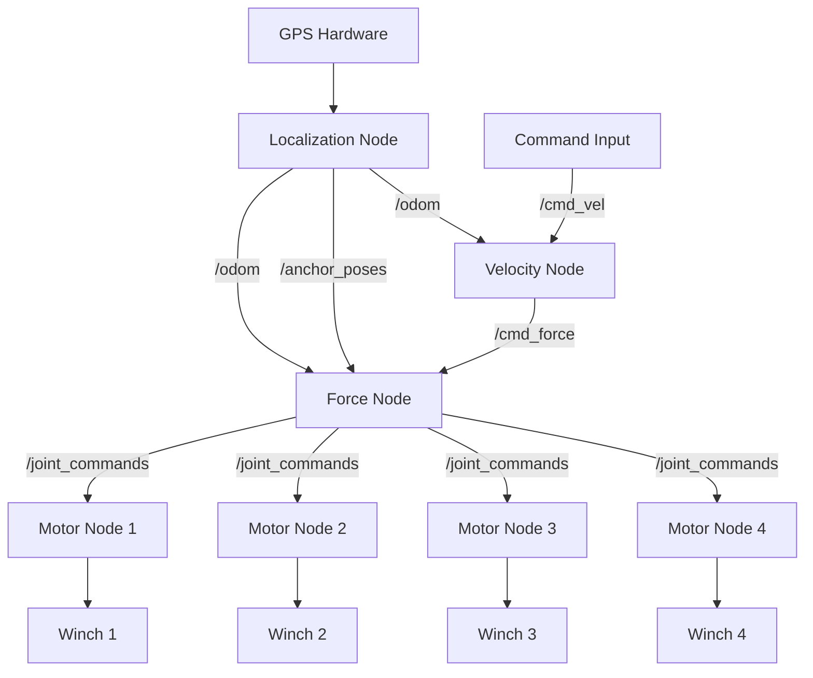
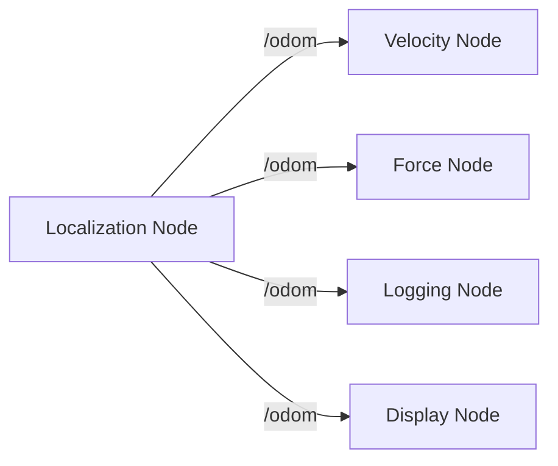
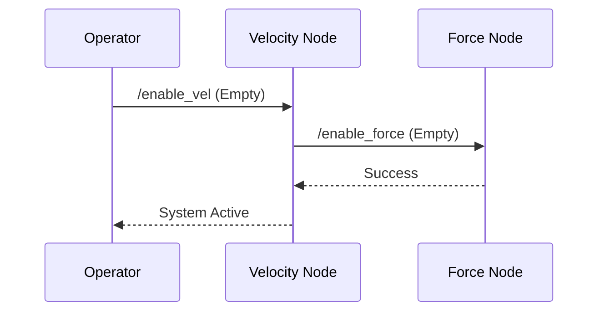
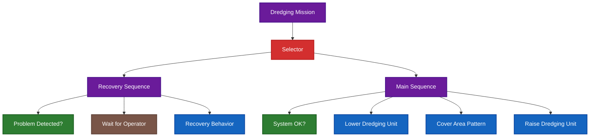

# Module 1: Introduction to ROS2

**Duration**: 30 minutes  
**Learning Objectives**: Understand ROS2 ecosystem scope, recognize common robotics patterns, see real-world applications

---

## Module Overview

This module introduces participants to the ROS2 ecosystem through Dyno Robotics' real-world dredging raft project, demonstrating how ROS2 enables sophisticated robotic coordination and providing the foundation for hands-on learning in subsequent modules.

### Structure

1. **Hook: Dredging Raft Showcase** (5 minutes)
2. **ROS2 Ecosystem Overview** (10 minutes)
3. **Communication Patterns** (10 minutes)
4. **Dyno Projects Gallery** (5 minutes)

---

## Section 1: Hook - Dredging Raft Showcase (5 minutes)

### Opening Statement

_"What you're about to see is a 4-winch robotic system that can systematically clean lake bottoms with centimeter-level precision. This is what ROS2 makes possible."_

### Dredging Raft System Overview

**The Challenge**: Clean sediment from lake bottoms efficiently and systematically
**The Solution**: Coordinated 4-winch system with RTK GPS precision

#### System Components

- **4 Electric Winches**: Positioned at corners of floating raft
- **RTK GPS**: Centimeter-level positioning accuracy
- **Dredging Unit**: Dragged across lake bottom
- **Central Controller**: Coordinates all components via ROS2

#### The Coordination Magic

- **Systematic Coverage**: Methodical area coverage patterns (lawn mower, spiral, grid)
- **Precise Positioning**: RTK GPS provides exact location feedback
- **Coordinated Movement**: All 4 winches work together to move dredging unit
- **Real-time Adaptation**: System adjusts to obstacles and environmental conditions

### Visual Elements

- **System Diagram**: 4-winch raft layout with GPS and dredging unit
- **Coverage Pattern Animation**: Show systematic area coverage
- **Coordination Visualization**: How 4 winches create desired movement

### Key Takeaway

_"This level of coordination - 4 independent motors working as one system - is exactly what ROS2 is designed to enable. Today you'll learn how."_

---

## Section 2: ROS2 Ecosystem Overview (10 minutes)

### What is ROS2?

**Robot Operating System 2** - A framework for building distributed robotic systems

#### Core Principles

- **Distributed**: Components can run on different computers
- **Modular**: Break complex systems into manageable pieces
- **Language Agnostic**: Python, C++, and other languages work together
- **Real-time Capable**: Supports time-critical applications
- **Cross-platform**: Linux, Windows, macOS

### ROS2 in the Dredging System

#### Distributed Architecture



#### Why This Matters

- **Modularity**: Each node has a single, clear responsibility (GPS conversion, velocity control, force calculation)
- **Testability**: Can test localization, velocity control, and force calculation independently
- **Scalability**: Easy to add more sensors, control layers, or actuators
- **Maintainability**: Update velocity control without affecting force calculation or motor control
- **Layered Control**: GPS → Position → Velocity → Force → Motors creates clean abstraction layers

### ROS2 Ecosystem Scope

#### What ROS2 Provides

- **Communication Infrastructure**: How components talk to each other
- **Development Tools**: Debugging, visualization, testing
- **Hardware Abstraction**: Same code works with different hardware
- **Community Packages**: Thousands of pre-built components

#### What ROS2 Doesn't Provide

- **Specific Algorithms**: You write the dredging pattern logic
- **Hardware Drivers**: You integrate with specific winch controllers
- **User Interfaces**: You build the operator control panel
- **Domain Knowledge**: You provide the dredging expertise

### Real-World Impact

#### Dredging System Benefits

- **Precision**: Centimeter-level accuracy vs. manual operation
- **Efficiency**: Systematic coverage vs. random patterns
- **Safety**: Remote operation vs. divers in hazardous conditions
- **Documentation**: Automatic logging of coverage and progress

---

## Section 3: Communication Patterns (10 minutes)

### The Four Essential Patterns

ROS2 provides four fundamental ways for components to communicate. Each serves a different purpose in robotic systems.

#### 1. Publishers/Subscribers (Pub/Sub)

**Purpose**: Continuous data streams that don't require acknowledgment

**Dredging Example**: Odometry Data Distribution



**Characteristics**:

- **Continuous**: GPS publishes position 10 times per second
- **One-to-Many**: Multiple nodes can subscribe to GPS data
- **No Acknowledgment**: GPS doesn't know who's listening
- **Decoupled**: GPS node doesn't need to know about subscribers

**Educational Analogy**: _"Like a radio station broadcasting - anyone can tune in, broadcaster doesn't know who's listening"_

#### 2. Services (Request/Response)

**Purpose**: Immediate request/response for synchronous operations

**Dredging Example**: System Enable/Disable



**Characteristics**:

- **Synchronous**: Caller waits for response
- **One-to-One**: Direct communication between two nodes
- **Acknowledgment**: Always get success/failure response
- **Immediate**: For operations that need instant confirmation

**Educational Analogy**: _"Like a phone call - you ask a question and wait for an answer"_

#### 3. Actions (Long-running Operations)

**Purpose**: Long-running operations with progress feedback and cancellation

**Dredging Example**: Underwater Dredging Mission with py-trees Behavior Tree



**Characteristics**:

- **Long-running**: Dredging operations take hours to complete
- **Progress Updates**: Real-time feedback on depth, coverage, position
- **Cancellable**: Emergency abort returns dredging unit to surface
- **Hierarchical**: Complex mission broken into manageable sub-actions
- **Visual Debugging**: py-trees viewer shows real-time behavior tree state

**Educational Analogy**: _"Like a construction project with phases - foundation, building, finishing - each with progress tracking and ability to pause/resume"_

#### 4. Parameters (Configuration)

**Purpose**: System configuration and calibration values

**Dredging Example**: Winch Calibration

```yaml
force_node:
  ros__parameters:
    mult: [1.1, 1.0, 1.0, 1.0] # Each winch has different characteristics
    deadzone_force_passive: 0.2 # Minimum tension to keep cables taut
    deadzone_force_active: 1.1 # Minimum force for active pulling
    tightening_force: 0.7 # Default cable tensioning force
```

**Characteristics**:

- **Configuration**: Set during system startup
- **Calibration**: Account for hardware differences
- **Defaults**: Baseline values that don't change during operation
- **Tuning**: Adjust system behavior without recompiling code

**Educational Analogy**: _"Like setting up your tools before starting work - configure once, use throughout the job"_

### Communication Pattern Selection

#### When to Use Each Pattern

| Pattern       | Use When                            | Dredging Example                |
| ------------- | ----------------------------------- | ------------------------------- |
| **Pub/Sub**   | Continuous data, multiple listeners | GPS position, winch status      |
| **Service**   | Immediate response needed           | Emergency stop                  |
| **Action**    | Long operation with progress        | Execute dredging pattern        |
| **Parameter** | System configuration                | Winch calibration, force limits |

### Complete System Communication Flow

#### Typical Dredging Operation

1. **Parameters**: Load winch calibration, PI controller gains, and coordinate transformation settings
2. **Service**: Enable/disable movement
3. **Pub/Sub**: GPS continuously publishes position data to localization node
4. **Pub/Sub**: Localization publishes odometry data to velocity and force controllers
5. **Action**: Execute dredging pattern - planner sends velocity commands over time
6. **Pub/Sub**: Velocity controller continuously adjusts force commands based on feedback
7. **Service**: Emergency disable if problems detected - immediate force shutdown
8. **Action**: Return to dock with continuous velocity control and progress updates

---

## Section 4: Dyno Projects Gallery (5 minutes)

### ROS2 Across Domains

The same communication patterns and architectural principles apply across all robotic domains.

#### Marine Robotics Applications

- **Autonomous Underwater Vehicles (AUVs)**
  - Same 4-thruster coordination pattern as dredging winches
  - Pub/Sub for sensor data (sonar, cameras, pressure)
  - Actions for long missions (pipeline inspection, mapping)
  - Services for emergency surfacing

- **Underwater Pipeline Repair**
  - Multi-robot coordination using ROS2 communication
  - Distributed sensing and manipulation
  - Real-time adaptation to underwater conditions

#### Industrial Automation Applications

- **Factory Floor Coordination**
  - Same systematic coverage patterns for warehouse robots
  - Pub/Sub for conveyor status and inventory tracking
  - Actions for complex assembly operations
  - Services for quality control checkpoints

- **Robotic Manufacturing**
  - Coordinated multi-arm assembly systems
  - Real-time adaptation to part variations
  - Safety systems with immediate response

#### Automotive Applications

- **Autonomous Vehicle Systems**
  - Same 4-wheel coordination as 4-winch dredging
  - Pub/Sub for sensor fusion (LIDAR, cameras, GPS)
  - Actions for navigation missions
  - Services for emergency braking

- **Fleet Coordination**
  - Multi-vehicle coordination using ROS2
  - Distributed traffic management
  - Real-time route optimization

### Universal Patterns

#### What Stays the Same

- **Communication Patterns**: Pub/Sub, Services, Actions, Parameters
- **Distributed Architecture**: Multiple nodes working together
- **Modularity**: Single responsibility components
- **Real-time Capability**: Time-critical operations

#### What Changes

- **Domain Knowledge**: Dredging vs. manufacturing vs. navigation
- **Sensors**: GPS vs. LIDAR vs. pressure sensors
- **Actuators**: Winches vs. wheels vs. robotic arms
- **Algorithms**: Coverage patterns vs. path planning vs. manipulation

### The ROS2 Advantage

#### Why Choose ROS2?

- **Proven Architecture**: Used in production systems worldwide
- **Rich Ecosystem**: Thousands of packages and tools
- **Industry Standard**: Common language across robotics domains
- **Future-Proof**: Designed for next-generation robotic systems

#### What You'll Learn

- **Module 2**: Set up your development environment
- **Module 3**: Structure ROS2 projects effectively
- **Module 4**: Model and visualize robotic systems
- **And More**: Debugging, simulation, advanced topics

---

## Module 1 Wrap-up

### Key Takeaways

1. **ROS2 enables sophisticated coordination** - like our 4-winch dredging system
2. **Four communication patterns** handle different types of robot interactions
3. **Same patterns apply across domains** - marine, industrial, automotive
4. **Modular architecture** makes complex systems manageable

### What's Next

- **Module 2**: Get hands-on with ROS2 setup and basic programming
- **Module 3**: Learn to structure ROS2 projects like professionals
- **Module 4**: Build and visualize your own robotic systems

### Questions & Discussion

_"What robotic coordination challenges do you face in your domain? How might ROS2's communication patterns help solve them?"_

---

## Instructor Notes

### Timing Guidelines

- **Section 1**: 5 minutes - Keep dredging demo concise but impressive
- **Section 2**: 10 minutes - Focus on architecture benefits, not technical details
- **Section 3**: 10 minutes - Use clear analogies, avoid implementation details
- **Section 4**: 5 minutes - Quick tour showing universality

### Key Messages to Emphasize

1. **ROS2 is about coordination** - multiple components working together
2. **Communication patterns are universal** - same concepts across all domains
3. **Real-world impact** - this isn't just academic, it solves real problems
4. **Accessible complexity** - sophisticated systems built from simple patterns

### Common Questions & Answers

**Q**: "Is ROS2 only for big, complex robots?"
**A**: "No - even simple robots benefit from modular architecture. Start simple, scale up."

**Q**: "Do I need to learn all four communication patterns?"
**A**: "Start with pub/sub for sensors and basic control. Add others as needed."

**Q**: "How does this compare to other robotics frameworks?"
**A**: "ROS2 is the most widely adopted, with the largest ecosystem and community."

**Q**: "Can I use ROS2 with my existing hardware?"
**A**: "Usually yes - ROS2 provides hardware abstraction layers for most common devices."

### Customization Notes

#### For Marine Robotics Clients

- Emphasize underwater communication challenges
- Highlight multi-AUV coordination examples
- Discuss bandwidth-limited environments

#### For Industrial Automation Clients

- Focus on factory floor integration
- Emphasize safety and reliability features
- Highlight real-time performance capabilities

#### For Automotive Clients

- Emphasize sensor fusion and safety systems
- Highlight real-time requirements
- Discuss fleet coordination scenarios

### Visual Aids Needed

1. **Dredging System Diagram**: 4-winch layout with GPS and controller
2. **Communication Pattern Diagrams**: Visual representation of each pattern
3. **Cross-Domain Comparison**: Same patterns in different applications
4. **ROS2 Ecosystem Map**: Overview of tools and capabilities

### Assessment Options

- **Quick Poll**: "Which communication pattern would you use for...?"
- **Discussion**: "What coordination challenges exist in your domain?"
- **Reflection**: "How might modular architecture help your current projects?"
