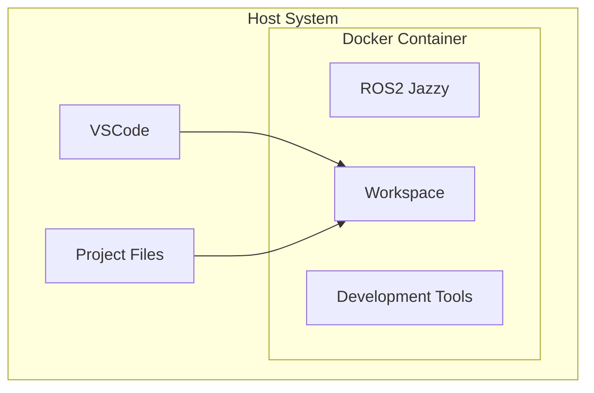

# Module 2: ROS2 Development Setup

**Duration**: 45 minutes  
**Prerequisites**: Module 1 completed  
**Learning Objectives**: Set up development environment, understand package structure, implement basic communication

---

## Learning Objectives

By the end of this module, participants will be able to:

1. **Set up a complete ROS2 development environment** using Docker and VSCode
2. **Create and structure ROS2 packages** following best practices
3. **Implement basic publisher/subscriber communication** in both Python and C++
4. **Use development tools** for debugging and introspection

---

## Section 1: Development Environment Setup (15 minutes)

### Docker Development Environment

Modern ROS2 development uses containerized environments for consistency and portability. We'll use the same setup that Dyno Robotics uses for most projects.

#### Why Docker for ROS2?

- **Consistency**: Same environment across all team members
- **Isolation**: No conflicts with host system packages
- **Portability**: Works on Linux, Windows, and macOS
- **Version Control**: Environment configuration is code

#### Container Architecture



### VSCode Development Container

VSCode's dev container feature provides seamless integration with Docker:

#### Key Features:

- **Integrated Terminal**: Direct access to ROS2 commands
- **IntelliSense**: Code completion for ROS2 APIs
- **Debugging**: Step-through debugging for Python and C++
- **Extensions**: ROS2-specific tools and syntax highlighting

#### Required Extensions:

- **Dev Containers**: Microsoft container integration
- **ROS**: ROS2 syntax highlighting and tools
- **Python**: Python development support
- **C/C++**: C++ development and debugging
- **CMake Tools**: Build system integration

### Hands-on: Environment Setup

#### Step 1: Verify Docker Installation

```bash
# Check Docker is running
docker --version
docker compose --version

# Test container access
docker run --rm hello-world
```

#### Step 2: Clone Workshop Repository

```bash
# Clone the workshop materials
git clone https://github.com/DynoRobotics/dyno_ros2_courses.git
cd dyno_ros2_courses
```

#### Step 3: Open in VSCode Dev Container

```bash
# Open VSCode in the project directory
code .

# VSCode will prompt to "Reopen in Container"
# Click "Reopen in Container" or use Command Palette:
# Ctrl+Shift+P -> "Dev Containers: Reopen in Container"
```

#### Step 4: Verify ROS2 Environment

```bash
# Inside the container terminal
ros2 --help

# Check available packages
ros2 pkg list | head -10
```

---

## Section 2: ROS2 Package Creation (15 minutes)

### Package Structure Overview

ROS2 packages follow a standardized structure that enables code sharing and dependency management.

#### Python Package Structure

```
my_robot_package/
├── package.xml          # Package metadata and dependencies
├── setup.py            # Python package configuration
├── setup.cfg           # Python build configuration
├── resource/           # Package marker files
│   └── my_robot_package
├── my_robot_package/   # Python source code
│   ├── __init__.py
│   └── my_node.py
└── test/              # Unit tests
    ├── test_copyright.py
    ├── test_flake8.py
    └── test_pep257.py
```

#### C++ Package Structure

```
my_robot_cpp/
├── package.xml         # Package metadata and dependencies
├── CMakeLists.txt     # Build configuration
├── include/           # Header files
│   └── my_robot_cpp/
│       └── my_node.hpp
├── src/               # Source files
│   └── my_node.cpp
└── test/              # Unit tests
    └── test_my_node.cpp
```

### Package Dependencies

#### Common ROS2 Dependencies:

- **rclpy**: Python ROS2 client library
- **rclcpp**: C++ ROS2 client library
- **std_msgs**: Standard message types
- **geometry_msgs**: Geometry-related messages
- **sensor_msgs**: Sensor data messages

#### Development Dependencies:

- **ament_cmake**: C++ build system
- **ament_python**: Python build system
- **ament_lint**: Code quality tools

### Hands-on: Create Your First Package

#### Step 1: Create Python Package

```bash
# Navigate to workspace source directory
cd /workspace/src

# Create Python package
ros2 pkg create --build-type ament_python my_first_py --dependencies rclpy std_msgs

# Examine the generated structure
tree my_first_py/
```

#### Step 2: Create C++ Package

```bash
# Create C++ package
ros2 pkg create --build-type ament_cmake my_first_cpp --dependencies rclcpp std_msgs

# Examine the generated structure
tree my_first_cpp/
```

#### Step 3: Build Packages

```bash
# Build all packages in workspace
./run in_container_build

# Verify packages are available
ros2 pkg list | grep my_first
```

---

## Section 3: Basic Publisher/Subscriber Implementation (15 minutes)

### Communication Pattern Review

From Module 1, we learned that Publisher/Subscriber is used for:

- **Continuous data streams** (sensor readings, status updates)
- **One-to-many communication** (one publisher, multiple subscribers)
- **Decoupled systems** (publisher doesn't know about subscribers)

### Message Types

#### Standard Messages:

- **std_msgs/String**: Simple text messages
- **std_msgs/Int32**: Integer values
- **geometry_msgs/Twist**: Velocity commands
- **sensor_msgs/Image**: Camera images

### Hands-on: Implement Talker/Listener

#### Step 1: Python Publisher (Talker)

```python
import rclpy
from rclpy.executors import ExternalShutdownException
from rclpy.node import Node
from std_msgs.msg import String


class Talker:
    def __init__(self, node: Node):
        self.node = node
        self.counter = 0

        self.publisher = self.node.create_publisher(String, "talker", 10)

        self.timer = self.node.create_timer(1.0, self.timer_callback)

        self.node.get_logger().info("Talker initialized")

    def timer_callback(self):
        msg = String()
        msg.data = f"Hello! Count: {self.counter}"

        self.publisher.publish(msg)
        self.node.get_logger().info(f'Published: "{msg.data}"')

        self.counter += 1


def main(args=None):
    rclpy.init(args=args)

    node = Node("talker")
    _ = Talker(node)

    try:
        rclpy.spin(node)
    except (KeyboardInterrupt, ExternalShutdownException):
        pass
    finally:
        node.destroy_node()
        rclpy.try_shutdown()


if __name__ == "__main__":
    main()
```

#### Step 2: Python Subscriber (Listener)

```python
import rclpy
from rclpy.executors import ExternalShutdownException
from rclpy.node import Node
from std_msgs.msg import String


class Listener:
    def __init__(self, node: Node):
        self.node = node

        self.subscription = self.node.create_subscription(
            String, "talker", self.listener_callback, 10
        )

        self.node.get_logger().info("Listener initialized")

    def listener_callback(self, msg):
        self.node.get_logger().info(f'Received: "{msg.data}"')


def main(args=None):
    rclpy.init(args=args)

    node = Node("listener")
    _ = Listener(node)

    try:
        rclpy.spin(node)
    except (KeyboardInterrupt, ExternalShutdownException):
        pass
    finally:
        node.destroy_node()
        rclpy.try_shutdown()


if __name__ == "__main__":
    main()
```

#### Step 3: Configure Package Entry Points

```python
# File: my_first_py/setup.py
from setuptools import setup

package_name = 'my_first_py'

setup(
    name=package_name,
    version='0.0.0',
    packages=[package_name],
    data_files=[
        ('share/ament_index/resource_index/packages',
            ['resource/' + package_name]),
        ('share/' + package_name, ['package.xml']),
    ],
    install_requires=['setuptools'],
    zip_safe=True,
    maintainer='your_name',
    maintainer_email='your_email@example.com',
    description='My first ROS2 package',
    license='Apache License 2.0',
    tests_require=['pytest'],
    entry_points={
        'console_scripts': [
            "talker = my_first_py.talker:main",
            "listener = my_first_py.listener:main",
        ],
    },
)
```

#### Step 4: Build and Test

```bash
./run in_container_build

# Test the nodes in separate terminals
# Terminal 1:
ros2 run my_first_package talker

# Terminal 2:
ros2 run my_first_package listener
```

#### Step 5: Introspection and Debugging

```bash
# List active nodes
ros2 node list

# Show node information
ros2 node info /talker

# List topics
ros2 topic list

# Show topic information
ros2 topic info /talker

# Echo topic messages
ros2 topic echo /talker

# Show topic publication rate
ros2 topic hz /talker
```

---

## Section 4: Service Communication Pattern (Optional - Advanced Topic)

### Understanding ROS2 Services

While Publisher/Subscriber is great for continuous data streams, **Services** provide a different communication pattern:

- **Request/Response communication** (like function calls)
- **Synchronous interaction** (client waits for response)
- **One-to-one communication** (one client, one server per request)

### Service vs Topic Communication

| Aspect | Topics (Pub/Sub) | Services |
|--------|------------------|----------|
| **Pattern** | Continuous streaming | Request/Response |
| **Timing** | Asynchronous | Synchronous |
| **Relationship** | One-to-many | One-to-one |
| **Use Cases** | Sensor data, status | Commands, calculations |

### Service Message Types

Services use **request/response** message pairs:

- **example_interfaces/srv/AddTwoInts**: Simple math service
- **std_srvs/srv/Empty**: Trigger service with no data
- **std_srvs/srv/SetBool**: Enable/disable functionality

### Hands-on: Service Implementation

#### Service Server Example

The service server waits for requests and provides responses:

```python
# File: src/references/my_first_py/my_first_py/service_server.py
import rclpy
from rclpy.node import Node
from rclpy.callback_groups import ReentrantCallbackGroup
from async_utils.async_primitives import async_sleep
import example_interfaces.srv

class ServiceServer:
    def __init__(self, node: Node):
        self.node = node
        self.node._default_callback_group = ReentrantCallbackGroup()
        self.logger = self.node.get_logger()

        # Create service that adds two integers
        self.test_service = self.node.create_service(
            example_interfaces.srv.AddTwoInts,
            "test_service",
            self.test_service_callback,
        )

    async def test_service_callback(self, request, response):
        # Perform the calculation
        response.sum = request.a + request.b
        self.logger.info(f"Adding {request.a} to {request.b} results in {response.sum}")
        
        # Simulate processing time
        await async_sleep(self.node, 1.0)
        self.logger.info("Finished processing request")
        
        return response
```

#### Service Client Example

The service client sends requests and handles responses:

```python
# File: src/references/my_first_py/my_first_py/service_client.py
import rclpy
from rclpy.node import Node
from rclpy.callback_groups import ReentrantCallbackGroup
from async_utils.async_primitives import future_with_timeout
import example_interfaces.srv

class ServiceClient:
    def __init__(self, node: Node):
        self.node = node
        self.node._default_callback_group = ReentrantCallbackGroup()
        self.logger = self.node.get_logger()

        # Create client for the test service
        self.test_client = self.node.create_client(
            example_interfaces.srv.AddTwoInts, "test_service"
        )

    async def call_service_with_timeout(self):
        # Create request
        request = example_interfaces.srv.AddTwoInts.Request()
        request.a = 38
        request.b = 4

        try:
            # Call service with timeout
            future = self.test_client.call_async(request)
            response = await future_with_timeout(self.node, future, 1.5)
            self.logger.info(f"Service call succeeded: {response.sum}")
        except TimeoutError as e:
            self.logger.error(f"Service call timed out: {e}")
```

#### Key Features Demonstrated:

1. **Async/Await Pattern**: Modern Python async programming
2. **Timeout Handling**: Prevents hanging on slow services
3. **Error Handling**: Graceful handling of service failures
4. **Reentrant Callbacks**: Allows concurrent service calls

#### Testing Services

```bash
# Terminal 1: Start the service server
ros2 run my_first_py service_server

# Terminal 2: Start the service client
ros2 run my_first_py service_client

# Terminal 3: Manual service call
ros2 service call /test_service example_interfaces/srv/AddTwoInts "{a: 5, b: 3}"

# List available services
ros2 service list

# Show service details
ros2 service type /test_service
```

---

## Section 5: Development Tools and Workflow (Optional - if time permits)

### Essential ROS2 Commands

#### Node Management:

```bash
ros2 node list                    # List running nodes
ros2 node info <node_name>        # Show node details
ros2 run <package> <executable>   # Run a node
```

#### Topic Management:

```bash
ros2 topic list                   # List active topics
ros2 topic echo <topic_name>      # Display topic messages
ros2 topic info <topic_name>      # Show topic details
ros2 topic hz <topic_name>        # Show publication frequency
ros2 topic pub <topic> <type> <data>  # Publish to topic
```

#### Package Management:

```bash
ros2 pkg list                     # List installed packages
ros2 pkg create <name>            # Create new package
colcon build                      # Build workspace
colcon build --packages-select <pkg>  # Build specific package
```

### VSCode Integration

#### Debugging Setup:

1. **Set Breakpoints**: Click in the gutter next to line numbers
2. **Launch Configuration**: Use F5 to start debugging
3. **Variable Inspection**: Hover over variables to see values
4. **Call Stack**: Navigate through function calls

#### Useful Shortcuts:

- **Ctrl+Shift+`**: Open new terminal
- **Ctrl+P**: Quick file open
- **Ctrl+Shift+P**: Command palette
- **F5**: Start debugging
- **Ctrl+C**: Stop running process

---

## Module Summary

### What We Accomplished:

1. ✅ **Set up Docker development environment** with VSCode integration
2. ✅ **Created ROS2 packages** in both Python and C++
3. ✅ **Implemented basic pub/sub communication** with talker/listener nodes
4. ✅ **Used ROS2 introspection tools** for debugging and monitoring

### Key Concepts Learned:

- **Containerized Development**: Consistent, portable environments
- **Package Structure**: Standard organization for ROS2 code
- **Build System**: colcon for workspace management
- **Communication**: Publisher/subscriber pattern implementation
- **Debugging Tools**: ros2 command-line utilities

### Next Steps:

- **Module 3**: Code structure and launch files
- **Module 4**: Robot modeling and visualization
- **Practice**: Extend the talker/listener with custom messages

### Troubleshooting Common Issues:

#### Container Won't Start:

- Check Docker is running: `docker ps`
- Verify permissions: `docker run hello-world`
- Restart VSCode and try again

#### Build Failures:

- Check package.xml dependencies
- Verify setup.py entry points
- Clean build: `./run in_container_build`

#### Nodes Not Communicating:

- Check topic names: `ros2 topic list`
- Verify message types: `ros2 topic info <topic>`
- Check node status: `ros2 node list`

---

## Additional Resources

### Documentation:

- [ROS2 Tutorials](https://docs.ros.org/en/humble/Tutorials.html)
- [VSCode Dev Containers](https://code.visualstudio.com/docs/remote/containers)
- [Docker Compose Reference](https://docs.docker.com/compose/)

### Community:

- [ROS Discourse](https://discourse.ros.org/)
- [ROS2 GitHub](https://github.com/ros2)
- [Articulated Robotics YouTube](https://www.youtube.com/c/ArticulatedRobotics)
