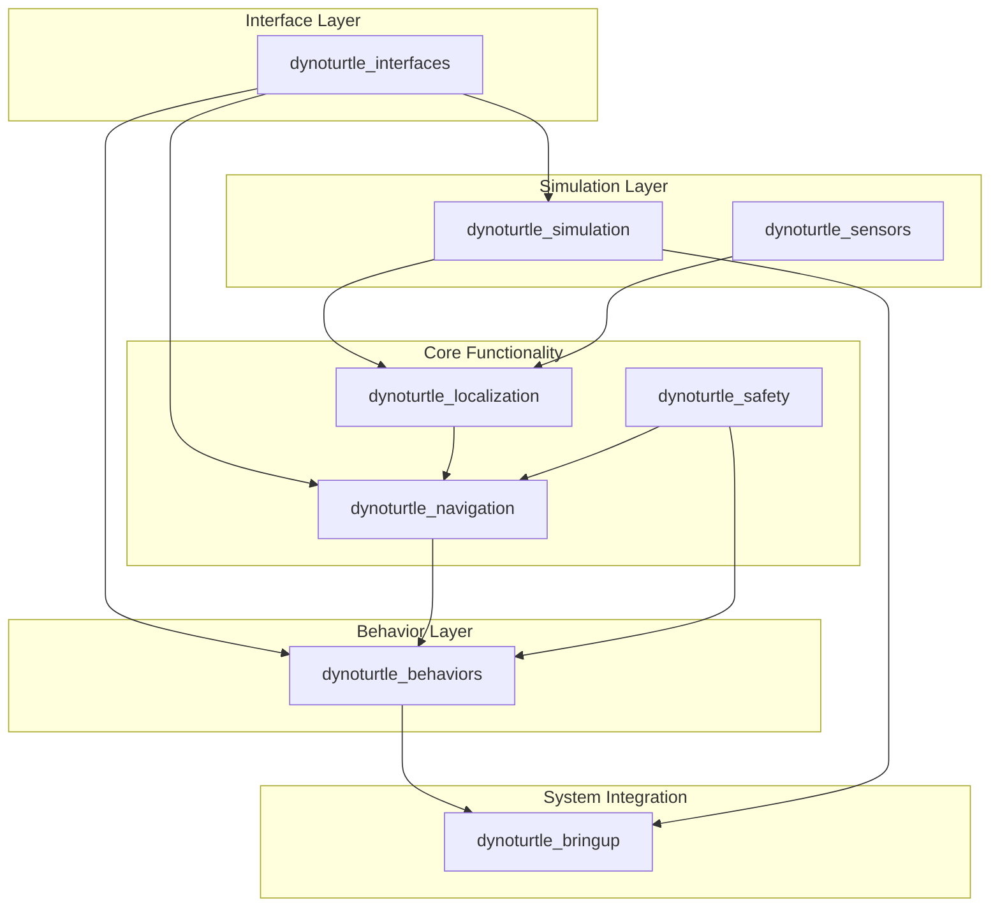
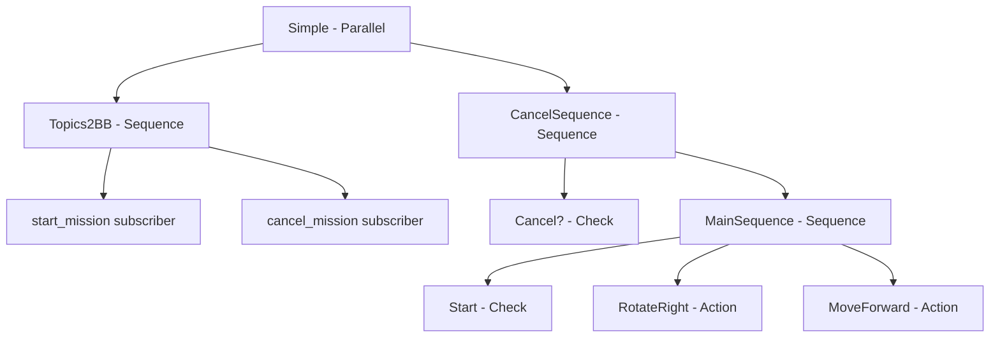

# Module 3: Code Structure and Architecture

**Duration**: 60 minutes  
**Prerequisites**: Module 2 completed  
**Learning Objectives**: Understand modular ROS2 architecture, launch systems, and behavior trees

---

## Learning Objectives

By the end of this module, participants will be able to:

1. **Understand modular package architecture** and separation of concerns
2. **Navigate complex ROS2 launch systems** with hierarchical launch files
3. **Implement behavior trees** for robot decision-making
4. **Design scalable robot software** using established patterns

---

## Section 1: Modular Package Architecture

### Overview: DynoTurtle System Architecture

The DynoTurtle project demonstrates a **modular, scalable architecture** that separates concerns into focused packages:



### Package Breakdown

#### 1. **dynoturtle_interfaces** - Communication Contracts
- **Purpose**: Define all custom messages, services, and actions
- **Key Files**:
  - `action/MoveTo.action` - Navigation action interface
  - `action/Rotate.action` - Rotation action interface
  - `action/Charge.action` - Battery charging action interface
- **Why Separate**: Enables loose coupling between packages

#### 2. **dynoturtle_simulation** - Virtual Environment
- **Purpose**: Provide simulation capabilities and extensions
- **Key Components**:
  - Turtle spawning and management
  - Simulator extensions (battery, visualization)
  - Physics simulation integration
- **Dependencies**: Turtlesim, visualization tools

#### 3. **dynoturtle_localization** - Position Awareness
- **Purpose**: Track robot position and orientation
- **Key Features**:
  - Transform (TF) publishing
  - Pose estimation
  - Coordinate frame management
- **Output**: Robot pose in world coordinates

#### 4. **dynoturtle_navigation** - Motion Control
- **Purpose**: Execute movement commands safely
- **Key Components**:
  - MoveTo action server
  - Path planning integration
  - Collision avoidance
- **Input**: Target poses, current position
- **Output**: Velocity commands

#### 5. **dynoturtle_safety** - Risk Management
- **Purpose**: Monitor and prevent unsafe conditions
- **Key Features**:
  - Collision detection
  - Emergency stops
  - Safety constraint enforcement
- **Priority**: Highest - can override all other systems

#### 6. **dynoturtle_behaviors** - Decision Making
- **Purpose**: High-level robot behavior coordination
- **Key Components**:
  - Behavior trees
  - Action implementations
  - Mission planning
- **Pattern**: Hierarchical state machines

#### 7. **dynoturtle_sensors** - Data Acquisition
- **Purpose**: Interface with robot sensors
- **Future Extensions**: Camera, lidar, IMU integration
- **Output**: Sensor data streams

#### 8. **dynoturtle_bringup** - System Integration
- **Purpose**: Launch and coordinate all system components
- **Key Files**:
  - Launch configurations
  - Parameter files
  - System startup scripts

### Design Principles Demonstrated

#### **Separation of Concerns**
- Each package has a single, well-defined responsibility
- Minimal coupling between packages
- Clear interfaces and dependencies

#### **Scalability**
- Easy to add new behaviors without modifying core systems
- Modular testing and development
- Independent package versioning

#### **Reusability**
- Packages can be used in different robot configurations
- Standard ROS2 interfaces enable interoperability
- Clear abstraction layers

---

## Section 2: Launch System Architecture (20 minutes)

### Hierarchical Launch Structure

The DynoTurtle system uses a **hierarchical launch architecture** that enables flexible system configuration:

```
full.launch.py                    # Complete system launcher
├── turtlesim_node                # Base simulation
├── simulator_extensions          # Simulation enhancements
├── turtle_spawner               # Multi-turtle management
├── web_bridge                   # Web interface
├── rviz                        # Visualization
├── py_trees_tree_viewer        # Behavior tree visualization
└── individual_turtle.launch.py  # Per-turtle subsystem
    ├── localization.launch.py   # Position tracking
    ├── navigation.launch.py     # Motion control
    ├── safety                   # Safety monitoring
    ├── move_action             # Movement behaviors
    ├── rotate_action           # Rotation behaviors
    ├── charge_action           # Charging behaviors
    └── simple_tree             # Behavior coordination
```

### Launch File Analysis

#### **full.launch.py** - System Orchestrator

```python
# Key Features:
- Multi-turtle support with namespacing
- Visualization tools integration
- Modular component launching
- Parameter configuration

# Architecture Pattern:
def generate_launch_description():
    # Core simulation components
    turtlesim = Node(package="turtlesim", ...)
    simulator_extensions = Node(package="dynoturtle_simulation", ...)
    
    # Per-turtle instances
    for i in range(num_turtles):
        turtle_launch = IncludeLaunchDescription(...)
        turtles.append(GroupAction([
            PushRosNamespace(f"turtle{i+1}"), 
            turtle_launch
        ]))
```

#### **individual_turtle.launch.py** - Robot Instance

```python
# Subsystem Integration:
- Localization (position tracking)
- Navigation (motion control) 
- Safety (risk management)
- Behaviors (decision making)

# Launch Pattern:
return LaunchDescription([
    safety,           # Highest priority
    localization,     # Foundation service
    navigation,       # Motion capability
    move_action,      # Behavior primitives
    rotate_action,    
    charge_action,
    behavior_tree,    # Coordination layer
])
```

### Launch System Benefits

#### **Modularity**
- Components can be launched independently
- Easy to disable/enable specific functionality
- Simplified debugging and testing

#### **Scalability**
- Support for multiple robot instances
- Namespace isolation prevents conflicts
- Parameter customization per instance

#### **Maintainability**
- Clear dependency relationships
- Centralized configuration management
- Reusable launch components

---

## Section 3: Behavior Tree Architecture (15 minutes)

### Understanding Behavior Trees

**Behavior Trees** provide a hierarchical, modular approach to robot decision-making:



### Behavior Tree Components

#### **Composite Nodes**
- **Sequence**: Execute children in order (AND logic)
- **Parallel**: Execute children simultaneously
- **Selector**: Try children until one succeeds (OR logic)

#### **Decorator Nodes**
- **Inverter**: Flip success/failure
- **Retry**: Repeat on failure
- **Timeout**: Limit execution time

#### **Leaf Nodes**
- **Action Clients**: Execute ROS2 actions
- **Condition Checks**: Evaluate blackboard variables
- **Subscribers**: Monitor topic data

### Simple Tree Implementation

```python
# Key Pattern: Blackboard Communication
start_mission_2bb = py_trees_ros.subscribers.EventToBlackboard(
    name="start_mission",
    topic_name="start_mission",
    variable_name="start_mission",
)

# Action Integration
rotate_right = py_trees_ros.actions.ActionClient(
    name="RotateRight",
    action_type=Rotate,
    action_name="rotate",
    action_goal=Rotate.Goal(delta_angle=-90.0),
)

# Conditional Logic
is_start_mission_requested = py_trees.behaviours.CheckBlackboardVariableValue(
    name="Start",
    check=py_trees.common.ComparisonExpression(
        variable="start_mission", value=True, operator=operator.eq
    ),
)
```

### Behavior Tree Advantages

#### **Modularity**
- Reusable behavior components
- Easy to modify and extend
- Clear behavior composition

#### **Debugging**
- Visual tree representation
- Real-time execution monitoring
- Clear success/failure paths

#### **Scalability**
- Complex behaviors from simple components
- Hierarchical organization
- Parallel execution support

---

## Section 4: Visualization and Debugging Tools (10 minutes)

### Essential ROS2 Development Tools

The DynoTurtle system integrates several powerful visualization and debugging tools that are essential for understanding and troubleshooting complex robotic systems:

#### **RViz2** - 3D Visualization and Robot State

**RViz2** is the primary 3D visualization tool for ROS2 systems:

```python
# From full.launch.py
rviz_config_file = PathJoinSubstitution(
    [FindPackageShare("dynoturtle_bringup"), "rviz", "default.rviz"]
)

rviz = Node(
    package="rviz2",
    executable="rviz2",
    name="rviz",
    arguments=["-d", rviz_config_file],
    output="screen",
)
```

**Key Features:**
- **Robot Model Visualization**: See the turtle's position and orientation in 3D space
- **Transform Tree (TF)**: Visualize coordinate frame relationships
- **Sensor Data**: Display laser scans, camera feeds, and point clouds
- **Path Planning**: Show planned trajectories and navigation goals
- **Interactive Markers**: Set navigation goals by clicking in the 3D view

**Common RViz2 Displays for DynoTurtle:**
- **TF**: Shows coordinate frame transformations (map → turtle1)
- **RobotModel**: 3D representation of the turtle
- **Path**: Planned and executed trajectories
- **Marker**: Battery level, status indicators
- **Grid**: Reference coordinate system

#### **rqt_graph** - System Architecture Visualization

**rqt_graph** provides a real-time view of the ROS2 computation graph:

```bash
# Launch rqt_graph to see node connections
rqt_graph
```

**What rqt_graph Shows:**
- **Nodes**: All running ROS2 nodes (circles/ovals)
- **Topics**: Communication channels between nodes (arrows)
- **Services**: Request/response connections (different arrow style)
- **Actions**: Long-running task connections (thick arrows)

**DynoTurtle Graph Analysis:**
```
turtlesim_node ←→ simulator_extensions
     ↓
localization → navigation → move_action
     ↓              ↓           ↓
   safety    →  behavior_tree ←→ rotate_action
                     ↓
                charge_action
```

**Debugging Benefits:**
- **Connection Verification**: Ensure nodes are properly connected
- **Data Flow Analysis**: Track information flow through the system
- **Namespace Isolation**: Verify multi-turtle separation
- **Performance Monitoring**: Identify communication bottlenecks

#### **py-trees-tree-viewer** - Behavior Tree Debugging

**py-trees-tree-viewer** provides real-time behavior tree visualization:

```python
# From full.launch.py
py_trees_tree_viewer = ExecuteProcess(
    cmd=["py-trees-tree-viewer"],
)
```

**Key Features:**
- **Live Tree Visualization**: See behavior tree structure in real-time
- **Execution Status**: Color-coded node states (running, success, failure)
- **Blackboard Monitoring**: View shared data between behaviors
- **Timeline Playback**: Review behavior execution history

**Behavior Tree States:**
- **Green**: Successfully completed nodes
- **Blue**: Currently running nodes
- **Red**: Failed nodes
- **Gray**: Inactive/waiting nodes

**DynoTurtle Tree Structure:**
```
Simple (Parallel)
├── Topics2BB (Sequence)
│   ├── start_mission (Subscriber)
│   └── cancel_mission (Subscriber)
└── CancelSequence (Sequence)
    ├── Cancel? (Condition)
    └── MainSequence (Sequence)
        ├── Start (Condition)
        ├── RotateRight (Action)
        └── MoveForward (Action)
```

### Tool Integration Workflow

#### **Development Workflow:**
1. **Start System**: Launch with all visualization tools
2. **Verify Connections**: Use rqt_graph to check node communication
3. **Monitor Execution**: Watch behavior tree in py-trees-viewer
4. **Visualize Results**: See robot movement and state in RViz2
5. **Debug Issues**: Use tools to identify and fix problems

#### **Debugging Scenarios:**

**Scenario 1: Robot Not Moving**
- **rqt_graph**: Check if navigation nodes are connected
- **RViz2**: Verify TF frames are being published
- **py-trees-viewer**: See if behavior tree is executing actions

**Scenario 2: Unexpected Behavior**
- **py-trees-viewer**: Check which behavior tree branches are active
- **RViz2**: Visualize planned vs actual robot path
- **rqt_graph**: Verify action server connections

**Scenario 3: Performance Issues**
- **rqt_graph**: Identify high-frequency topic connections
- **RViz2**: Monitor TF publishing rates
- **py-trees-viewer**: Check for stuck or slow behaviors

### Hands-on: Tool Exploration

#### **Step 1: Launch Complete System**
```bash
# Start all tools together
ros2 launch dynoturtle_bringup full.launch.py
```

#### **Step 2: Explore rqt_graph**
```bash
# In separate terminal (if not auto-launched)
rqt_graph

# Try different view options:
# - Nodes only
# - Nodes/Topics (active)
# - Nodes/Topics/Services/Actions (all)
```

#### **Step 3: Interact with RViz2**
```bash
# RViz2 should open automatically
# Try these interactions:
# 1. Add new displays (TF, Path, Marker)
# 2. Change view angles and zoom
# 3. Toggle display visibility
# 4. Set navigation goals (if 2D Nav Goal tool available)
```

#### **Step 4: Monitor Behavior Tree**
```bash
# py-trees-tree-viewer should open automatically
# Trigger behavior execution:
ros2 topic pub /turtle1/start_mission std_msgs/msg/Empty "{}"

# Watch the tree execute:
# - Observe color changes
# - Check blackboard variables
# - Monitor action progress
```

---

## Hands-on Activities

### Activity 1: Sending Actions

```bash
# Start the web-ui
cd src/web-ui/react_web_ui/
npm install
npm run dev

# In another terminal
ros2 launch dynoturtle_bringup full.launch.py
```

Open browser at `http://localhost:5173/`


### Activity 2: Behavior Tree Visualization

```bash
# Start the system with behavior tree viewer
ros2 launch dynoturtle_bringup full.launch.py

# Trigger behavior tree execution
ros2 topic pub /turtle1/start_mission std_msgs/msg/Empty "{}"

# Observe tree execution in py-trees-tree-viewer
# Cancel mission
ros2 topic pub /turtle1/cancel_mission std_msgs/msg/Empty "{}"
```


## Module Summary

### Architecture Principles Learned

1. **Modular Design**: Separation of concerns into focused packages
2. **Hierarchical Launch**: Structured system startup and configuration
3. **Behavior Trees**: Modular decision-making and task coordination
4. **Action Integration**: Asynchronous, feedback-rich component communication

### Key Takeaways

- **Scalability**: Architecture supports multiple robots and complex behaviors
- **Maintainability**: Clear interfaces and dependencies
- **Reusability**: Components can be used across different robot configurations
- **Debuggability**: Visual tools and clear execution paths

### Next Steps

- **Module 4**: Robot modeling and visualization
- **Module 5**: Advanced debugging techniques
- **Module 6**: Simulation and testing strategies

---

## Additional Resources

### Documentation
- [ROS2 Launch System](https://docs.ros.org/en/humble/Tutorials/Intermediate/Launch/Launch-Main.html)
- [py-trees Documentation](https://py-trees.readthedocs.io/)
- [ROS2 Actions](https://docs.ros.org/en/humble/Tutorials/Beginner-CLI-Tools/Understanding-ROS2-Actions/Understanding-ROS2-Actions.html)

### Tools
- [py-trees-tree-viewer](https://github.com/splintered-reality/py_trees_ros_viewer)
- [RViz2](https://docs.ros.org/en/humble/Tutorials/Intermediate/RViz/RViz-User-Guide/RViz-User-Guide.html)
- [rqt_graph](https://docs.ros.org/en/humble/Concepts/About-RQt.html)
