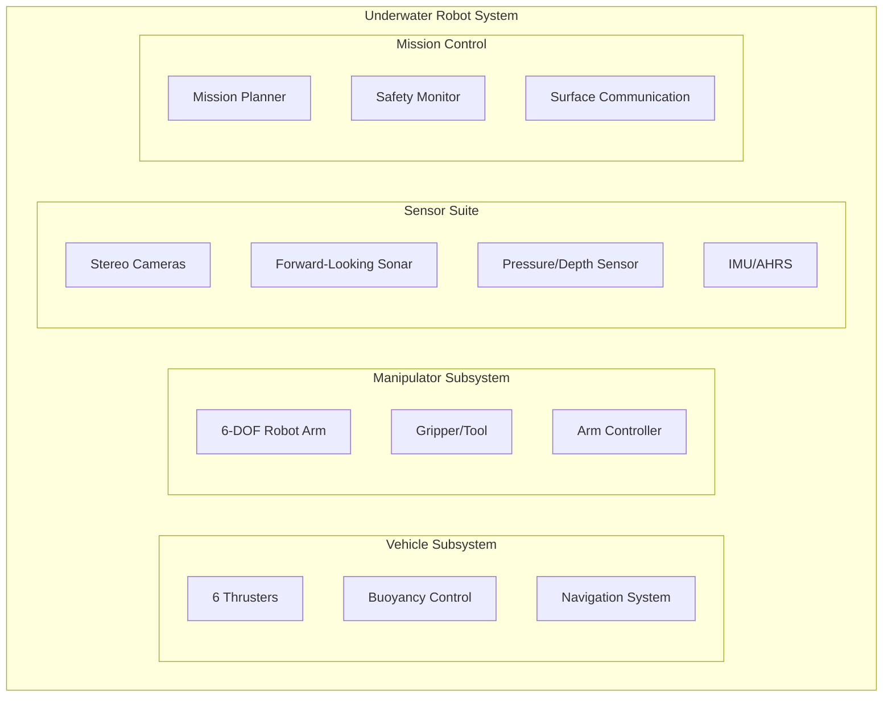

# Module 3: ROS2 Code Structure for Underwater Robot with Manipulator

**Duration**: 60 minutes  
**Prerequisites**: Modules 1 & 2 completed  
**Learning Objectives**: Organize complex underwater robotics projects, create multi-subsystem launch files, configure marine robot parameters

---

## Learning Objectives

By the end of this module, participants will be able to:

1. **Organize complex marine robotics projects** with multiple subsystems (vehicle + manipulator)
2. **Create hierarchical launch files** for underwater robot operations
3. **Configure underwater systems** using parameter files for vehicle dynamics and arm control
4. **Apply marine robotics best practices** for safety and modularity

---

## Section 1: Underwater Robot System Architecture (15 minutes)

### System Overview

Our underwater robot combines an Autonomous Underwater Vehicle (AUV) with a 6-DOF manipulator arm for inspection and manipulation tasks.

#### System Components:



### Professional Package Organization

#### Workspace Structure for Marine Robotics:

```
underwater_workspace/
├── src/
│   ├── auv_bringup/           # System launch and configuration
│   ├── auv_description/       # Vehicle and arm URDF models
│   ├── auv_control/           # Vehicle control (thrusters, buoyancy)
│   ├── arm_control/           # Manipulator control and kinematics
│   ├── auv_localization/      # Localization and state estimation
│   ├── auv_navigation/        # Path planning and navigation
│   ├── auv_sensors/           # Sensor drivers and processing
│   ├── auv_missions/          # High-level mission planning
│   ├── auv_interfaces/        # Custom messages for underwater ops
│   └── auv_safety/            # Safety systems and emergency procedures
├── config/                    # Global configuration files
├── missions/                  # Mission definition files
└── README.md                  # Project documentation
```

### Package Responsibilities

#### 1. AUV Bringup Package

```
auv_bringup/
├── package.xml
├── setup.py
├── launch/                    # System launch files
│   ├── auv_full_system.launch.py      # Complete system
│   ├── auv_vehicle_only.launch.py     # Vehicle subsystem only
│   ├── auv_arm_only.launch.py         # Arm subsystem only
│   ├── auv_simulation.launch.py       # Gazebo simulation
│   └── auv_hardware.launch.py         # Real hardware
├── config/                    # System-wide parameters
│   ├── vehicle_params.yaml
│   ├── arm_params.yaml
│   ├── sensor_params.yaml
│   └── mission_params.yaml
└── auv_bringup/              # Launch utilities
    ├── __init__.py
    └── launch_utils.py
```

#### 2. AUV Description Package

```
auv_description/
├── package.xml
├── CMakeLists.txt
├── urdf/                      # Robot models
│   ├── auv_vehicle.urdf.xacro         # Vehicle hull and thrusters
│   ├── manipulator_arm.urdf.xacro     # 6-DOF arm model
│   ├── sensor_suite.urdf.xacro        # Cameras, sonar, sensors
│   └── auv_complete.urdf.xacro        # Combined system
├── meshes/                    # 3D models
│   ├── vehicle/
│   │   ├── hull.stl
│   │   └── thruster.stl
│   └── arm/
│       ├── base_link.stl
│       ├── link1.stl
│       └── gripper.stl
├── config/                    # Physical parameters
│   ├── joint_limits.yaml
│   ├── inertial_params.yaml
│   └── collision_params.yaml
└── launch/
    └── display_robot.launch.py
```

#### 3. AUV Control Package

```
auv_control/
├── package.xml
├── setup.py
├── auv_control/               # Vehicle control nodes
│   ├── __init__.py
│   ├── thruster_controller.py         # 6-DOF thruster control
│   ├── buoyancy_controller.py         # Depth/buoyancy control
│   ├── navigation_controller.py       # Position/heading control
│   └── dynamics_model.py              # Vehicle dynamics
├── config/                    # Control parameters
│   ├── thruster_allocation.yaml       # Thruster configuration
│   ├── pid_gains.yaml                 # Control gains
│   └── vehicle_limits.yaml            # Safety limits
└── test/
    ├── test_thruster_controller.py
    └── test_navigation.py
```

#### 4. AUV Localization Package

```
auv_localization/
├── package.xml
├── setup.py
├── auv_localization/          # Localization nodes
│   ├── __init__.py
│   ├── ekf_localization.py            # Extended Kalman Filter
│   ├── dvl_integration.py             # Doppler Velocity Log
│   ├── imu_integration.py             # IMU data processing
│   ├── pressure_depth.py              # Depth from pressure
│   └── acoustic_positioning.py        # USBL/LBL positioning
├── config/                    # Localization parameters
│   ├── ekf_params.yaml                # Filter configuration
│   ├── sensor_noise.yaml              # Sensor noise models
│   └── coordinate_frames.yaml         # Frame transformations
└── test/
    ├── test_ekf_localization.py
    └── test_sensor_fusion.py
```

#### 5. AUV Navigation Package

```
auv_navigation/
├── package.xml
├── setup.py
├── auv_navigation/            # Navigation nodes
│   ├── __init__.py
│   ├── path_planner.py                # A* and RRT path planning
│   ├── trajectory_follower.py         # Path following control
│   ├── obstacle_avoidance.py          # Dynamic obstacle avoidance
│   ├── waypoint_manager.py            # Mission waypoint handling
│   └── current_compensation.py        # Ocean current estimation
├── config/                    # Navigation parameters
│   ├── planner_params.yaml            # Path planning configuration
│   ├── controller_params.yaml         # Trajectory following gains
│   └── safety_zones.yaml              # Navigation boundaries
└── test/
    ├── test_path_planner.py
    └── test_trajectory_follower.py
```

### Hands-on: Create Underwater Robot Package Structure

#### Step 1: Create Core Packages

```bash
cd /workspace/src

# Create bringup package
ros2 pkg create --build-type ament_python auv_bringup \
    --dependencies rclpy launch launch_ros

# Create description package
ros2 pkg create --build-type ament_cmake auv_description

# Create control packages
ros2 pkg create --build-type ament_python auv_control \
    --dependencies rclpy std_msgs geometry_msgs sensor_msgs

ros2 pkg create --build-type ament_python arm_control \
    --dependencies rclpy std_msgs geometry_msgs trajectory_msgs

# Create localization and navigation packages
ros2 pkg create --build-type ament_python auv_localization \
    --dependencies rclpy std_msgs geometry_msgs sensor_msgs nav_msgs tf2_ros

ros2 pkg create --build-type ament_python auv_navigation \
    --dependencies rclpy std_msgs geometry_msgs nav_msgs
```

#### Step 2: Create Directory Structures

```bash
# Bringup package structure
cd auv_bringup
mkdir -p launch config auv_bringup

# Description package structure
cd ../auv_description
mkdir -p urdf meshes/vehicle meshes/arm config launch

# Control package structure
cd ../auv_control
mkdir -p config test

cd ../arm_control
mkdir -p config test

# Localization package structure
cd ../auv_localization
mkdir -p config test

# Navigation package structure
cd ../auv_navigation
mkdir -p config test
```

---

## Section 2: Launch Files for Complex Marine Systems (20 minutes)

### Launch File Hierarchy

Marine robotics systems require sophisticated launch file organization to handle different operational modes and safety requirements.

#### 1. Vehicle-Only Launch (Testing/Transit Mode)

```python
# File: auv_bringup/launch/auv_vehicle_only.launch.py
import os
from launch import LaunchDescription
from launch.actions import DeclareLaunchArgument, GroupAction
from launch.substitutions import LaunchConfiguration
from launch_ros.actions import Node
from ament_index_python.packages import get_package_share_directory

def generate_launch_description():
    # Get package directory
    bringup_dir = get_package_share_directory('auv_bringup')

    # Declare arguments
    config_file_arg = DeclareLaunchArgument(
        'config_file',
        default_value=os.path.join(bringup_dir, 'config', 'vehicle_params.yaml'),
        description='Vehicle configuration file'
    )

    use_sim_time_arg = DeclareLaunchArgument(
        'use_sim_time',
        default_value='false',
        description='Use simulation time'
    )

    # Vehicle control nodes
    vehicle_nodes = GroupAction([
        Node(
            package='auv_control',
            executable='thruster_controller',
            name='thruster_controller',
            output='screen',
            parameters=[
                LaunchConfiguration('config_file'),
                {'use_sim_time': LaunchConfiguration('use_sim_time')}
            ]
        ),
        Node(
            package='auv_control',
            executable='buoyancy_controller',
            name='buoyancy_controller',
            output='screen',
            parameters=[
                LaunchConfiguration('config_file'),
                {'use_sim_time': LaunchConfiguration('use_sim_time')}
            ]
        ),
        Node(
            package='auv_control',
            executable='navigation_controller',
            name='navigation_controller',
            output='screen',
            parameters=[
                LaunchConfiguration('config_file'),
                {'use_sim_time': LaunchConfiguration('use_sim_time')}
            ]
        )
    ])

    return LaunchDescription([
        config_file_arg,
        use_sim_time_arg,
        vehicle_nodes
    ])
```

#### 2. Arm-Only Launch (Manipulation Testing)

```python
# File: auv_bringup/launch/auv_arm_only.launch.py
import os
from launch import LaunchDescription
from launch.actions import DeclareLaunchArgument, GroupAction
from launch.substitutions import LaunchConfiguration
from launch_ros.actions import Node
from ament_index_python.packages import get_package_share_directory

def generate_launch_description():
    # Get package directory
    bringup_dir = get_package_share_directory('auv_bringup')

    # Declare arguments
    arm_config_arg = DeclareLaunchArgument(
        'arm_config',
        default_value=os.path.join(bringup_dir, 'config', 'arm_params.yaml'),
        description='Arm configuration file'
    )

    # Arm control nodes
    arm_nodes = GroupAction([
        Node(
            package='arm_control',
            executable='arm_controller',
            name='arm_controller',
            output='screen',
            parameters=[LaunchConfiguration('arm_config')]
        ),
        Node(
            package='arm_control',
            executable='gripper_controller',
            name='gripper_controller',
            output='screen',
            parameters=[LaunchConfiguration('arm_config')]
        ),
        Node(
            package='arm_control',
            executable='arm_kinematics',
            name='arm_kinematics',
            output='screen',
            parameters=[LaunchConfiguration('arm_config')]
        )
    ])

    return LaunchDescription([
        arm_config_arg,
        arm_nodes
    ])
```

#### 3. Full System Launch (Mission Operations)

```python
# File: auv_bringup/launch/auv_full_system.launch.py
import os
from launch import LaunchDescription
from launch.actions import DeclareLaunchArgument, IncludeLaunchDescription
from launch.launch_description_sources import PythonLaunchDescriptionSource
from launch.substitutions import LaunchConfiguration
from launch_ros.actions import Node
from ament_index_python.packages import get_package_share_directory

def generate_launch_description():
    # Get package directories
    bringup_dir = get_package_share_directory('auv_bringup')

    # Declare arguments
    mission_config_arg = DeclareLaunchArgument(
        'mission_config',
        default_value=os.path.join(bringup_dir, 'config', 'mission_params.yaml'),
        description='Mission configuration file'
    )

    # Include vehicle subsystem
    vehicle_launch = IncludeLaunchDescription(
        PythonLaunchDescriptionSource([
            os.path.join(bringup_dir, 'launch', 'auv_vehicle_only.launch.py')
        ])
    )

    # Include arm subsystem
    arm_launch = IncludeLaunchDescription(
        PythonLaunchDescriptionSource([
            os.path.join(bringup_dir, 'launch', 'auv_arm_only.launch.py')
        ])
    )

    # Mission-level nodes
    mission_planner = Node(
        package='auv_missions',
        executable='mission_planner',
        name='mission_planner',
        output='screen',
        parameters=[LaunchConfiguration('mission_config')]
    )

    safety_monitor = Node(
        package='auv_safety',
        executable='safety_monitor',
        name='safety_monitor',
        output='screen',
        parameters=[LaunchConfiguration('mission_config')]
    )

    return LaunchDescription([
        mission_config_arg,
        vehicle_launch,
        arm_launch,
        mission_planner,
        safety_monitor
    ])
```

### Hands-on: Create Launch Files

#### Step 1: Create Basic Vehicle Launch

```bash
cd /workspace/src/auv_bringup/launch

# Create the vehicle-only launch file
cat > auv_vehicle_only.launch.py << 'EOF'
from launch import LaunchDescription
from launch_ros.actions import Node

def generate_launch_description():
    return LaunchDescription([
        Node(
            package='auv_control',
            executable='thruster_controller',
            name='thruster_controller',
            output='screen'
        ),
        Node(
            package='auv_control',
            executable='navigation_controller',
            name='navigation_controller',
            output='screen'
        )
    ])
EOF
```

#### Step 2: Test Launch File

```bash
cd /workspace
colcon build --packages-select auv_bringup

# Source workspace
source install/setup.bash

# Test launch (will show missing executables - that's expected)
ros2 launch auv_bringup auv_vehicle_only.launch.py
```

---

## Section 3: Parameter Configuration for Marine Systems (15 minutes)

### Parameter Organization for Underwater Robots

Marine robotics systems require extensive parameter configuration for vehicle dynamics, sensor calibration, and safety limits.

#### 1. Vehicle Parameters

```yaml
# File: auv_bringup/config/vehicle_params.yaml

# Vehicle Physical Properties
vehicle:
  mass: 45.0 # kg
  volume: 0.045 # m³ (slightly positive buoyancy)
  center_of_mass: [0.0, 0.0, 0.02] # m, relative to geometric center
  center_of_buoyancy: [0.0, 0.0, 0.0] # m, relative to geometric center

  # Inertia matrix (kg⋅m²)
  inertia:
    ixx: 1.2
    iyy: 4.5
    izz: 4.5
    ixy: 0.0
    ixz: 0.0
    iyz: 0.0

# Thruster Configuration
thrusters:
  count: 6
  max_thrust: 50.0 # N per thruster

  # Thruster positions and orientations
  positions:
    - [0.3, 0.2, 0.0] # Front right
    - [0.3, -0.2, 0.0] # Front left
    - [-0.3, 0.2, 0.0] # Rear right
    - [-0.3, -0.2, 0.0] # Rear left
    - [0.0, 0.0, 0.15] # Top vertical
    - [0.0, 0.0, -0.15] # Bottom vertical

  orientations:
    - [0.0, 0.0, 0.0] # Forward
    - [0.0, 0.0, 0.0] # Forward
    - [0.0, 0.0, 3.14159] # Backward
    - [0.0, 0.0, 3.14159] # Backward
    - [0.0, 1.5708, 0.0] # Up
    - [0.0, -1.5708, 0.0] # Down

# Control Parameters
control:
  position:
    kp: [2.0, 2.0, 3.0] # Proportional gains [x, y, z]
    ki: [0.1, 0.1, 0.2] # Integral gains
    kd: [0.5, 0.5, 0.8] # Derivative gains

  orientation:
    kp: [1.5, 1.5, 1.0] # Proportional gains [roll, pitch, yaw]
    ki: [0.05, 0.05, 0.02] # Integral gains
    kd: [0.3, 0.3, 0.2] # Derivative gains

# Safety Limits
safety:
  max_depth: 100.0 # m
  max_velocity: 2.0 # m/s
  max_angular_velocity: 1.0 # rad/s
  emergency_surface_depth: 5.0 # m
  low_battery_threshold: 20.0 # %
```

#### 2. Arm Parameters

```yaml
# File: auv_bringup/config/arm_params.yaml

# Manipulator Arm Configuration
arm:
  dof: 6

  # Joint limits (radians)
  joint_limits:
    joint1: [-3.14159, 3.14159] # Base rotation
    joint2: [-1.5708, 1.5708] # Shoulder pitch
    joint3: [-2.0944, 2.0944] # Elbow pitch
    joint4: [-3.14159, 3.14159] # Wrist roll
    joint5: [-1.5708, 1.5708] # Wrist pitch
    joint6: [-3.14159, 3.14159] # Wrist yaw

  # Maximum velocities (rad/s)
  max_velocities: [1.0, 0.8, 1.2, 2.0, 1.5, 2.0]

  # Maximum accelerations (rad/s²)
  max_accelerations: [2.0, 1.5, 2.5, 4.0, 3.0, 4.0]

# Gripper Configuration
gripper:
  type: "parallel_jaw"
  max_opening: 0.08 # m
  max_force: 100.0 # N

# Kinematics
kinematics:
  base_link: "arm_base_link"
  end_effector_link: "gripper_link"

  # DH Parameters [a, alpha, d, theta_offset]
  dh_params:
    - [0.0, 1.5708, 0.15, 0.0] # Joint 1
    - [0.25, 0.0, 0.0, -1.5708] # Joint 2
    - [0.20, 0.0, 0.0, 0.0] # Joint 3
    - [0.0, 1.5708, 0.18, 0.0] # Joint 4
    - [0.0, -1.5708, 0.0, 0.0] # Joint 5
    - [0.0, 0.0, 0.12, 0.0] # Joint 6

# Control Parameters
arm_control:
  position_tolerance: 0.01 # m
  orientation_tolerance: 0.05 # rad

  joint_pid:
    kp: [50.0, 40.0, 30.0, 20.0, 15.0, 10.0]
    ki: [1.0, 0.8, 0.6, 0.4, 0.3, 0.2]
    kd: [5.0, 4.0, 3.0, 2.0, 1.5, 1.0]
```

#### 3. Sensor Parameters

```yaml
# File: auv_bringup/config/sensor_params.yaml

# Camera Configuration
cameras:
  stereo_camera:
    frame_rate: 30 # fps
    resolution: [1280, 720] # pixels

    # Intrinsic parameters (example values)
    left_camera:
      fx: 615.0
      fy: 615.0
      cx: 640.0
      cy: 360.0
      distortion: [0.1, -0.2, 0.0, 0.0, 0.0]

    right_camera:
      fx: 615.0
      fy: 615.0
      cx: 640.0
      cy: 360.0
      distortion: [0.1, -0.2, 0.0, 0.0, 0.0]

    # Stereo parameters
    baseline: 0.12 # m

# Sonar Configuration
sonar:
  forward_looking:
    frequency: 1000000 # Hz (1 MHz)
    range: 50.0 # m
    beam_width: 0.0349 # rad (2 degrees)
    update_rate: 10 # Hz

# IMU Configuration
imu:
  frame_id: "imu_link"
  update_rate: 100 # Hz

  # Noise parameters
  angular_velocity_noise: 0.01 # rad/s
  linear_acceleration_noise: 0.1 # m/s²

# Pressure Sensor
pressure_sensor:
  frame_id: "pressure_link"
  update_rate: 50 # Hz
  depth_offset: 0.0 # m (calibration offset)
  atmospheric_pressure: 101325 # Pa
```

#### 4. Localization Parameters

```yaml
# File: auv_bringup/config/localization_params.yaml

# Extended Kalman Filter Configuration
ekf:
  # State vector: [x, y, z, roll, pitch, yaw, vx, vy, vz, vroll, vpitch, vyaw]
  initial_state: [0.0, 0.0, 0.0, 0.0, 0.0, 0.0, 0.0, 0.0, 0.0, 0.0, 0.0, 0.0]

  # Initial covariance (diagonal elements)
  initial_covariance:
    [1.0, 1.0, 1.0, 0.1, 0.1, 0.1, 0.5, 0.5, 0.5, 0.1, 0.1, 0.1]

  # Process noise (system uncertainty)
  process_noise:
    position: [0.01, 0.01, 0.01] # m²/s²
    orientation: [0.001, 0.001, 0.001] # rad²/s²
    velocity: [0.1, 0.1, 0.1] # (m/s)²/s²
    angular_velocity: [0.01, 0.01, 0.01] # (rad/s)²/s²

# Sensor Fusion Configuration
sensor_fusion:
  # DVL (Doppler Velocity Log)
  dvl:
    enabled: true
    topic: "/sensors/dvl/velocity"
    noise_variance: [0.01, 0.01, 0.01, 0.005] # [vx, vy, vz, altitude]
    max_altitude: 50.0 # m (maximum valid altitude)

  # IMU (Inertial Measurement Unit)
  imu:
    enabled: true
    topic: "/sensors/imu/data"
    angular_velocity_noise: 0.01 # rad²/s²
    linear_acceleration_noise: 0.1 # m²/s⁴
    orientation_noise: 0.001 # rad²

  # Pressure/Depth Sensor
  pressure:
    enabled: true
    topic: "/sensors/pressure/depth"
    noise_variance: 0.01 # m²

  # USBL (Ultra-Short Baseline) Acoustic Positioning
  usbl:
    enabled: false # Enable when available
    topic: "/sensors/usbl/position"
    noise_variance: [1.0, 1.0, 0.5] # [x, y, z] in m²
    max_range: 1000.0 # m

# Coordinate Frames
frames:
  world_frame: "world"
  base_frame: "base_link"
  imu_frame: "imu_link"
  dvl_frame: "dvl_link"
  pressure_frame: "pressure_link"

# Dead Reckoning Fallback
dead_reckoning:
  max_time_without_fix: 60.0 # seconds
  position_drift_rate: 0.01 # m/s (estimated drift)
  heading_drift_rate: 0.001 # rad/s (estimated drift)
```

#### 5. Navigation Parameters

```yaml
# File: auv_bringup/config/navigation_params.yaml

# Path Planning Configuration
path_planning:
  algorithm: "rrt_star" # Options: "a_star", "rrt", "rrt_star"

  # Grid-based planning (for A*)
  grid:
    resolution: 0.5 # m per cell
    inflation_radius: 2.0 # m (obstacle inflation)

  # RRT/RRT* planning
  rrt:
    max_iterations: 5000
    step_size: 1.0 # m
    goal_tolerance: 2.0 # m
    rewire_radius: 5.0 # m (for RRT*)

  # Planning bounds
  bounds:
    x_min: -500.0 # m
    x_max: 500.0 # m
    y_min: -500.0 # m
    y_max: 500.0 # m
    z_min: 0.0 # m (surface)
    z_max: 100.0 # m (max depth)

# Trajectory Following
trajectory_following:
  # Line-of-Sight (LOS) guidance
  los:
    lookahead_distance: 5.0 # m
    acceptance_radius: 2.0 # m
    max_cross_track_error: 10.0 # m

  # Speed control
  speed:
    nominal_speed: 1.0 # m/s
    max_speed: 2.0 # m/s
    min_speed: 0.2 # m/s
    speed_reduction_distance: 10.0 # m (before waypoint)

  # Depth control
  depth:
    kp: 2.0 # Proportional gain
    ki: 0.1 # Integral gain
    kd: 0.5 # Derivative gain
    max_depth_rate: 0.5 # m/s

# Obstacle Avoidance
obstacle_avoidance:
  enabled: true

  # Dynamic Window Approach (DWA)
  dwa:
    velocity_samples: 20
    angular_samples: 20
    prediction_time: 3.0 # seconds

  # Cost function weights
  costs:
    obstacle_cost: 5.0
    goal_cost: 1.0
    path_cost: 2.0
    speed_cost: 0.5

  # Safety distances
  safety:
    min_obstacle_distance: 3.0 # m
    emergency_stop_distance: 1.0 # m
    vertical_clearance: 2.0 # m

# Waypoint Management
waypoints:
  # Waypoint acceptance criteria
  position_tolerance: 2.0 # m
  depth_tolerance: 1.0 # m
  heading_tolerance: 0.1 # rad (≈6 degrees)

  # Waypoint types
  types:
    survey: # For survey patterns
      speed: 0.8 # m/s
      altitude: 5.0 # m above bottom
    transit: # For transit between areas
      speed: 1.5 # m/s
      depth: 20.0 # m
    station_keeping: # For stationary operations
      position_hold_radius: 1.0 # m
      max_hold_time: 300.0 # seconds

# Ocean Current Compensation
current_compensation:
  enabled: true

  # Current estimation
  estimation:
    window_size: 100 # Number of samples for estimation
    min_speed_threshold: 0.1 # m/s (minimum speed for estimation)
    max_current_magnitude: 2.0 # m/s (sanity check)

  # Compensation method
  compensation:
    method: "feed_forward" # Options: "feed_forward", "feedback"
    gain: 0.8 # Compensation gain (0.0 = no compensation, 1.0 = full)

# Safety Zones and Boundaries
safety_zones:
  # Operating boundaries
  boundaries:
    max_depth: 100.0 # m
    min_depth: 2.0 # m (minimum safe depth)

    # Geographic boundaries (example coordinates)
    polygon: # Vertices of allowed operating area
      - [100.0, 100.0] # [x, y] in meters
      - [100.0, -100.0]
      - [-100.0, -100.0]
      - [-100.0, 100.0]

  # Exclusion zones (obstacles, restricted areas)
  exclusions:
    - type: "cylinder" # Cylindrical exclusion zone
      center: [50.0, 50.0] # [x, y] center
      radius: 10.0 # m
      depth_range: [0.0, 100.0] # [min_depth, max_depth]

    - type: "box" # Rectangular exclusion zone
      min_corner: [20.0, 20.0, 0.0] # [x, y, z]
      max_corner: [30.0, 30.0, 50.0] # [x, y, z]

# Emergency Procedures
emergency_navigation:
  # Emergency surface
  surface:
    max_ascent_rate: 1.0 # m/s
    safety_stop_depth: 5.0 # m
    safety_stop_duration: 30.0 # seconds

  # Return to launch point
  return_home:
    enabled: true
    home_position: [0.0, 0.0, 0.0] # [x, y, z]
    return_speed: 1.5 # m/s
    return_depth: 10.0 # m
```

### Hands-on: Create Parameter Files

#### Step 1: Create Vehicle Parameters

```bash
cd /workspace/src/auv_bringup/config

cat > vehicle_params.yaml << 'EOF'
# Basic vehicle configuration
vehicle:
  mass: 45.0
  max_depth: 100.0

thrusters:
  count: 6
  max_thrust: 50.0

control:
  position:
    kp: [2.0, 2.0, 3.0]
    ki: [0.1, 0.1, 0.2]
    kd: [0.5, 0.5, 0.8]
EOF
```

#### Step 2: Create Localization Parameters

```bash
cat > localization_params.yaml << 'EOF'
# Basic localization configuration
ekf:
  initial_state: [0.0, 0.0, 0.0, 0.0, 0.0, 0.0, 0.0, 0.0, 0.0, 0.0, 0.0, 0.0]
  initial_covariance: [1.0, 1.0, 1.0, 0.1, 0.1, 0.1, 0.5, 0.5, 0.5, 0.1, 0.1, 0.1]

sensor_fusion:
  dvl:
    enabled: true
    noise_variance: [0.01, 0.01, 0.01, 0.005]
  imu:
    enabled: true
    angular_velocity_noise: 0.01
    linear_acceleration_noise: 0.1
  pressure:
    enabled: true
    noise_variance: 0.01

frames:
  world_frame: "world"
  base_frame: "base_link"
EOF
```

#### Step 3: Create Navigation Parameters

```bash
cat > navigation_params.yaml << 'EOF'
# Basic navigation configuration
path_planning:
  algorithm: "rrt_star"
  bounds:
    x_min: -100.0
    x_max: 100.0
    y_min: -100.0
    y_max: 100.0
    z_min: 0.0
    z_max: 50.0

trajectory_following:
  los:
    lookahead_distance: 5.0
    acceptance_radius: 2.0
  speed:
    nominal_speed: 1.0
    max_speed: 2.0

safety_zones:
  boundaries:
    max_depth: 50.0
    min_depth: 2.0
EOF
```

#### Step 4: Test Parameter Loading

```bash
# Test parameter file syntax
ros2 param load /test_node vehicle_params.yaml --dry-run
ros2 param load /test_node localization_params.yaml --dry-run
ros2 param load /test_node navigation_params.yaml --dry-run
```

---

## Section 4: Best Practices for Marine Robotics (10 minutes)

### Safety-First Design Principles

#### 1. Emergency Procedures

```python
# File: auv_safety/auv_safety/emergency_surface.py
import rclpy
from rclpy.node import Node
from std_msgs.msg import Bool
from geometry_msgs.msg import Twist

class EmergencySurfaceNode:
    def __init__(self, node: Node):
        self.node = node

        # Emergency surface publisher
        self.emergency_pub = self.node.create_publisher(
            Twist, '/emergency_surface_cmd', 10
        )

        # Emergency trigger subscriber
        self.emergency_sub = self.node.create_subscription(
            Bool, '/emergency_trigger', self.emergency_callback, 10
        )

        # Safety parameters
        self.emergency_surface_speed = self.node.get_parameter(
            'emergency_surface_speed'
        ).value

    def emergency_callback(self, msg):
        if msg.data:
            self.node.get_logger().warn('EMERGENCY SURFACE TRIGGERED!')
            self.execute_emergency_surface()

    def execute_emergency_surface(self):
        # Command maximum upward velocity
        cmd = Twist()
        cmd.linear.z = self.emergency_surface_speed

        # Publish emergency surface command
        self.emergency_pub.publish(cmd)
```

#### 2. Modular Testing Strategy

```python
# File: auv_control/test/test_thruster_controller.py
import unittest
import rclpy
from rclpy.node import Node
from auv_control.thruster_controller import ThrusterController

class TestThrusterController(unittest.TestCase):

    def setUp(self):
        rclpy.init()
        self.node = Node('test_thruster_controller')
        self.controller = ThrusterController(self.node)

    def tearDown(self):
        self.node.destroy_node()
        rclpy.shutdown()

    def test_thruster_allocation(self):
        # Test 6-DOF force allocation to 6 thrusters
        forces = [10.0, 0.0, 5.0, 0.0, 0.0, 1.0]  # [fx, fy, fz, tx, ty, tz]
        thruster_commands = self.controller.allocate_forces(forces)

        # Verify thruster commands are within limits
        for cmd in thruster_commands:
            self.assertLessEqual(abs(cmd), self.controller.max_thrust)

    def test_emergency_stop(self):
        # Test emergency stop functionality
        self.controller.emergency_stop()

        # Verify all thrusters are commanded to zero
        for i in range(6):
            self.assertEqual(self.controller.thruster_commands[i], 0.0)

if __name__ == '__main__':
    unittest.main()
```

### Code Organization Best Practices

#### 1. Namespace Management

```python
# Use consistent namespacing for underwater operations
namespace_mapping = {
    'vehicle': '/auv/vehicle',
    'arm': '/auv/arm',
    'sensors': '/auv/sensors',
    'mission': '/auv/mission'
}
```

#### 2. Configuration Management

```python
# Centralized configuration loading
def load_vehicle_config(node, config_file):
    """Load and validate vehicle configuration parameters."""
    try:
        # Load parameters from file
        node.declare_parameters_from_yaml_file(config_file)

        # Validate critical parameters
        mass = node.get_parameter('vehicle.mass').value
        if mass <= 0:
            raise ValueError("Vehicle mass must be positive")

        max_depth = node.get_parameter('safety.max_depth').value
        if max_depth <= 0:
            raise ValueError("Max depth must be positive")

        return True

    except Exception as e:
        node.get_logger().error(f"Failed to load config: {e}")
        return False
```

---

## Module Summary

### What We Accomplished:

1. ✅ **Organized complex marine robotics project** with vehicle + manipulator subsystems
2. ✅ **Created hierarchical launch files** for different operational modes
3. ✅ **Configured underwater systems** with comprehensive parameter files
4. ✅ **Applied marine robotics best practices** for safety and modularity

### Key Concepts Learned:

- **Subsystem Organization**: Separate packages for vehicle, arm, sensors, and missions
- **Launch File Hierarchy**: Vehicle-only, arm-only, and full system configurations
- **Parameter Management**: Comprehensive configuration for marine environments
- **Safety Integration**: Emergency procedures and fail-safe mechanisms
- **Testing Strategy**: Modular testing for complex underwater systems

### Real-World Applications:

- **Underwater Inspection**: Pipeline and infrastructure inspection
- **Sample Collection**: Scientific sampling and retrieval
- **Manipulation Tasks**: Valve operation and tool deployment
- **Emergency Response**: Search and rescue operations

### Next Steps:

- **Module 4**: Robot modeling and visualization with URDF
- **Practice**: Extend the system with additional sensors or tools
- **Advanced**: Add mission planning and autonomous behaviors

### Professional Tips:

1. **Always include emergency surface capability** in underwater systems
2. **Use parameter files** for all physical constants and limits
3. **Test subsystems independently** before integration
4. **Implement comprehensive logging** for post-mission analysis
5. **Follow marine safety standards** and regulations

---

## Additional Resources

### Marine Robotics Documentation:

- [UUV Simulator](https://uuvsimulator.github.io/)
- [Marine Robotics Best Practices](https://www.whoi.edu/what-we-do/explore/underwater-vehicles/)
- [ROS2 Control for Marine Systems](https://control.ros.org/)

### Safety Standards:

- [ANSI/RIA R15.08](https://www.robotics.org/content-detail.cfm/Industrial-Robotics-Industry-Insights/ANSI-RIA-R15-08-Underwater-Robotics-Safety-Standard/content_id/9045)
- [Marine Technology Society Guidelines](https://www.mtsociety.org/)
