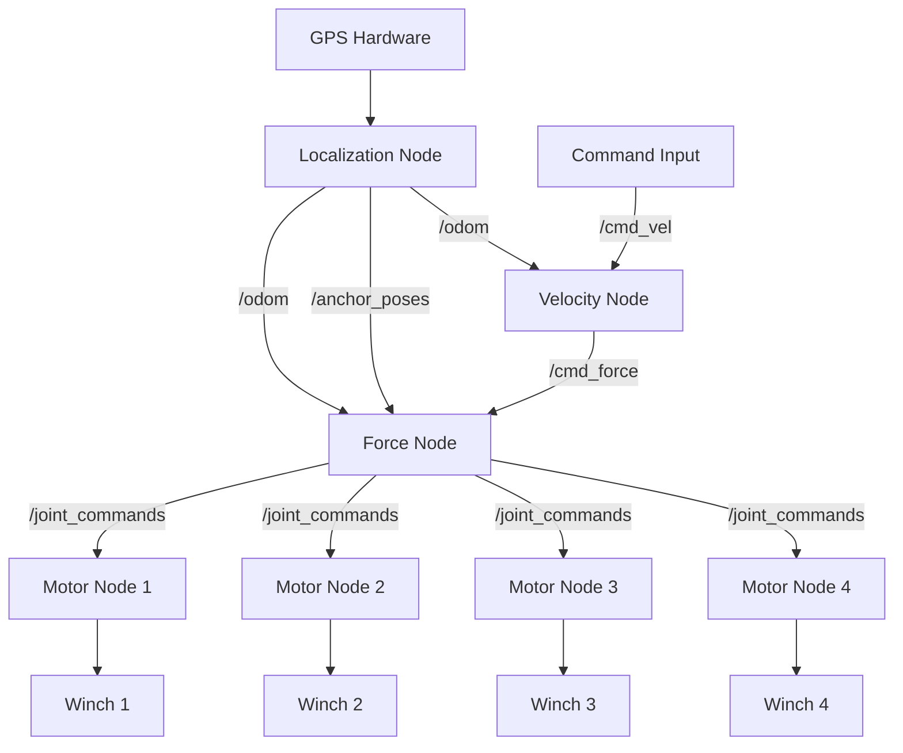
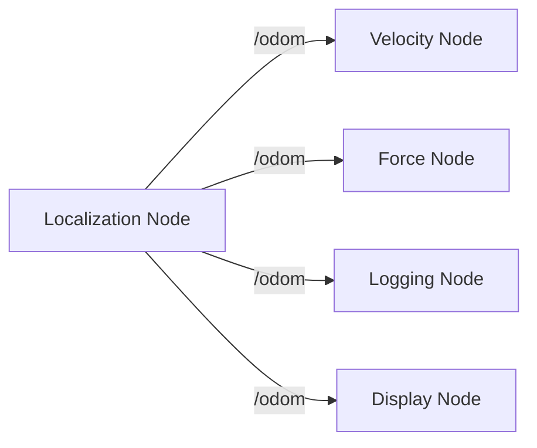
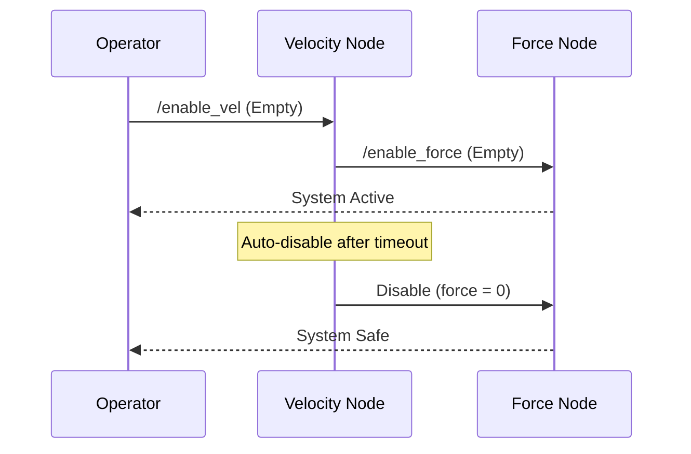
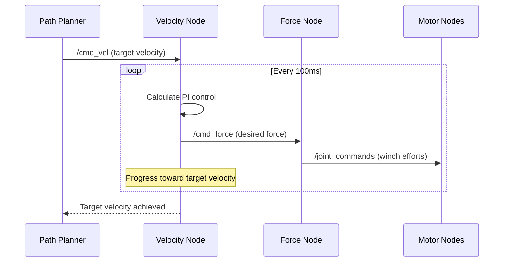

```mermaid
graph TB
    subgraph Marine["Marine Robotics"]
        SONAR[Sonar] --> MLOC[Localization]
        MLOC --> MNAV[Navigation]
        MNAV --> MTHRUST[Thruster Control]
    end

    subgraph Industrial["Industrial Automation"]
        LIDAR[LIDAR] --> ILOC[Localization]
        ILOC --> IPATH[Path Planning]
        IPATH --> IWHEELS[Wheel Control]
    end

    subgraph Automotive["Automotive"]
        AGPS[GPS/IMU] --> ALOC[Localization]
        ALOC --> APLANNER[Path Planner]
        APLANNER --> ASTEERING[Steering Control]
    end
```

# Module 1 Visual Aids Specification

This document specifies the visual aids needed for Module 1: Introduction to ROS2, based on the actual dredging raft system architecture.

---

## Required Visual Aids

### 1. Dredging System Overview Diagram

**Purpose**: Show the complete 4-winch dredging system architecture  
**Usage**: Section 1 - Hook (System Overview)  
**Duration**: 2 minutes

#### Content Requirements:

- **4 Electric Winches**: Positioned at corners of floating raft
- **RTK GPS Unit**: Central positioning system
- **Dredging Unit**: Equipment being dragged across lake bottom
- **Central Controller**: ROS2-based coordination system
- **Cables/Connections**: Show physical connections between components

#### Visual Style:

- **Format**: Diagram or technical illustration
- **Perspective**: Top-down view showing raft layout
- **Labels**: Clear component identification
- **Colors**: Professional technical drawing style
- **Size**: Full screen presentation slide

#### Key Messages:

- "4 independent winches working as one system"
- "Centimeter-level GPS precision"
- "Systematic coordination through ROS2"

---

### 2. Coverage Pattern Animation/Diagram

**Purpose**: Demonstrate systematic area coverage patterns  
**Usage**: Section 1 - Hook (Coordination Magic)  
**Duration**: 2 minutes

#### Content Requirements:

- **Coverage Patterns**: Lawn mower, spiral, or grid patterns
- **Raft Movement**: Show how 4 winches coordinate to create movement
- **Area Coverage**: Visual representation of systematic vs. random coverage
- **Progress Indication**: Show completion percentage or covered area

#### Visual Style:

- **Format**: Animation (preferred) or sequence of diagrams
- **View**: Overhead view of lake/work area
- **Colors**: Covered area in one color, uncovered in another
- **Movement**: Smooth animation showing coordinated winch action

#### Key Messages:

- "Systematic patterns ensure complete coverage"
- "Four winches coordinate to create precise movement"
- "No gaps or overlaps in coverage"

---

### 3. ROS2 Distributed Architecture Diagram

**Purpose**: Show how ROS2 nodes communicate in the dredging system  
**Usage**: Section 2 - ROS2 Ecosystem (Distributed Architecture)  
**Duration**: 4 minutes

#### Mermaid Diagram:



#### Visual Style:

- **Format**: Mermaid flowchart rendered as clean diagram
- **Nodes**: Rectangular boxes with clear labels
- **Connections**: Arrows showing data flow direction with topic names
- **Colors**: Different colors for different node types (sensors, controllers, actuators)
- **Text**: Large, readable fonts for presentation

#### Key Messages:

- "Layered control architecture: GPS → Position → Velocity → Force → Motors"
- "Each node has single responsibility"
- "Components communicate through named topics"

---

### 4. Communication Pattern Diagrams (Set of 4)

**Purpose**: Visualize each ROS2 communication pattern with real examples  
**Usage**: Section 3 - Communication Patterns  
**Duration**: 8 minutes (2 minutes each)

#### 4a. Publishers/Subscribers (Pub/Sub)

**Mermaid Diagram**:



**Visual Elements**:

- One publisher (Localization) broadcasting to multiple subscribers
- Data flow arrows showing one-to-many relationship
- Topic name (/odom) clearly labeled
- "Radio broadcast" analogy visualization

#### 4b. Services (Request/Response)

**Mermaid Diagram**:



**Visual Elements**:

- Sequence diagram showing request/response flow
- Synchronous timing indication
- Safety timeout mechanism
- "Phone call" analogy visualization

#### 4c. Actions (Long-running Operations)

**Mermaid Diagram**:



**Visual Elements**:

- Control loop showing continuous feedback
- Progress indication over time
- Goal, feedback, and result phases
- "Package tracking" analogy visualization

#### 4d. Parameters (Configuration)

**Content**:

```yaml
# Localization Node Parameters
localization_node:
  ros__parameters:
    earth_radius: 6371000.0
    coordinate_frame: "map"

# Velocity Node Parameters
vel_node:
  ros__parameters:
    kp_gain: 0.01
    ki_gain: 0.01
    max_integral: 10.0

# Force Node Parameters
force_node:
  ros__parameters:
    mult: [1.1, 1.0, 1.0, 1.0]
    deadzone_force_passive: 0.2
    deadzone_force_active: 1.1
    tightening_force: 0.7
```

**Visual Elements**:

- Configuration file representation for multiple nodes
- "Tool setup" analogy visualization
- Emphasis on "set once, use throughout"

---

### 5. Communication Pattern Selection Table

**Purpose**: Quick reference for when to use each pattern  
**Usage**: Section 3 - Communication Patterns (Pattern Selection)  
**Duration**: 30 seconds

#### Content Requirements:

| Pattern       | Use When                            | Dredging Example                                 |
| ------------- | ----------------------------------- | ------------------------------------------------ |
| **Pub/Sub**   | Continuous data, multiple listeners | GPS position, odometry data                      |
| **Service**   | Immediate response needed           | System enable/disable, status check              |
| **Action**    | Long operation with progress        | Velocity control loop, coverage execution        |
| **Parameter** | System configuration                | PI gains, coordinate settings, winch calibration |

#### Visual Style:

- **Format**: Clean table with clear borders
- **Colors**: Alternating row colors for readability
- **Text**: Large fonts suitable for presentation
- **Emphasis**: Bold pattern names

---

### 6. Cross-Domain Comparison Diagram

**Purpose**: Show ROS2 patterns apply across different robotics domains  
**Usage**: Section 4 - Dyno Projects Gallery  
**Duration**: 3 minutes

#### Content Requirements:

- **Marine Robotics**: AUV with 4 thrusters (same layered control as dredging)
- **Industrial Automation**: Warehouse robot with systematic coverage
- **Automotive**: Autonomous vehicle with sensor fusion and control layers

#### Mermaid Diagram:



#### Key Messages:

- "Same layered architecture across domains"
- "Universal ROS2 communication patterns"
- "Transferable knowledge and skills"

---

### 7. ROS2 Ecosystem Scope Comparison

**Purpose**: Clarify what ROS2 provides vs. what you must provide  
**Usage**: Section 2 - ROS2 Ecosystem (Ecosystem Scope)  
**Duration**: 3 minutes

#### Content Requirements:

**What ROS2 Provides:**

- Communication infrastructure (topics, services, actions)
- Development tools (debugging, visualization)
- Hardware abstraction (sensor/actuator interfaces)
- Community packages (navigation, control, perception)

**What ROS2 Doesn't Provide:**

- Specific algorithms (PI control tuning, coverage patterns)
- Hardware drivers (GPS receivers, motor controllers)
- User interfaces (operator control panels)
- Domain knowledge (marine operations, dredging expertise)

#### Visual Style:

- **Format**: Two-column comparison
- **Colors**: Green for "provides", orange for "doesn't provide"
- **Icons**: Simple icons to represent each category
- **Balance**: Equal visual weight to both columns

---

## Presentation Guidelines

### Mermaid Diagram Standards

- **Rendering**: Use Mermaid-compatible presentation tools or pre-render as SVG/PNG
- **Colors**: Consistent color scheme across all diagrams
- **Font Size**: Large enough for back-row visibility
- **Complexity**: Keep diagrams simple enough to understand quickly

### Slide Design Standards

- **Font**: Sans-serif, minimum 24pt for body text, 36pt for headings
- **Colors**: High contrast for readability
- **Background**: Clean, professional (white or light gray)
- **Branding**: Include Dyno Robotics logo consistently
- **Spacing**: Generous white space, not cluttered

### Animation Guidelines

- **Timing**: Smooth, not distracting
- **Purpose**: Support explanation, don't overwhelm
- **Control**: Presenter-controlled advancement
- **Fallback**: Static versions available if animation fails

### Technical Requirements

- **Resolution**: 1920x1080 minimum
- **Format**: PowerPoint (.pptx) with Mermaid plugin or pre-rendered diagrams
- **Backup**: Static images available separately
- **Testing**: Verify Mermaid rendering on presentation equipment

---

## Mermaid Diagram Implementation

### Recommended Tools

- **Mermaid Live Editor**: For creating and testing diagrams
- **PowerPoint Mermaid Plugin**: For direct integration
- **Pre-rendered SVG**: For maximum compatibility
- **GitHub/GitLab**: For version control of diagram source

### Diagram Source Files

Store Mermaid source code separately for easy editing:

```
docs/session1/diagrams/
├── architecture.mmd
├── pubsub-example.mmd
├── service-example.mmd
├── action-example.mmd
└── cross-domain.mmd
```

### Fallback Strategy

- Always have PNG/SVG versions ready
- Test Mermaid rendering before presentation
- Have simplified ASCII diagrams as backup
- Prepare hand-drawn whiteboard versions if needed

---

## Creation Checklist

### Pre-Production

- [ ] Review module content and timing requirements
- [ ] Test Mermaid diagram rendering in presentation environment
- [ ] Gather reference materials (photos, technical specs)
- [ ] Confirm presentation equipment capabilities

### Diagram Creation

- [ ] Create all Mermaid source files
- [ ] Test rendering in multiple tools
- [ ] Generate high-resolution static versions
- [ ] Verify readability at presentation size

### Quality Assurance

- [ ] Review diagrams with domain expert
- [ ] Test with sample audience for clarity
- [ ] Verify technical accuracy of node relationships
- [ ] Confirm timing fits presentation schedule

### Delivery Preparation

- [ ] Package all diagram formats
- [ ] Test on actual presentation equipment
- [ ] Prepare backup static versions
- [ ] Brief presenter on diagram navigation
