# ROS2 Workshop Modular Architecture

## Overview

This document outlines the modular architecture for Dyno Robotics' ROS2 workshop, designed for maximum reusability across different client domains while maintaining a solid educational foundation.

## Workshop Structure

## Module Dependencies

## Module Readiness Status

```mermaid
graph TB
    subgraph "✅ Ready (Based on Phase 1-4 Analysis)"
        A1[Setup<br/>Docker, VSCode, Package Creation]
        A2[Code Structure<br/>File System, Launch Files, Best Practices]
        A3[Debugging<br/>Logger, Terminal Commands, Common Mistakes]
        A4[Docker<br/>Compose, Container Patterns]
        A5[Testing<br/>Unit Tests, Integration Tests, CI/CD]
    end
    
    subgraph "🔄 Needs Development"
        B1[Intro<br/>Dyno Projects Showcase]
        B2[Robot<br/>URDF, TF2, Rviz2, ros2_control]
        B3[Simulation<br/>Gazebo, Teleop, SLAM+NAV2]
        B4[HW Sensor<br/>Driver Examples, Custom Drivers]
        B5[Network<br/>DDS, Zenoh Integration]
        B6[py-trees<br/>Behavior Trees, Coordination]
    end
    
    subgraph "📚 Content Ready"
        C1[Learn More<br/>Documentation, Resources, Community]
        C2[Advanced<br/>Multithreading, Namespacing, CMake]
    end
    
    classDef ready fill:#2e7d32,stroke:#1b5e20,stroke-width:2px,color:#ffffff
    classDef development fill:#f57c00,stroke:#e65100,stroke-width:2px,color:#ffffff
    classDef content fill:#0277bd,stroke:#01579b,stroke-width:2px,color:#ffffff
    
    class A1,A2,A3,A4,A5 ready
    class B1,B2,B3,B4,B5,B6 development
    class C1,C2 content
```

## Client Customization Strategy

## Module Content Overview

## Detailed Module Breakdown

### Session 1: Foundation (4 hours)

#### Module 1: Intro (30 min)
**Status**: 🔄 Needs Dyno Robotics project showcase

**Content**:
- ROS ecosystem overview
- Basic concepts: pub/sub, actions, services, parameters
- Show existing Dyno Robotics projects

**Learning Objectives**:
- Understand ROS2 ecosystem scope
- Recognize common robotics patterns
- See real-world applications

**Customization Points**:
- Marine: AUV coordination projects
- Industrial: Factory automation examples
- Automotive: Autonomous vehicle systems

#### Module 2: Setup (45 min)
**Status**: ✅ Ready (Phase 1 analysis complete)

**Content**:
- Docker development environment
- VSCode configuration and extensions
- Create ROS2 package (Python + C++)
- Basic pub/sub implementation

**Learning Objectives**:
- Set up development environment
- Understand package structure
- Implement basic communication

**Infrastructure**:
- Docker compose files
- VSCode dev containers
- Template packages

#### Module 3: Code Structure (60 min)
**Status**: ✅ Ready (Phase 2 analysis complete)

**Content**:
- File system structure and conventions
- Launch files and bringup patterns
- Parameter files (YAML configuration)
- Best practices and coding standards

**Learning Objectives**:
- Organize ROS2 projects effectively
- Use launch systems for complex setups
- Configure systems with parameters

**Examples**:
- Multi-node launch files
- Parameter hierarchies
- Package dependencies

#### Module 4: Debugging (45 min)
**Status**: ✅ Ready (Phase 3 analysis complete)

**Content**:
- Logger usage and levels
- Terminal commands (ros2 topic, service, param)
- rqt tools for visualization
- ros2 bag for data recording
- Common mistakes and solutions

**Learning Objectives**:
- Debug ROS2 systems effectively
- Use introspection tools
- Record and replay data

**Tools**:
- VSCode debugging setup
- rqt_graph, rqt_console
- ros2 bag workflows

### Session 2: Application (4 hours)

#### Module 5: Robot (60 min)
**Status**: 🔄 Needs development

**Content**:
- URDF robot modeling
- TF2 coordinate transforms
- Rviz2 visualization
- ros2_control introduction

**Learning Objectives**:
- Model robots in URDF
- Understand coordinate frames
- Visualize robot state
- Control robot joints

**Customization Examples**:
- Marine: Underwater vehicle models
- Industrial: Robotic arm configurations
- Automotive: Vehicle chassis models

#### Module 6: Simulation (60 min)
**Status**: 🔄 Needs development

**Content**:
- Gazebo simulation setup
- Teleop control interfaces
- SLAM and NAV2 basics

**Learning Objectives**:
- Simulate robot environments
- Control robots remotely
- Navigate autonomously

**Customization Examples**:
- Marine: Underwater environments
- Industrial: Factory floor layouts
- Automotive: Urban road networks

#### Module 7: HW Sensor (60 min)
**Status**: 🔄 Needs development

**Content**:
- Docker configuration for hardware
- Using existing ROS2 drivers (LIDAR example)
- Writing custom drivers from datasheets
- Standard vs custom message types

**Learning Objectives**:
- Interface with real hardware
- Understand driver patterns
- Choose appropriate message types

**Examples**:
- LIDAR integration
- Camera drivers
- IMU sensors

#### Module 8: Learn More (20 min)
**Status**: 📚 Content ready

**Content**:
- ROS2 documentation resources
- Articulated Robotics YouTube channel
- Open source community
- ROSCon conferences

**Learning Objectives**:
- Find learning resources
- Engage with community
- Continue self-directed learning

### Advanced Modules (Optional)

#### Module 9: Docker (Advanced)
**Status**: ✅ Ready

**Content**:
- Docker compose for multi-container setups
- Container registries
- Production deployment patterns

**Learning Objectives**:
- Scale ROS2 deployments
- Manage container dependencies
- Deploy to production

#### Module 10: Network (Advanced)
**Status**: 🔄 Needs development

**Content**:
- DDS configuration and tuning
- Zenoh integration for efficient communication
- Multi-robot networking

**Learning Objectives**:
- Optimize network performance
- Enable multi-robot systems
- Handle network constraints

**Connection to Underwater Pipeline Repair**:
- Zenoh for bandwidth-limited underwater communication
- Multi-AUV coordination patterns

#### Module 11: Testing (Advanced)
**Status**: ✅ Ready (Phase 4 analysis complete)

**Content**:
- Unit testing with pytest/gtest
- Integration testing patterns
- CI/CD with GitHub Actions
- Test-driven development

**Learning Objectives**:
- Write reliable ROS2 code
- Automate testing workflows
- Ensure code quality

**Note**: "Dyno almost never tests using code except when i try myself" - this module addresses a key gap

#### Module 12: py-trees (Advanced)
**Status**: 🔄 Needs development

**Content**:
- Behavior tree fundamentals
- py-trees ROS2 integration
- Coordination patterns
- Visual debugging with py_trees_ros_viewer

**Learning Objectives**:
- Design hierarchical behaviors
- Coordinate multiple robots
- Debug complex behaviors visually

**Connection to Underwater Pipeline Repair**:
- Simplified AUV mission coordination
- Team behavior patterns
- Fault tolerance through behavior trees

## Development Roadmap

### Phase 1: Complete Missing Core Modules
1. **Robot Module** - URDF, TF2, Rviz2 basics
2. **Simulation Module** - Gazebo integration
3. **HW Sensor Module** - Driver patterns and examples

### Phase 2: Advanced Module Development
1. **Network Module** - DDS and Zenoh integration
2. **py-trees Module** - Behavior tree coordination

### Phase 3: Client Customization
1. **Marine Examples** - Underwater robotics focus
2. **Industrial Examples** - Factory automation focus
3. **Automotive Examples** - Vehicle systems focus

### Phase 4: Content Refinement
1. **Intro Module** - Dyno project showcase
2. **Documentation** - Self-study materials
3. **Assessment** - Learning validation

## Implementation Notes

### Collaborative Individuation Integration
- **Pattern Synthesizer**: Template-based module development
- **Reality Anchor**: Hardware constraints and real-world testing
- **Systems Integrator**: Multi-module coordination exercises
- **Critical Filter**: Code review and testing practices

### Reusability Strategy
- **Core modules** remain universal across all clients
- **Application modules** use configurable examples
- **Advanced modules** provide expansion paths
- **Documentation** supports self-directed learning

### Quality Assurance
- Each module includes hands-on exercises
- Progressive complexity building on previous modules
- Real hardware integration where possible
- Visual feedback through simulation and tools

This modular architecture enables Dyno Robotics to deliver consistent, high-quality ROS2 education while adapting to specific client needs and domains.
