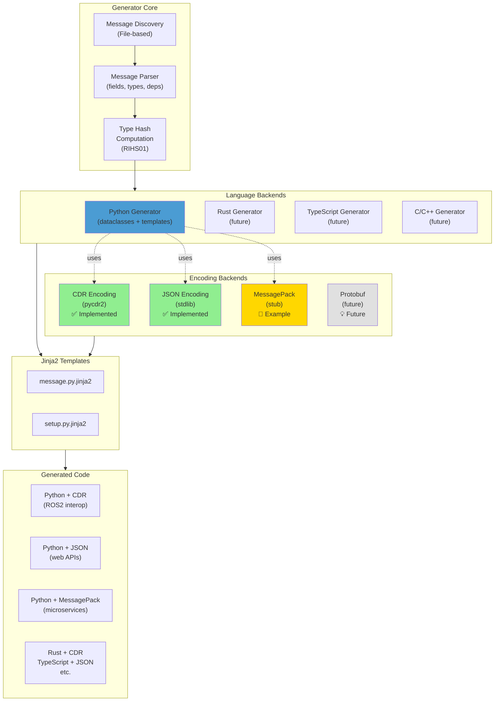
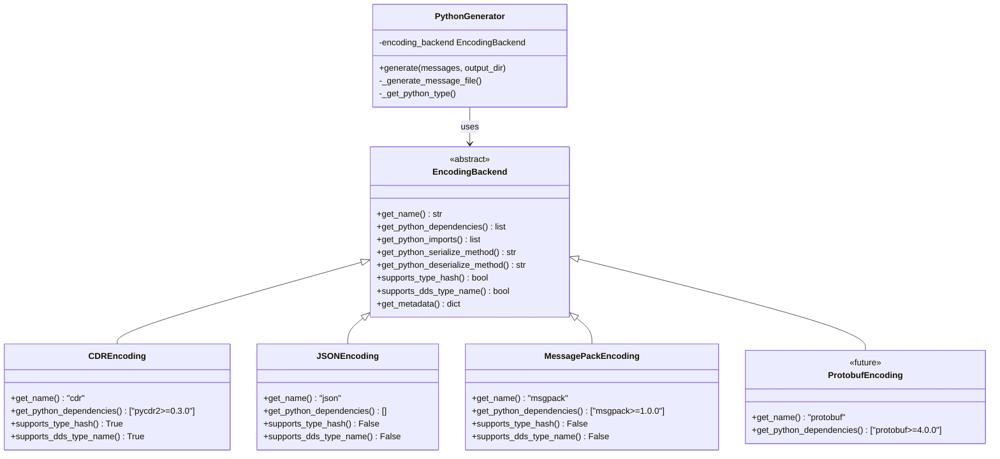
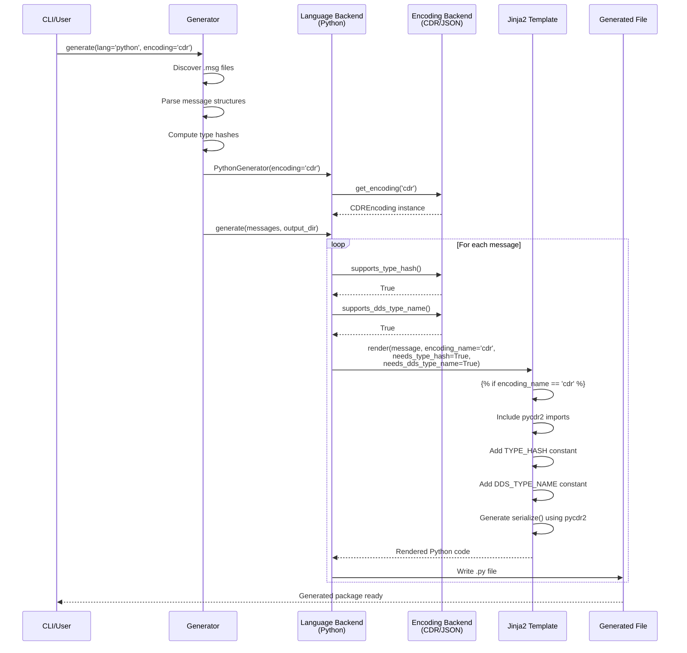
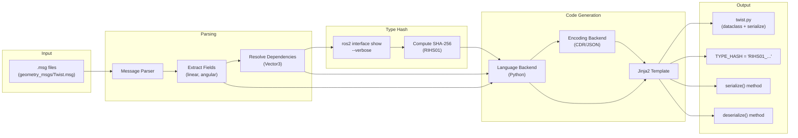
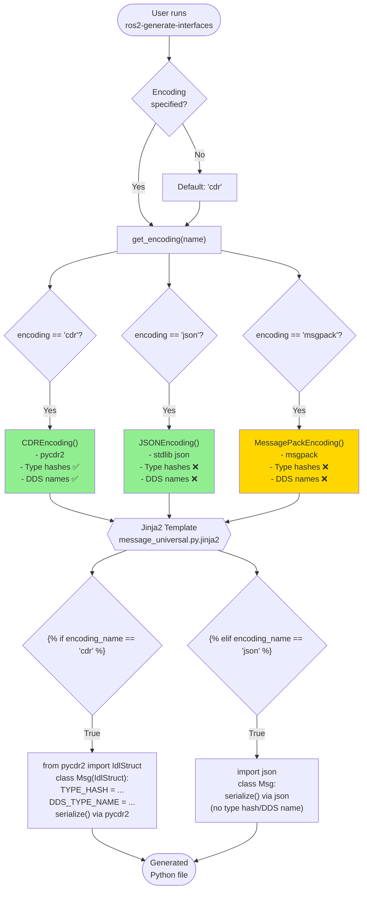
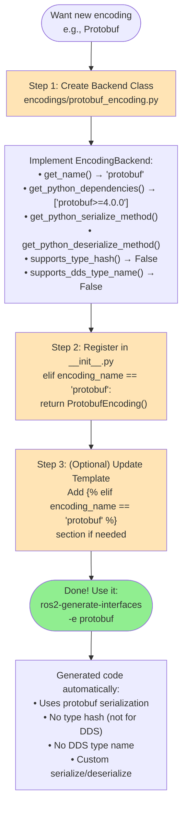
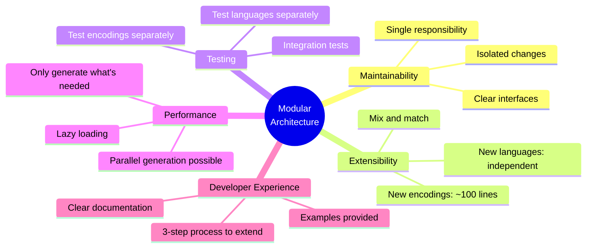

# ROS2 Interface Generator - Architecture

## System Architecture

## Encoding Backend Architecture

## Code Generation Flow

## Package Structure

```mermaid
graph TD
    Root["ros2_interface_generator/"]
    
    Root --> Core["ros2_interface_generator/"]
    Root --> Bin["bin/"]
    Root --> Tests["tests/"]
    Root --> Docs["Documentation"]
    
    Core --> Gen["generator.py<br/>(Core logic)"]
    Core --> PkgLists["package_lists.py<br/>(Presets)"]
    Core --> LangDir["languages/"]
    Core --> EncDir["encodings/"]
    Core --> TmplDir["templates/"]
    
    LangDir --> PyGen["python.py<br/>(Python generator)"]
    LangDir --> RustGen["rust.py<br/>(future)"]
    
    EncDir --> EncInit["__init__.py<br/>(Factory)"]
    EncDir --> EncBase["base.py<br/>(Abstract base)"]
    EncDir --> EncCDR["cdr.py<br/>(CDR impl ✅)"]
    EncDir --> EncJSON["json_encoding.py<br/>(JSON impl ✅)"]
    EncDir --> EncMsgPack["msgpack_encoding.py<br/>(Stub 🚧)"]
    
    TmplDir --> PyTmpl["python/"]
    PyTmpl --> MsgTmpl["message.py.jinja2"]
    PyTmpl --> SetupTmpl["setup.py.jinja2"]
    
    Bin --> CLI["ros2-generate-interfaces<br/>(CLI tool)"]
    
    Tests --> TestBasic["test_basic.py"]
    Tests --> TestPy["test_python_generation.py"]
    Tests --> TestE2E["test_end_to_end.py"]
    
    Docs --> README["README.md"]
    Docs --> EncArch["ENCODING_ARCHITECTURE.md"]
    Docs --> EncExample["ENCODING_EXAMPLE.md"]
    Docs --> FuturePf["FUTURE_PROOFING_SUMMARY.md"]
    
    style EncCDR fill:#90EE90
    style EncJSON fill:#90EE90
    style EncMsgPack fill:#FFD700
    style PyGen fill:#4B9CD3
```

## Message Generation Process

## Encoding Selection Flow

## Adding a New Encoding

## Encoding Comparison Matrix

| Feature              | CDR ✅ | JSON ✅ | MessagePack 🚧 | Protobuf 💡 |
|----------------------|--------|---------|----------------|-------------|
| **Implementation**   | Full   | Full    | Stub/Example   | Future      |
| **Binary Format**    | ✅     | ❌      | ✅             | ✅          |
| **Compact**          | ✅     | ❌      | ✅             | ✅          |
| **Human Readable**   | ❌     | ✅      | ❌             | ❌          |
| **ROS2 Compatible**  | ✅     | ❌      | ❌             | ❌          |
| **Type Hash**        | ✅     | ❌      | ❌             | ❌          |
| **DDS Interop**      | ✅     | ❌      | ❌             | ❌          |
| **Zero Deps**        | ❌     | ✅      | ❌             | ❌          |
| **Schema-based**     | ✅     | ❌      | ❌             | ✅          |
| **Use Case**         | ROS2   | Web APIs| Microservices  | gRPC/Proto  |

## Key Design Principles

### 1. Separation of Concerns
- **Language backends** handle syntax and structure (Python dataclasses, Rust structs, etc.)
- **Encoding backends** handle serialization logic (CDR, JSON, MessagePack, etc.)
- Neither knows about the other's implementation details

### 2. Extensibility
- Adding a new language: Create class in `languages/`
- Adding a new encoding: Create class in `encodings/`
- Both follow abstract base classes

### 3. Flexibility
- Any language can use any encoding
- `Python + CDR` for ROS2 interop
- `Python + JSON` for web APIs
- `Rust + CDR` for performance
- `TypeScript + JSON` for browser apps

### 4. Template-driven
- Jinja2 templates receive encoding metadata
- Templates adapt to encoding capabilities
- `` conditionals

### 5. Type Safety
- Abstract base classes define contracts
- Type hints throughout
- Compile-time checking where possible

## Benefits

## Future Roadmap

1. **Complete MessagePack** - Finish the stub implementation
2. **Add Protobuf** - For gRPC and cross-platform
3. **Rust Backend** - Generate Rust code with CDR
4. **TypeScript Backend** - Generate TS code with JSON
5. **Service/Action Support** - Beyond just messages
6. **Performance Optimization** - Parallel generation, caching
7. **Plugin System** - User-defined backends

---

See also:
- [ENCODING_ARCHITECTURE.md](ENCODING_ARCHITECTURE.md) - Detailed architecture guide
- [ENCODING_EXAMPLE.md](ENCODING_EXAMPLE.md) - Quick-start for adding encodings
- [README.md](README.md) - User documentation

