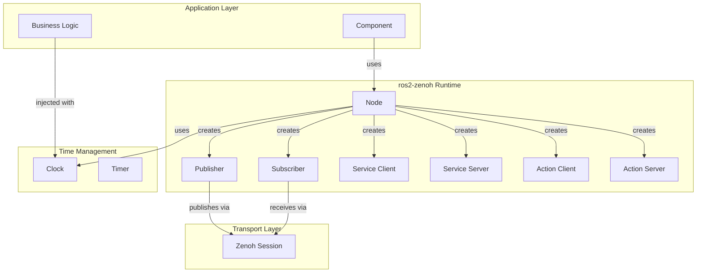

# ROS2 Zenoh Multi-Language Ecosystem Plan

**Status:** Design Phase  
**Last Updated:** 2025-01-23  
**Vision:** LLM-optimized, multi-language ROS2 framework with TypeScript-based tooling

---

## Table of Contents

1. [Executive Summary](#executive-summary)
2. [Architecture Overview](#architecture-overview)
3. [Documentation-Driven Development Workflow](#documentation-driven-development-workflow)
4. [Phase 0: Documentation Foundation](#phase-0-documentation-foundation-obsidian-vault)
5. [Phase 1: Testing Infrastructure (Python)](#phase-1-testing-infrastructure-python)
6. [Phase 2: TypeScript Interface Generator](#phase-2-typescript-interface-generator)
7. [Phase 3: Pattern Library & Code Generation](#phase-3-pattern-library--code-generation)
8. [Phase 4: MCP Server](#phase-4-mcp-server)
9. [Phase 5: Multi-Language Implementations](#phase-5-multi-language-implementations)
10. [LLM Optimization Strategy](#llm-optimization-strategy)
11. [Timeline & Priorities](#timeline--priorities)

---

## Executive Summary

### Goals

1. **Documentation-Driven Development**: Specifications in Obsidian as source of truth
2. **Multi-Language Support**: Python, Rust, C, TypeScript implementations of ros2_zenoh
3. **LLM-First Design**: Optimized for code generation with Claude, Cursor, and other LLMs
4. **Domain-Driven Design**: Explicit domain models, ubiquitous language, bounded contexts
5. **TypeScript Tooling**: Universal MCP server and interface generator
6. **Pattern-Based Generation**: Dual-mode (deterministic + LLM) code generation
7. **Browser Support**: Generate code and inspect systems from web browser

### Key Decisions

- **Documentation as Source of Truth**: Obsidian vault with YAML frontmatter and Diátaxis structure
- **Documentation-Driven Workflow**: Write description → Generate spec → Generate code → Implement → Test
- **Domain-Driven Design**: Explicit entities, value objects, aggregates, and ubiquitous language
- **TypeScript for Tooling**: MCP server, interface generator, pattern library (universal)
- **Language-Specific Implementations**: Each language has idiomatic package (Python, Rust, C, TS)
- **TypeScript as IR**: Use TypeScript + YAML as intermediate representation for cross-language generation
- **AST-Based Generation**: Not Jinja templates - use Python/TypeScript AST manipulation
- **Monorepo**: Single repository for all languages + shared tooling
- **ROS2 Workspace Overlay Support**: Respect AMENT_PREFIX_PATH in TypeScript tools
- **Obsidian + MCP Integration**: Cursor/Claude can read vault, generate from specs

---

## Architecture Overview

### Repository Structure

```
ros2-zenoh/                        # Monorepo root
├── docs/                          # Obsidian vault (SOURCE OF TRUTH)
│   ├── .obsidian/
│   │   ├── plugins/
│   │   │   ├── templater/
│   │   │   ├── dataview/
│   │   │   └── linter/
│   │   └── templates/
│   │       ├── pattern.md
│   │       ├── component-spec.md
│   │       ├── tutorial.md
│   │       └── howto.md
│   ├── 00-Index/
│   │   ├── README.md
│   │   ├── Architecture-MOC.md
│   │   ├── Patterns-MOC.md
│   │   ├── Ubiquitous-Language.md
│   │   └── Domain-Model.md
│   ├── 01-Concepts/              # Diátaxis: Explanation
│   │   ├── Component-Lifecycle.md
│   │   ├── Immutable-State.md
│   │   └── Dependency-Injection.md
│   ├── 02-Tutorials/             # Diátaxis: Tutorial
│   │   ├── Getting-Started.md
│   │   └── First-Component.md
│   ├── 03-HowTo/                 # Diátaxis: How-To
│   │   ├── Handle-Large-Data.md
│   │   └── Test-With-Sim-Time.md
│   ├── 04-Reference/             # Diátaxis: Reference
│   │   └── API/
│   ├── 05-Patterns/              # Executable patterns
│   │   ├── Basic-Component.md
│   │   └── Image-Processing.md
│   └── 06-Specs/                 # Component specifications
│       ├── ObstacleAvoidance.md
│       └── ImageProcessor.md
│
├── mcp-server/                    # TypeScript - Universal MCP server
│   ├── src/
│   │   ├── tools/                 # MCP tool implementations
│   │   │   ├── documentation.ts   # Doc-driven tools
│   │   │   ├── generate.ts        # Code generation
│   │   │   ├── inspect.ts         # Runtime inspection
│   │   │   └── debug.ts           # Debugging tools
│   │   ├── obsidian/              # Obsidian integration
│   │   │   ├── reader.ts          # Read vault documents
│   │   │   └── spec_parser.ts     # Parse specs from markdown
│   │   ├── domain/                # Domain model extraction
│   │   │   └── analyzer.ts
│   │   ├── patterns/              # Multi-language patterns
│   │   ├── generators/            # Code generators
│   │   ├── introspection/         # Runtime inspection
│   │   └── server.ts
│   └── package.json
│
├── interface-generator/           # TypeScript - Message/service generator
│   ├── src/
│   │   ├── parsers/               # .msg/.srv/.action parsers
│   │   │   ├── msg.ts
│   │   │   ├── srv.ts
│   │   │   └── action.ts
│   │   ├── ir/                    # Intermediate representation
│   │   │   └── message.ts
│   │   ├── generators/            # Language-specific generators
│   │   │   ├── python.ts
│   │   │   ├── rust.ts
│   │   │   ├── c.ts
│   │   │   └── typescript.ts
│   │   ├── introspection/         # Workspace scanning
│   │   │   └── workspace.ts       # ROS2 overlay resolution
│   │   ├── hasher/                # RIHS01 type hashing
│   │   │   └── rihs.ts
│   │   ├── cli.ts                 # CLI interface
│   │   └── browser.ts             # Browser bundle entry
│   └── package.json
│
├── patterns/                      # Pattern library (language-agnostic concepts)
│   ├── README.md                  # Human-readable catalog
│   ├── INDEX.json                 # Machine-readable metadata
│   ├── CHANGELOG.md               # Pattern evolution
│   ├── specs/                     # TypeScript + YAML specs
│   │   ├── component_basic.yaml   # Structure
│   │   └── component_basic.ts     # Behavior (executable!)
│   └── validation/
│       └── test_patterns.ts       # Validate patterns work
│
├── python/                        # Python implementation
│   ├── ros2_zenoh_python/
│   │   ├── __init__.py
│   │   ├── node.py
│   │   ├── publisher.py
│   │   ├── subscription.py
│   │   ├── testing/               # Testing utilities (Phase 1)
│   │   │   ├── clock.py
│   │   │   └── mocks.py
│   │   └── _bundled_msgs/
│   ├── tests/
│   ├── examples/
│   └── pyproject.toml
│
├── rust/                          # Rust implementation (generated from specs)
│   ├── ros2-zenoh-rust/
│   │   ├── src/
│   │   ├── tests/
│   │   └── examples/
│   └── Cargo.toml
│
├── c/                             # C implementation (for embedded/buildroot)
│   ├── ros2_zenoh_c/
│   │   ├── include/
│   │   ├── src/
│   │   ├── tests/
│   │   └── examples/
│   └── CMakeLists.txt
│
├── typescript/                    # TypeScript/JavaScript implementation
│   ├── ros2-zenoh-ts/
│   │   ├── src/
│   │   ├── tests/
│   │   └── examples/
│   └── package.json
│
├── docs/                          # Shared documentation
│   ├── concepts/                  # Language-agnostic concepts
│   ├── architecture/              # Design docs
│   ├── AI_ARCHITECTURE.md         # LLM quick reference
│   ├── TESTING_GUIDE.md           # Testing best practices
│   └── PATTERNS.md                # Pattern catalog
│
├── .cursorrules                   # Cursor AI rules for the project
└── README.md
```

### Data Flow

```
1. DOCUMENT (Obsidian)
   Human writes intent in markdown
       ↓
2. ANALYZE (MCP)
   Extract domain model, requirements
       ↓
3. SPECIFY (MCP + Human)
   Generate formal spec with YAML frontmatter
   Human reviews and refines
       ↓
4. GENERATE (MCP)
   Pattern Library + Spec → Code
       ↓
       ├─→ Simple Generator (AST) → Deterministic output
       └─→ LLM Generator (few-shot) → Adaptive output
       ↓
5. IMPLEMENT
   Language-Specific Code + Tests + Docs
       ↓
6. SYNC (MCP)
   Keep spec ↔ code synchronized
```

---

## Documentation-Driven Development Workflow

**Primary development process for all components**

### Workflow Overview

This is the recommended workflow for building any component in the ros2-zenoh ecosystem:

```
Write → Analyze → Specify → Review → Generate → Implement → Test → Sync
```

### Step-by-Step Process

#### Step 1: Document Your Intent

**Tool:** Obsidian (human authoring)

**Create a draft in:** `docs/06-Specs/DRAFT-ComponentName.md`

```markdown
---
id: draft:component-name
title: Component Name (Draft)
type: draft
status: in-progress
---

# What I Want

Brief description of what the component should do.

## Requirements
- Functional requirements
- Performance requirements
- Safety constraints

## Behavior
Describe how it should work

## Context
- System integration
- Dependencies
- Constraints
```

#### Step 2: Analyze Documentation

**MCP Tool:** `analyze_documentation`

**Usage in Cursor:**
```
User: "Analyze my component draft"
Claude via MCP: 
  - Extracts domain concepts
  - Identifies inputs/outputs
  - Suggests appropriate pattern
  - Highlights potential issues
```

**Output:**
- Domain model sketch
- Suggested pattern
- Required state
- Test requirements
- Next steps

#### Step 3: Generate Formal Specification

**MCP Tool:** `create_spec_from_doc`

**Usage:**
```bash
ros2-zenoh create-spec from-doc DRAFT-ComponentName.md --interactive
```

**Generates:** Formal specification with:
- Complete YAML frontmatter
- Domain model (entities, value objects, aggregates)
- I/O specifications
- State definition
- Behavior rules in TypeScript
- Quality attributes
- Test requirements

**Location:** `docs/06-Specs/ComponentName.md`

#### Step 4: Review & Refine

**MCP Tool:** `review_spec`

**Validation checks:**
- Completeness (all required sections)
- Domain model validity
- Safety requirements (if safety-critical)
- Testability assessment
- Consistency with ubiquitous language

**Human action:** Edit spec in Obsidian based on review feedback

#### Step 5: Generate Implementation

**MCP Tool:** `generate_from_spec`

**Usage:**
```bash
ros2-zenoh generate from-spec ComponentName.md --lang python
```

**Generates:**
- Domain model classes
- Component implementation (from pattern)
- Unit tests
- Integration tests  
- README

**Languages:** Python, Rust, C, TypeScript

#### Step 6: Implement & Test

**Developer actions:**
- Review generated code
- Customize as needed (within pattern constraints)
- Run tests
- Add custom tests for edge cases
- Iterate

**Philosophy:** Generated code provides structure and boilerplate. Developer adds domain-specific logic.

#### Step 7: Keep Synchronized

**MCP Tool:** `sync_spec_to_code`

**Usage:** Automatic or on-demand
```bash
ros2-zenoh sync ComponentName.md component_name/
```

**When spec changes:**
- Detects divergence
- Shows diff
- Offers to regenerate affected code
- Preserves custom modifications (when possible)

### Domain-Driven Design Support

#### Ubiquitous Language

**File:** `docs/00-Index/Ubiquitous-Language.md`

**Purpose:** Single source of truth for domain terminology

**Structure:**
- Entities: Objects with identity
- Value Objects: Immutable descriptors
- Aggregates: Consistency boundaries
- Domain Events: Things that happened
- Business Rules: Invariants and constraints

**MCP Tool:** `validate_ubiquitous_language`

Ensures all specs use consistent terminology.

#### Domain Model Extraction

**MCP Tool:** `extract_domain_model`

Analyzes all specs and creates:
- Domain model diagram (Mermaid)
- Bounded context map
- Aggregate relationships
- Event flows

**Output:** `docs/00-Index/Domain-Model.md`

### Obsidian Integration

#### Required Plugins

**Core:**
- **Templater**: Enforce consistent spec structure
- **Dataview**: Query specs, patterns, dashboards
- **Linter**: Keep markdown clean and LLM-friendly

**Optional:**
- **Periodic Notes**: Changelogs, decision logs
- **Advanced Tables**: Keep tables valid
- **Excalidraw**: Draw domain models

#### Templates

**Pattern Template** (`docs/.obsidian/templates/pattern.md`):
- Enforces pattern structure
- Auto-fills frontmatter
- Includes all required sections

**Spec Template** (`docs/.obsidian/templates/component-spec.md`):
- Complete specification structure
- Domain model sections
- Test requirement checklist

#### Dataview Dashboards

**Pattern Dashboard:**
```dataview
TABLE status, version, tags
FROM "05-Patterns"
WHERE type = "reference"
SORT status DESC, version DESC
```

**Spec Status:**
```dataview
TABLE status, pattern, generate
FROM "06-Specs"
WHERE type = "reference"
SORT status ASC
```

**Safety-Critical Components:**
```dataview
LIST
FROM "06-Specs"
WHERE safety_critical = true
```

### CI/CD Integration

#### Validation Pipeline

```yaml
# .github/workflows/docs-validation.yml
name: Validate Documentation

on: [push, pull_request]

jobs:
  lint-markdown:
    - markdownlint
    - vale (prose style)
    - yamllint (frontmatter)
  
  validate-schemas:
    - JSON Schema validation of frontmatter
    - Check all specs have required fields
  
  check-links:
    - Validate Obsidian [[wikilinks]]
    - Check external URLs
  
  verify-ubiquitous-language:
    - All domain terms defined
    - Consistent usage across specs
  
  test-generation:
    - Generate code from specs (--validate-only)
    - Ensure all specs are generatable
  
  compile-generated-code:
    - Actually compile generated code
    - Run generated tests
```

### MCP Tools Summary

**Documentation-Driven Workflow:**

1. `analyze_documentation` - Analyze draft, suggest pattern
2. `create_spec_from_doc` - Generate formal spec
3. `review_spec` - Validate spec completeness
4. `generate_from_spec` - Generate implementation
5. `sync_spec_to_code` - Keep code synchronized
6. `validate_ubiquitous_language` - Check terminology
7. `extract_domain_model` - Build domain model from specs
8. `trace_requirement` - Doc → Spec → Code → Test

**All integrate with Obsidian vault as source of truth**

---

## Phase 0: Documentation Foundation (Obsidian Vault)

**Goal:** Establish documentation as source of truth before writing code

**Status:** Not started

### 0.1 Initialize Obsidian Vault

**Structure:**

```
docs/
├── .obsidian/
│   ├── plugins/
│   │   ├── templater/
│   │   ├── dataview/
│   │   └── linter/
│   ├── templates/
│   │   ├── pattern.md
│   │   ├── component-spec.md
│   │   ├── tutorial.md
│   │   ├── howto.md
│   │   ├── concept.md
│   │   └── reference.md
│   └── config.json
├── 00-Index/
│   ├── README.md
│   ├── Architecture-MOC.md
│   ├── Patterns-MOC.md
│   ├── Ubiquitous-Language.md
│   └── Domain-Model.md
├── 01-Concepts/
│   ├── Component-Lifecycle.md
│   ├── Immutable-State.md
│   ├── Dependency-Injection.md
│   ├── Simulation-Time.md
│   └── Testing-Philosophy.md
├── 02-Tutorials/
│   ├── Getting-Started.md
│   ├── First-Component.md
│   ├── Testing-With-Mocks.md
│   └── Writing-Specifications.md
├── 03-HowTo/
│   ├── Handle-Large-Data.md
│   ├── Test-With-Sim-Time.md
│   ├── Implement-Lifecycle.md
│   └── Generate-From-Spec.md
├── 04-Reference/
│   ├── API/
│   │   ├── Python.md
│   │   ├── Rust.md
│   │   ├── C.md
│   │   └── TypeScript.md
│   └── ROS2-Messages.md
├── 05-Patterns/
│   ├── Basic-Component.md
│   ├── Stateful-Component.md
│   ├── Image-Processing.md
│   ├── Service-Handler.md
│   └── Action-Server.md
└── 06-Specs/
    └── (initially empty, specs go here)
```

### 0.2 Create Core Documentation

**Ubiquitous Language** (`docs/00-Index/Ubiquitous-Language.md`):

```markdown
---
id: index:ubiquitous-language
title: Ubiquitous Language
type: reference
category: index
summary: Domain terminology for ros2-zenoh ecosystem
---

# Ubiquitous Language

## Core Abstractions

### Node
**Definition:** Container for publishers, subscribers, services, and actions.
**Bounded Context:** ros2-zenoh runtime
**Lifecycle:** Created → Setup → Running → Teardown → Destroyed

### Component
**Definition:** Business logic unit with inputs, outputs, and state.
**Bounded Context:** application layer
**Pattern:** Follows Component pattern with setup/teardown

### Clock
**Definition:** Time source for scheduling and delays.
**Types:**
- WALL_TIME: Real system time
- SIM_TIME_LIVE: `/clock` topic subscription
- SIM_TIME_TEST: Controlled time for testing
**Bounded Context:** time management

## Domain Model

### Entities
(Objects with identity)

**Publisher**: Sends messages to topic
**Subscriber**: Receives messages from topic
**ServiceClient**: Requests service
**ServiceServer**: Handles service requests
**ActionClient**: Sends goals, receives feedback
**ActionServer**: Executes goals, publishes feedback

### Value Objects
(Immutable descriptors)

**TopicName**: Fully-qualified ROS2 topic name
**MessageType**: ROS2 interface type (e.g., std_msgs/String)
**TimeStamp**: Immutable time point
**Duration**: Immutable time interval

### Aggregates
(Consistency boundaries)

**NodeState**: All publishers, subscribers, clients, servers for a node
**ComponentState**: Business logic state (frozen dataclass)

## Events

**MessageReceived**: Message arrived on subscription
**ServiceRequested**: Service call received
**GoalReceived**: Action goal received
**TimeAdvanced**: Simulation time changed (TEST mode only)

## Business Rules

**Message Ordering**: FIFO within single topic
**Depth Enforcement**: Drop oldest when queue full
**Type Safety**: CDR encoding ensures type consistency
**Simulation Time Isolation**: TEST mode never affects WALL_TIME or SIM_TIME_LIVE
```

**Domain Model** (`docs/00-Index/Domain-Model.md`):

```markdown
---
id: index:domain-model
title: Domain Model
type: reference
category: index
summary: High-level domain model for ros2-zenoh
updated: 2025-01-23
---

# Domain Model

## Bounded Contexts



## Core Aggregates

### Node Aggregate
**Root:** Node  
**Members:** Publishers, Subscribers, Clients, Servers, Actions  
**Invariant:** All members destroyed when node destroyed

### Component Aggregate
**Root:** Component  
**Members:** State, Inputs, Outputs, Logic  
**Invariant:** State transitions only through defined logic

## Entity Relationships

- Node **has many** Publishers
- Node **has many** Subscribers
- Node **has one** Clock
- Component **uses** Node
- Component **has** State (Value Object)
```

**Architecture MOC** (`docs/00-Index/Architecture-MOC.md`):

```markdown
---
id: index:architecture-moc
title: Architecture Map of Content
type: index
category: moc
summary: Navigation hub for architecture documentation
---

# Architecture Map of Content

## Core Concepts
- [[Component-Lifecycle]]
- [[Immutable-State]]
- [[Dependency-Injection]]
- [[Simulation-Time]]
- [[Testing-Philosophy]]

## Patterns
- [[Basic-Component]]
- [[Stateful-Component]]
- [[Image-Processing]]
- [[Service-Handler]]
- [[Action-Server]]

## Layers

### Application Layer
Business logic, domain models, components

**Key Concepts:**
- [[Component-Lifecycle]]
- [[Immutable-State]]

### Runtime Layer (ros2-zenoh)
Node, Publisher, Subscriber, Service, Action

**Key Concepts:**
- [[Node-Management]]
- [[Message-Passing]]

### Transport Layer (Zenoh)
Low-level communication

**Key Concepts:**
- [[Zenoh-Architecture]]
- [[Liveliness-Tokens]]

## Cross-Cutting Concerns

### Time Management
- [[Simulation-Time]]
- [[Clock-Modes]]
- [[Timer-Scheduling]]

### Testing
- [[Testing-Philosophy]]
- [[Mocking-Strategy]]
- [[Fast-Mode-Testing]]

### Code Generation
- [[Pattern-Library]]
- [[Spec-Format]]
- [[Multi-Language-Generation]]
```

### 0.3 Create Obsidian Templates

**Pattern Template** (`docs/.obsidian/templates/pattern.md`):

```markdown
---
id: pattern:<% tp.file.title.toLowerCase() %>
title: <% tp.file.title %>
type: reference
category: pattern
summary: <% tp.system.prompt("One-sentence summary") %>
version: "1.0"
status: draft
tags: [pattern]
updated: <% tp.date.now("YYYY-MM-DD") %>
languages: [python, rust, c, typescript]
---

# <% tp.file.title %>

## Purpose

Why this pattern exists and when to use it.

## Structure

```typescript
// TypeScript + YAML IR
interface ComponentSpec {
  state: {
    // ...
  };
  inputs: {
    // ...
  };
  outputs: {
    // ...
  };
}
```

## Example (Python)

```python
# Full, executable example
```

## Example (Rust)

```rust
// Full, executable example
```

## Example (C)

```c
// Full, executable example
```

## Example (TypeScript)

```typescript
// Full, executable example
```

## Testing Strategy

How to test components following this pattern.

## Variations

Common modifications to this pattern.

## Related Patterns

- [[Pattern-Name]]
```

**Component Spec Template** (`docs/.obsidian/templates/component-spec.md`):

```markdown
---
id: spec:<% tp.file.title.toLowerCase() %>
title: <% tp.file.title %> Specification
type: reference
category: spec
summary: <% tp.system.prompt("One-sentence summary") %>
tags: [spec]
domain: <% tp.system.prompt("Domain (e.g., safety.collision-prevention)") %>
pattern: pattern:<% tp.system.prompt("Pattern name") %>
version: "1.0"
status: draft
updated: <% tp.date.now("YYYY-MM-DD") %>
derived_from: <% tp.system.prompt("Draft doc (or leave empty)") %>
generate: true
safety_critical: <% tp.system.prompt("true/false") %>
---

# <% tp.file.title %> Specification

## Purpose

What this component does and why.

## Domain Model

### Entities

### Value Objects

### Aggregates

## Inputs

| Topic | Type | Rate | Domain Concept | Constraints |
|-------|------|------|----------------|-------------|
|       |      |      |                |             |

## Outputs

| Topic | Type | Rate | Domain Concept | Guarantees |
|-------|------|------|----------------|-----------|
|       |      |      |                |           |

## State

```yaml
state:
  field_name:
    type: type
    default: value
    description: purpose
```

## Behavior (Business Rules)

### Rule 1: Name

```typescript
function ruleName(inputs): outputs {
  // Logic in TypeScript
}
```

## Quality Attributes

### Performance
- Requirements
- Verification
- Mitigation

### Reliability
- Requirements
- Verification
- Mitigation

### Safety (if safety_critical)
- Requirements
- Verification
- Mitigation

## Test Requirements

### Unit Tests
- [ ] Test case 1
- [ ] Test case 2

### Integration Tests
- [ ] Test case 1
- [ ] Test case 2

### Safety Tests (if safety_critical)
- [ ] Test case 1
- [ ] Test case 2

### Performance Tests
- [ ] Test case 1
- [ ] Test case 2

## Generate

```bash
# Generate implementation
ros2-zenoh generate from-spec <% tp.file.title %>.md --lang python

# Generate tests
ros2-zenoh generate tests <% tp.file.title %>.md --lang python
```

## References

- Pattern: [[Pattern-Name]]
- Related: [[Component-Name]]
```

### 0.4 Configure Obsidian Plugins

**Required Plugins:**

1. **Templater**
   - Auto-fill frontmatter
   - Template variables (date, prompts)
   - Install: Obsidian Community Plugins

2. **Dataview**
   - Query specs by status, pattern, domain
   - Generate dashboards
   - Install: Obsidian Community Plugins

3. **Linter**
   - Keep markdown clean
   - Validate frontmatter
   - Configure: YAML validation, consistent formatting

**Obsidian Config** (`docs/.obsidian/config.json`):

```json
{
  "strictLineBreaks": false,
  "showFrontmatter": true,
  "defaultViewMode": "source",
  "foldHeading": true,
  "foldIndent": true,
  "theme": "obsidian",
  "templates": {
    "folder": ".obsidian/templates"
  }
}
```

### 0.5 Add Example Specifications

Create 2-3 example specs to demonstrate the workflow:

1. **Basic Publisher Component** (simple)
2. **Obstacle Avoidance** (medium, safety-critical)
3. **Image Processor** (complex, performance-critical)

**Deliverables:**
- ✅ Obsidian vault structure
- ✅ Core documentation (Ubiquitous Language, Domain Model, Architecture MOC)
- ✅ Templates for patterns and specs
- ✅ Configured Obsidian plugins
- ✅ 2-3 example specifications
- ✅ README with setup instructions

**Time Estimate:** 1 week

---

## Phase 1: Testing Infrastructure (Python)

**Goal:** Foundation for testable, maintainable components

**Status:** Partially implemented, needs completion

### 1.1 Fix Subscription Depth Handling

**File:** `python/ros2_zenoh_python/ros2_zenoh_python/subscription.py`

**Change:** Implement ring buffer semantics (drop oldest, not newest)

```python
from collections import deque

class Subscription:
    def __init__(self, msg_type, topic, callback, depth=10, ...):
        self._message_buffer = deque(maxlen=depth)  # Ring buffer
        self._processing = False
        # ... rest
    
    def _zenoh_callback(self, sample):
        msg = deserialize(sample)
        self._message_buffer.append(msg)  # Auto-drops oldest if full
        
        if not self._processing:
            asyncio.create_task(self._process_messages())
    
    async def _process_messages(self):
        self._processing = True
        while self._message_buffer:
            msg = self._message_buffer.popleft()
            await self._invoke_callback(msg)
        self._processing = False
```

### 1.2 Create Clock for Simulation Time

**File:** `python/ros2_zenoh_python/ros2_zenoh_python/testing/clock.py`

**Three mutually exclusive modes:**
- `WALL_TIME`: Real system time (production default)
- `SIM_TIME_LIVE`: Subscribe to /clock topic (production with simulator)
- `SIM_TIME_TEST`: Manual control (testing)

```python
from enum import Enum

class TimeMode(Enum):
    WALL_TIME = 1
    SIM_TIME_LIVE = 2
    SIM_TIME_TEST = 3

class Clock:
    def __init__(self, mode: TimeMode = TimeMode.WALL_TIME, node=None):
        self._mode = mode
        # Implementation per design doc
    
    # Methods available depend on mode
    def now() -> float
    async def sleep(duration: float)
    
    # Test-only methods (error if called in other modes)
    def set_time(t: float)  # TEST only
    async def advance_by(duration: float)  # TEST only (recommended)
    async def advance_until(target: float)  # TEST only
    async def advance_to_next_event()  # TEST only (fine-grained)
```

### 1.3 Create Mock Classes

**File:** `python/ros2_zenoh_python/ros2_zenoh_python/testing/mocks.py`

Custom mock classes (not unittest.mock):
- `MockPublisher` - Records published messages
- `MockSubscription` - Can inject messages
- `MockService` - Records calls, returns canned responses
- `MockClient` - Returns canned responses
- `MockNode` - Dependency injection for testing

### 1.4 Component Base Class

**File:** `python/ros2_zenoh_python/ros2_zenoh_python/component.py`

Optional base class that encourages best practices:

```python
class Component:
    """
    Base class for testable components.
    Enforces dependency injection and lifecycle patterns.
    """
    def __init__(self, node, clock=None):
        self.node = node
        self.clock = clock or getattr(node, 'get_clock', lambda: None)()
    
    async def setup(self):
        """Override for initialization."""
        pass
    
    async def teardown(self):
        """Override for cleanup."""
        pass
    
    async def __aenter__(self):
        await self.setup()
        return self
    
    async def __aexit__(self, *args):
        await self.teardown()
```

### 1.5 Documentation

**File:** `docs/TESTING_GUIDE.md`

Comprehensive guide covering:
- Testing utilities (Clock, MockNode)
- Architecture best practices
- State management (small vs large data)
- Lifecycle patterns
- Complete examples

**Deliverables:**
- ✅ Ring buffer subscription
- ✅ Clock with 3 modes
- ✅ Mock classes
- ✅ Component base class
- ✅ Testing guide
- ✅ Example tests

**Time Estimate:** 1-2 weeks

---

## Phase 2: TypeScript Interface Generator

**Goal:** Port ros2_interface_generator to TypeScript for multi-language support and browser usage

### 2.1 Core Parser (Week 1)

**Files:**
- `interface-generator/src/parsers/msg.ts`
- `interface-generator/src/parsers/srv.ts`
- `interface-generator/src/parsers/action.ts`

**Port from Python:**
- Message definition parsing
- Service definition parsing  
- Action definition parsing
- Constant parsing
- Type resolution

**Validation:**
- Test against Python version
- Same input → semantically equivalent IR

### 2.2 Intermediate Representation (Week 1)

**File:** `interface-generator/src/ir/message.ts`

Rich TypeScript types (better than Python dicts):

```typescript
export interface MessageIR {
  package: string;
  name: string;
  fields: Field[];
  constants: Constant[];
  dependencies: string[];
  typeHash: string;
  namespace?: string;
}

export interface Field {
  name: string;
  type: TypeInfo;
  isArray: boolean;
  arraySize?: number;
  defaultValue?: any;
  comment?: string;
}

export interface TypeInfo {
  package?: string;
  name: string;
  isPrimitive: boolean;
  isBuiltin: boolean;
}
```

### 2.3 Python Generator (Week 2)

**File:** `interface-generator/src/generators/python.ts`

Port existing Python generator, validate output matches:

```typescript
export class PythonGenerator {
  generate(ir: MessageIR): string {
    // Use template literals, not Jinja
    return `
from dataclasses import dataclass
from typing import ${this.generateImports(ir)}

@dataclass
class ${ir.name}:
    ${this.generateFields(ir)}
    
    ${this.generateSerialize(ir)}
    ${this.generateDeserialize(ir)}
`;
  }
}
```

### 2.4 Workspace Resolution (Week 2)

**File:** `interface-generator/src/introspection/workspace.ts`

ROS2 workspace overlay support:

```typescript
export class WorkspaceResolver {
  private prefixPaths: string[];
  
  constructor() {
    // Read AMENT_PREFIX_PATH
    const amentPath = process.env.AMENT_PREFIX_PATH || '';
    this.prefixPaths = amentPath.split(':').filter(p => p);
  }
  
  findInterface(name: string): string | null {
    // Search in priority order (overlay → base)
    for (const prefix of this.prefixPaths) {
      const candidate = path.join(prefix, 'share', ...);
      if (fs.existsSync(candidate)) {
        return candidate;
      }
    }
    return null;
  }
  
  findAllVersions(name: string): Map<string, string> {
    // For debugging overlay conflicts
  }
}
```

### 2.5 Additional Language Generators (Week 3)

**Files:**
- `interface-generator/src/generators/rust.ts`
- `interface-generator/src/generators/c.ts`
- `interface-generator/src/generators/typescript.ts`

Generate idiomatic code for each language from same IR.

### 2.6 Browser Bundle (Week 4)

**File:** `interface-generator/src/browser.ts`

Webpack bundle for browser usage:

```typescript
// Browser-specific resolver
export class BrowserResolver {
  async loadFromURL(url: string): Promise<void> {
    // Load interface definitions from CDN or user upload
  }
}

// Expose for browser
export const ROS2InterfaceGenerator = {
  parse,
  generate,
  // ...
};
```

### 2.7 CLI Tool (Week 4)

**File:** `interface-generator/src/cli.ts`

```bash
# Generate Python code
ros2-interface-gen generate geometry_msgs/msg/Twist --lang python

# Generate Rust code
ros2-interface-gen generate geometry_msgs/msg/Twist --lang rust

# Scan workspace for used interfaces
ros2-interface-gen scan ./my_workspace

# Check overlay conflicts
ros2-interface-gen check-overlays geometry_msgs
```

**Deliverables:**
- ✅ Multi-language message generator
- ✅ Workspace overlay support
- ✅ Browser bundle
- ✅ CLI tool
- ✅ Validation tests (compare with Python version)

**Time Estimate:** 3-4 weeks

---

## Phase 3: Pattern Library & Code Generation

**Goal:** LLM-optimized patterns with dual-mode generation (deterministic + adaptive)

### 3.1 Pattern Structure

**Format:** Executable TypeScript + YAML metadata

```yaml
# patterns/specs/component_basic.yaml
component:
  name: Basic Component
  version: 1.0
  status: stable
  tags: [dependency-injection, immutable-state]
  
  variables:
    - name: component_name
    - name: state_fields
    - name: inputs
    - name: outputs
  
  description: |
    Basic component with immutable state, pure logic, and thin I/O wrapper.
    
  best_practices:
    - Dependency injection via __init__
    - Immutable state with dataclass
    - Pure logic separated from I/O
    - Type hints throughout
  
  anti_patterns:
    - Creating Node() in component
    - Mutable state without protection
    - Mixed business logic and I/O
```

```typescript
// patterns/specs/component_basic.ts
// This is REAL, executable TypeScript!
// NOT a template - actual code that runs

import { Component } from 'ros2-zenoh-ts';

/**
 * Example component showing best practices.
 * This code is executable and serves as the pattern.
 */

// State pattern: immutable
interface ExampleState {
  readonly velocity: number;
  readonly mode: 'idle' | 'moving';
}

// Logic pattern: pure functions
class ExampleLogic {
  static process(
    state: ExampleState,
    input: number
  ): [ExampleState, number] {
    const newState = { ...state, velocity: input * 2.0 };
    return [newState, newState.velocity];
  }
}

// Component pattern: thin I/O wrapper
class ExampleComponent extends Component {
  private state: ExampleState = { velocity: 0, mode: 'idle' };
  private logic = new ExampleLogic();
  
  async setup() {
    // Outputs first, inputs last
    this.pub = this.node.createPublisher(Float32, '/output');
    this.sub = this.node.createSubscription(Float32, '/input', this.onInput);
  }
  
  onInput(msg: Float32) {
    const [newState, output] = ExampleLogic.process(this.state, msg.data);
    this.state = newState;
    this.pub.publish({ data: output });
  }
}
```

### 3.2 AST-Based Simple Generator

**File:** `patterns/generators/simple_generator.ts`

Generate code using AST manipulation (not string templates):

```typescript
import * as ts from 'typescript';
import * as python from 'python-ast-utils';

export class SimpleGenerator {
  /**
   * Generate by modifying AST, not string templates.
   * More robust than Jinja!
   */
  generate(
    patternPath: string,
    options: GenerateOptions
  ): MultiLanguageOutput {
    // Load pattern as AST
    const sourceFile = ts.createSourceFile(
      patternPath,
      readFileSync(patternPath, 'utf8'),
      ts.ScriptTarget.Latest
    );
    
    // Modify AST
    const modified = this.transform(sourceFile, options);
    
    // Generate for each language
    return {
      python: this.toPython(modified),
      rust: this.toRust(modified),
      c: this.toC(modified),
      typescript: ts.createPrinter().printFile(modified),
    };
  }
  
  private transform(ast: ts.SourceFile, options: GenerateOptions): ts.SourceFile {
    // Rename classes, replace fields, update callbacks, etc.
    return ts.transform(ast, [
      this.renameTransformer(options.componentName),
      this.fieldsTransformer(options.stateFields),
      // ...
    ]).transformed[0];
  }
}
```

### 3.3 LLM Generator

**File:** `patterns/generators/llm_generator.ts`

Use patterns as few-shot examples for LLM:

```typescript
export class LLMGenerator {
  generate(description: string, options: GenerateOptions): Promise<string> {
    // Select relevant patterns
    const patterns = this.selectPatterns(description, options);
    
    // Build few-shot prompt
    const prompt = `
You are generating a ROS2 component. Follow these patterns:

${patterns.map(p => this.formatPattern(p)).join('\n\n')}

USER REQUIREMENTS:
${description}
Inputs: ${JSON.stringify(options.inputs)}
Outputs: ${JSON.stringify(options.outputs)}

Generate complete code following the pattern structure.
Include comments explaining design decisions.
`;
    
    return llm.generate(prompt);
  }
}
```

### 3.4 Pattern Validation Tests

**File:** `patterns/validation/test_patterns.ts`

```typescript
describe('Pattern Validation', () => {
  it('patterns are executable', () => {
    // Can actually run pattern code
    const { ExampleComponent } = require('./component_basic');
    expect(ExampleComponent).toBeDefined();
  });
  
  it('simple generator produces valid code', () => {
    const gen = new SimpleGenerator();
    const code = gen.generate('component_basic', options);
    
    // Generated code compiles
    expect(() => compile(code.python)).not.toThrow();
  });
  
  it('patterns work with all generators', () => {
    for (const lang of ['python', 'rust', 'c', 'typescript']) {
      const code = gen.generate('component_basic', { ...options, lang });
      expect(code).toMatchSnapshot();
    }
  });
});
```

**Deliverables:**
- ✅ Pattern library (5-10 core patterns)
- ✅ Simple generator (AST-based)
- ✅ LLM generator (few-shot)
- ✅ Validation tests
- ✅ Pattern catalog (INDEX.json)

**Time Estimate:** 2-3 weeks

---

## Phase 4: MCP Server

**Goal:** Universal MCP server for code generation, inspection, and debugging

### 4.1 Documentation-Driven Workflow Tools

```typescript
// mcp-server/src/tools/documentation.ts

server.tool('analyze_documentation', async ({ docPath }) => {
  /**
   * Analyze a draft component description and extract domain model.
   * 
   * Step 1 of workflow: Human writes intent → MCP analyzes
   */
  const doc = await obsidian.readDocument(docPath);
  
  const analysis = await llm.analyze({
    prompt: `
Analyze this component description and extract:
1. Domain concepts (entities, value objects, aggregates)
2. Inputs and outputs (ROS2 topics/services/actions)
3. State requirements
4. Business rules and invariants
5. Safety/quality attributes
6. Suggested pattern

Document:
${doc.content}
`,
    schema: ComponentAnalysis,
  });
  
  return {
    domain_model: analysis.domainModel,
    inputs: analysis.inputs,
    outputs: analysis.outputs,
    state: analysis.state,
    suggested_pattern: analysis.pattern,
    safety_critical: analysis.safetyCritical,
    next_steps: [
      "Review analysis",
      `Run: ros2-zenoh create-spec from-doc ${docPath}`,
    ],
  };
});

server.tool('create_spec_from_doc', async ({ docPath, interactive }) => {
  /**
   * Generate formal specification from documentation.
   * 
   * Step 2 of workflow: Draft → Formal spec with YAML + TypeScript
   */
  const doc = await obsidian.readDocument(docPath);
  const analysis = await domainAnalyzer.extract(doc);
  
  // Generate complete spec with all sections
  const spec = {
    frontmatter: {
      id: `spec:${analysis.name.toLowerCase()}`,
      title: `${analysis.name} Specification`,
      type: 'reference',
      category: 'spec',
      summary: analysis.purpose,
      pattern: analysis.suggestedPattern,
      status: 'review',
      safety_critical: analysis.safetyCritical,
      generate: true,
    },
    sections: {
      purpose: analysis.purpose,
      domain_model: analysis.domainModel,
      inputs: analysis.inputs,
      outputs: analysis.outputs,
      state: generateStateSpec(analysis.state),
      behavior: generateBehaviorTS(analysis.rules),
      quality_attributes: analysis.qualityAttributes,
      tests: generateTestRequirements(analysis.rules),
    },
  };
  
  const specPath = `docs/06-Specs/${analysis.name}.md`;
  
  if (interactive) {
    return {
      spec,
      preview: formatMarkdown(spec),
      message: "Review the spec. Approve to save.",
    };
  } else {
    await obsidian.writeDocument(specPath, spec);
    return { specPath, spec };
  }
});

server.tool('review_spec', async ({ specPath }) => {
  /**
   * Validate specification completeness and correctness.
   * 
   * Step 3 of workflow: Validate before code generation
   */
  const spec = await obsidian.readDocument(specPath);
  
  return {
    completeness: checkSections(spec),
    domain_model: validateDomainModel(spec),
    safety: analyzeSafetyCritical(spec),
    testability: assessTestCoverage(spec),
    ubiquitous_language: await validateLanguage(spec),
    warnings: collectWarnings(spec),
    suggestions: generateSuggestions(spec),
    ready_to_generate: isComplete(spec) && !hasCriticalIssues(spec),
  };
});

server.tool('validate_ubiquitous_language', async ({ specPath }) => {
  /**
   * Check domain terminology consistency.
   */
  const spec = await obsidian.readDocument(specPath);
  const language = await obsidian.readDocument('docs/00-Index/Ubiquitous-Language.md');
  
  const validation = {
    undefined_terms: [],
    inconsistent_usage: [],
    suggestions: [],
  };
  
  const specTerms = extractDomainTerms(spec);
  for (const term of specTerms) {
    if (!language.defines(term)) {
      validation.undefined_terms.push(term);
    }
  }
  
  return validation;
});

server.tool('extract_domain_model', async ({ scope }) => {
  /**
   * Analyze all specs and build comprehensive domain model.
   */
  const specs = await obsidian.queryDocuments({
    from: 'docs/06-Specs',
    where: { type: 'reference' },
  });
  
  const model = {
    entities: new Map(),
    valueObjects: new Map(),
    aggregates: new Map(),
    domainEvents: [],
    businessRules: [],
  };
  
  for (const spec of specs) {
    mergeDomainModel(model, spec.domain_model);
  }
  
  // Generate domain model document
  const doc = generateDomainModelDoc(model);
  await obsidian.writeDocument('docs/00-Index/Domain-Model.md', doc);
  
  return { model, diagram: generateMermaid(model) };
});

server.tool('sync_spec_to_code', async ({ specPath, codePath }) => {
  /**
   * Detect spec changes and synchronize with code.
   * 
   * Step 6 of workflow: Keep spec ↔ code in sync
   */
  const spec = await obsidian.readDocument(specPath);
  const code = await readCode(codePath);
  
  const diff = compareSpecToCode(spec, code);
  
  if (diff.changes.length > 0) {
    return {
      changes: diff.changes,
      action: 'regenerate',
      affected_files: diff.affectedFiles,
      preserve_custom: diff.customModifications,
      command: `ros2-zenoh generate from-spec ${specPath} --update ${codePath}`,
    };
  }
  
  return { status: 'in-sync' };
});

server.tool('trace_requirement', async ({ requirement_id }) => {
  /**
   * Trace requirement from doc → spec → code → test.
   */
  const trace = await traceRequirement(requirement_id);
  
  return {
    documentation: trace.docs,
    specification: trace.spec,
    implementation: trace.code,
    tests: trace.tests,
    coverage: trace.coverage,
  };
});
```

### 4.2 Code Generation Tools

```typescript
// mcp-server/src/tools/generate.ts

server.tool('generate_from_spec', async ({ specPath, language, options }) => {
  /**
   * Generate implementation from formal specification.
   * 
   * Step 4 of workflow: Spec → Code + Tests
   */
  const spec = await obsidian.readDocument(specPath);
  
  // 1. Load pattern
  const pattern = await loadPattern(spec.pattern);
  
  // 2. Generate domain model classes
  const domainCode = generateDomainModel(spec.domain_model, language);
  
  // 3. Generate component from pattern
  const componentCode = await pattern.generate({
    name: spec.title,
    state: spec.state,
    inputs: spec.inputs,
    outputs: spec.outputs,
    logic: spec.behavior,
    language,
  });
  
  // 4. Generate tests
  const testCode = generateTests(spec.tests, language);
  
  // 5. Package everything
  return {
    files: {
      [`${spec.id}/domain.${ext}`]: domainCode,
      [`${spec.id}/component.${ext}`]: componentCode,
      [`${spec.id}/tests.${ext}`]: testCode,
      [`${spec.id}/README.md`]: generateReadme(spec),
    },
    metadata: {
      spec_version: spec.version,
      pattern: spec.pattern,
      generated_at: new Date().toISOString(),
    },
  };
});

server.tool('generate_component', async (args) => {
  /**
   * Quick generation without full spec (for simple cases).
   */
  const { name, description, language, inputs, outputs, mode } = args;
  
  if (mode === 'simple') {
    const gen = new SimpleGenerator();
    return gen.generate(name, { inputs, outputs, language });
  } else {
    const gen = new LLMGenerator();
    return await gen.generate(description, { inputs, outputs, language });
  }
});

server.tool('generate_tests', async ({ componentPath, language }) => {
  // Analyze component, generate appropriate tests
});
```

### 4.3 Inspection Tools

```typescript
// mcp-server/src/tools/inspect.ts

server.tool('list_topics', async () => {
  // Query Zenoh liveliness
  const session = zenoh.open(zenoh.Config());
  const replies = session.liveliness().get('@ros2_lv/**');
  return parseTopics(replies);
});

server.tool('show_messages', async ({ topic, count }) => {
  // Subscribe and collect N messages
  return await collectMessages(topic, count);
});

server.tool('check_connections', async () => {
  // Find orphaned publishers, type mismatches, etc.
  return await analyzeConnections();
});

server.tool('scan_workspace', async ({ path }) => {
  // Find all used interfaces, check overlays
  const scanner = new WorkspaceScanner();
  return await scanner.scan(path);
});
```

### 4.4 Debugging Tools

```typescript
// mcp-server/src/tools/debug.ts

server.tool('analyze_timing', async ({ nodeName }) => {
  // Analyze callback execution times, dropped messages
});

server.tool('explain_test_failure', async ({ testOutput }) => {
  // Parse pytest/cargo test output
  // Provide targeted fix suggestions
});

server.tool('trace_message', async ({ topic, messageId }) => {
  // Follow message through system
  // Show full path: pub → zenoh → sub
});
```

### 4.5 MCP Server Configuration

```json
// User's MCP config (.cursorrules or Claude Desktop)
{
  "mcpServers": {
    "ros2-zenoh": {
      "command": "node",
      "args": ["/path/to/mcp-server/dist/server.js"],
      "env": {
        "ROS_DOMAIN_ID": "0",
        "AMENT_PREFIX_PATH": "/home/user/ws/install:/opt/ros/humble"
      }
    }
  }
}
```

**Deliverables:**
- ✅ Documentation-driven workflow tools (analyze, create spec, review, sync)
- ✅ Domain model extraction and validation tools
- ✅ Obsidian integration (read vault, parse specs, write docs)
- ✅ Code generation tools (component, tests, messages)
- ✅ Inspection tools (topics, messages, connections)
- ✅ Debugging tools (timing, errors, tracing)
- ✅ MCP server package (npm installable)
- ✅ Documentation for tool usage

**Time Estimate:** 3-4 weeks

---

## Phase 5: Multi-Language Implementations

**Goal:** Idiomatic implementations for Rust, C, and TypeScript

### 5.1 Rust Implementation

**Generated from TypeScript specs:**

```rust
// Generated from specs/ros2_zenoh_api.ts

pub struct Node {
    // ...
}

impl Node {
    pub fn create_publisher<T>(&self, topic: &str) -> Publisher<T> {
        // Idiomatic Rust implementation
    }
    
    pub fn create_subscription<T, F>(&self, topic: &str, callback: F) -> Subscription<T>
    where
        F: Fn(T) + Send + 'static
    {
        // Idiomatic Rust implementation
    }
}
```

### 5.2 C Implementation

**For embedded/buildroot systems:**

```c
// Generated from specs/ros2_zenoh_api.ts

typedef struct ros2_zenoh_node ros2_zenoh_node_t;
typedef struct ros2_zenoh_publisher ros2_zenoh_publisher_t;

ros2_zenoh_node_t* ros2_zenoh_node_create(const char* name);
ros2_zenoh_publisher_t* ros2_zenoh_create_publisher(
    ros2_zenoh_node_t* node,
    const char* topic,
    const char* type_name
);
```

### 5.3 TypeScript Implementation

**Native TypeScript (not generated):**

```typescript
export class Node {
  createPublisher<T>(msgType: Type<T>, topic: string): Publisher<T> {
    // Native TypeScript implementation
    return new Publisher(this.session, msgType, topic);
  }
  
  createSubscription<T>(
    msgType: Type<T>,
    topic: string,
    callback: (msg: T) => void
  ): Subscription<T> {
    return new Subscription(this.session, msgType, topic, callback);
  }
}
```

**Deliverables:**
- ✅ Rust package (Cargo)
- ✅ C library (CMake)
- ✅ TypeScript package (npm)
- ✅ Tests for each language
- ✅ Examples for each language

**Time Estimate:** 4-6 weeks per language (can parallelize)

---

## LLM Optimization Strategy

### Rich Documentation with Examples

Every public class/function includes:

```python
class Component:
    """
    Base class for testable ROS2 components.
    
    Usage Pattern:
        ```python
        from ros2_zenoh_python import Component
        from dataclasses import dataclass
        
        @dataclass(frozen=True)
        class State:
            velocity: float = 0.0
        
        class MyComponent(Component):
            async def setup(self):
                self.state = State()
                self.pub = self.node.create_publisher(Twist, '/cmd_vel')
        ```
    
    Testing:
        ```python
        from ros2_zenoh_python.testing import MockNode
        
        mock_node = MockNode('test')
        component = MyComponent(mock_node)
        await component.setup()
        ```
    """
```

### Type Hints Everywhere

```typescript
// TypeScript (full type safety)
export interface Publisher<T> {
  publish(msg: T): void;
  destroy(): void;
}

// Python (typed)
class Publisher(Generic[T]):
    def publish(self, msg: T) -> None: ...
    def destroy(self) -> None: ...

// Rust (typed)
pub struct Publisher<T> {
    // ...
}
```

### .cursorrules File

```markdown
# .cursorrules for ros2-zenoh projects

## Component Pattern
When creating a ROS2 component:
1. Inherit from `Component` base class
2. Separate logic (pure functions) from I/O (ROS wrapper)
3. Use immutable state for metadata (< 1KB)
4. Inject `node` and `clock` in `__init__`
5. Override `async def setup()` and `async def teardown()`

## State Management
- Small state (< 1KB): Immutable dataclass/interface
- Large data (images): Separate metadata from buffers
- Update state immutably

## Type Hints
- Always provide type hints
- Use generics: `Publisher[MsgType]`

## Example Structure
```python
from ros2_zenoh_python import Component
from dataclasses import dataclass, replace

@dataclass(frozen=True)
class State:
    field: type

class Logic:
    @staticmethod
    def process(state: State, input: Input) -> tuple[State, Output]:
        new_state = replace(state, field=new_value)
        return new_state, output

class MyComponent(Component):
    async def setup(self):
        self.state = State()
        self.logic = Logic()
        self.pub = self.node.create_publisher(Output, '/output')
        self.sub = self.node.create_subscription(Input, '/input', self.on_input)
    
    def on_input(self, msg: Input):
        self.state, output = self.logic.process(self.state, msg)
        self.pub.publish(output)
```
```

### AI_ARCHITECTURE.md

Quick reference for LLMs:

```markdown
# AI Architecture Reference

## File Structure (Always use)
```
my_component/
├── logic.ts           # Pure business logic
├── component.ts       # ROS wrapper
├── spec.yaml          # Component spec
└── tests/
    ├── test_logic.ts
    └── test_component.ts
```

## Imports
```typescript
// logic.ts
// No ROS imports!

// component.ts
import { Component } from 'ros2-zenoh-ts';

// tests
import { MockNode, Clock } from 'ros2-zenoh-ts/testing';
```

## Anti-Patterns
❌ Don't: `const node = new Node('name')` in component
✅ Do: `constructor(node: Node)` - accept as parameter

❌ Don't: Use `Date.now()` directly
✅ Do: Use injected `clock.now()`
```

### Pattern Catalog

Machine-readable pattern index:

```markdown
# PATTERNS.md

## P001: Basic Component
**Status:** ✅ Stable  
**File:** `patterns/specs/component_basic.ts`  
**Use When:** Building any component  
**Concepts:** dependency-injection, immutable-state  

## P002: Component with Images
**Status:** ✅ Stable  
**File:** `patterns/specs/component_images.ts`  
**Use When:** Processing large data  
**Concepts:** buffer-management, metadata-separation
```

---

## Timeline & Priorities

### Critical Path (MVP)

**Week 1:** Phase 0 - Documentation Foundation
- Obsidian vault setup
- Core documentation (Ubiquitous Language, Domain Model)
- Templates and example specs
- Foundation for documentation-driven workflow

**Weeks 2-3:** Phase 1 - Python Testing Infrastructure
- Essential for all future work
- Validates design decisions

**Weeks 4-7:** Phase 2 - TypeScript Interface Generator
- Blocks multi-language support
- Enables browser generation

**Weeks 8-10:** Phase 3 - Pattern Library
- Foundation for code generation
- LLM optimization

**Weeks 11-14:** Phase 4 - MCP Server
- Brings everything together
- Documentation-driven workflow tools
- Huge productivity boost

### Parallel Work (After Week 6)

**Rust Implementation** (4-6 weeks)
- Can start after interface generator done

**C Implementation** (4-6 weeks)  
- Can start after interface generator done

**TypeScript Implementation** (4-6 weeks)
- Can start after interface generator done

### Total Timeline

- **Documentation Foundation (Phase 0):** 1 week
- **MVP (MCP + Python):** 14 weeks (~3.5 months)
- **Multi-Language:** 6 months (with parallel work)
- **Polish & Docs:** +1 month

**Total:** ~7.5 months to production-ready multi-language ecosystem

---

## Success Criteria

### Phase 0 Complete
- ✅ Obsidian vault structure created
- ✅ Ubiquitous Language defined
- ✅ Domain Model documented
- ✅ Templates for patterns and specs
- ✅ 2-3 example specifications
- ✅ Dataview dashboards working

### Phase 1 Complete
- ✅ All tests pass with simulation time
- ✅ MockNode works for complex scenarios
- ✅ Documentation covers all patterns
- ✅ Examples run cleanly

### Phase 2 Complete
- ✅ Generates Python code matching original generator
- ✅ Rust/C/TS generators produce compilable code
- ✅ Browser bundle works in major browsers
- ✅ Workspace overlay resolution tested

### Phase 3 Complete
- ✅ 10+ validated patterns
- ✅ Simple generator produces deterministic output
- ✅ LLM generator adapts to requirements
- ✅ All patterns have tests

### Phase 4 Complete
- ✅ MCP server works in Cursor/Claude Desktop
- ✅ Code generation tools tested
- ✅ Inspection tools work with live systems
- ✅ npm package published

### Phase 5 Complete
- ✅ Rust/C/TS implementations feature-complete
- ✅ Cross-language tests pass
- ✅ Performance benchmarks met
- ✅ Documentation complete

---

## Next Steps

1. **Review & Approve Plan** - Stakeholder sign-off
2. **Phase 0: Documentation Foundation** - Set up Obsidian vault, templates, core docs
3. **Set Up Infrastructure** - Monorepo, CI/CD
4. **Phase 1: Testing Infrastructure** - Python mocks, Clock, testing patterns
5. **Begin TypeScript Prototype** - Prove feasibility of interface generator
6. **Iterate** - Adjust based on learnings

---

## Open Questions

1. Should we support WebAssembly for browser (beyond TypeScript)?
2. Priority order for languages after Python (Rust vs C vs TS)?
3. Host for pattern library CDN?
4. MCP server hosting model (local vs cloud)?
5. Licensing strategy for commercial use?

---

**Document Maintained By:** Development Team  
**Last Review:** 2025-01-23  
**Next Review:** After Phase 1 completion

