# Domain Model

**Purpose:** Visual representation of the ros2-zenoh architecture, showing bounded contexts, aggregates, and relationships.

See [[Ubiquitous-Language]] for terminology definitions.

---

## Bounded Contexts

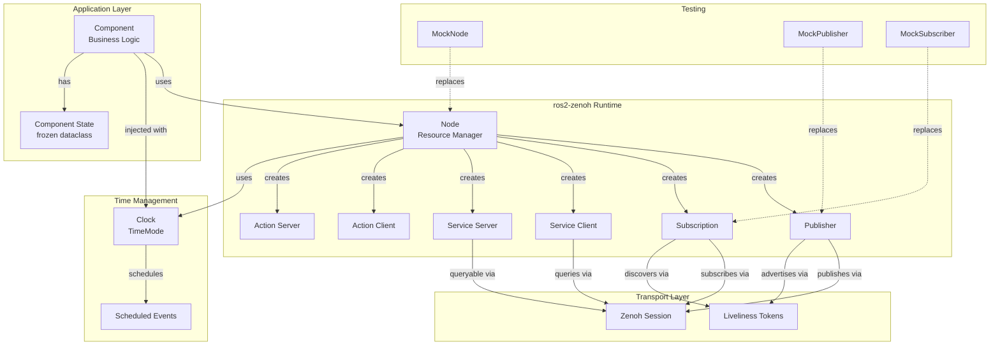

---

## Core Aggregates

### 1. Node Aggregate

**Root Entity:** Node  
**Value Objects:** NodeName, Namespace  
**Collections:**
- publishers: Dict[TopicName, Publisher]
- subscriptions: Dict[TopicName, Subscription]
- service_clients: Dict[ServiceName, ServiceClient]
- service_servers: Dict[ServiceName, ServiceServer]
- action_clients: Dict[ActionName, ActionClient]
- action_servers: Dict[ActionName, ActionServer]

**Invariant:** All members destroyed when Node destroyed

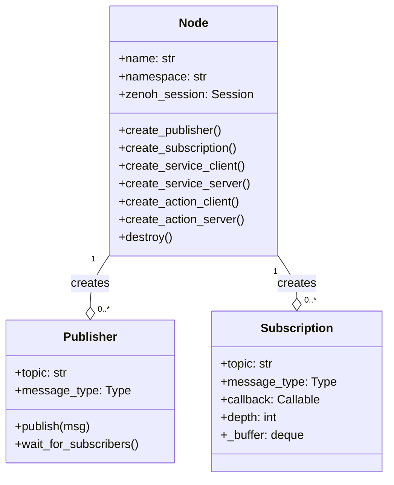

### 2. Component Aggregate

**Root Entity:** Component  
**Value Objects:** ComponentState  
**Associations:**
- Inputs: List[Subscription]
- Outputs: List[Publisher]
- Clock: Clock (injected)

**Invariant:** State transitions only through defined business logic

```python
@dataclass(frozen=True)
class ComponentState:
    """Immutable state snapshot"""
    field1: int
    field2: str
    # ... more fields

class MyComponent:
    def __init__(self, node: Node, clock: Clock):
        self._node = node
        self._clock = clock
        self._state = ComponentState(field1=0, field2="")
    
    async def setup(self):
        """Setup I/O"""
        self._input_sub = self._node.create_subscription(...)
        self._output_pub = self._node.create_publisher(...)
    
    async def teardown(self):
        """Cleanup"""
        pass
    
    def _on_input(self, msg):
        """Update state (create new immutable state)"""
        new_state = ComponentState(
            field1=self._state.field1 + 1,
            field2=msg.data
        )
        self._state = new_state
        self._output_pub.publish(...)
```

### 3. MessageBuffer Aggregate

**Root Entity:** Subscription  
**Value Objects:** None (primitives)  
**Collection:** deque[Message] (maxlen=depth)

**Invariant:** Buffer length ≤ depth (ring buffer semantics)

```python
from collections import deque

class Subscription:
    def __init__(self, ..., depth: int = 10):
        self._buffer = deque(maxlen=depth)  # Auto-drops oldest
        self._message_event = asyncio.Event()
    
    def _on_zenoh_message(self, sample):
        msg = deserialize(sample.payload)
        self._buffer.append(msg)  # Drops oldest if full
        self._message_event.set()
    
    async def _process_messages(self):
        while True:
            await self._message_event.wait()
            while self._buffer:
                msg = self._buffer.popleft()
                await self._callback(msg)
            self._message_event.clear()
```

---

## Entity Relationships

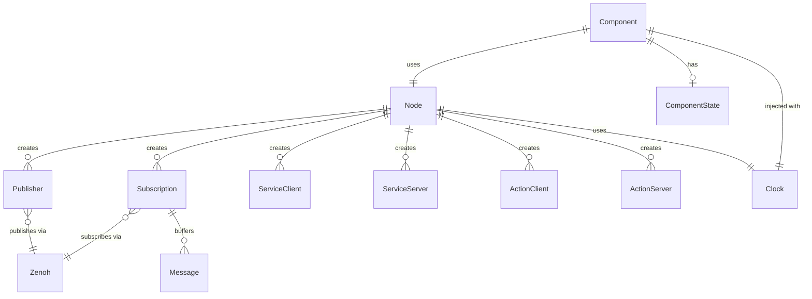

---

## Layer Architecture

### Vertical Layers

```
┌─────────────────────────────────────────┐
│      Application Layer                  │
│  - Business Logic                       │
│  - Domain Models                        │
│  - Components                           │
└─────────────────┬───────────────────────┘
                  │ uses
┌─────────────────▼───────────────────────┐
│      ros2-zenoh Runtime                 │
│  - Node, Publisher, Subscription        │
│  - Service, Action                      │
│  - CDR Encoding/Decoding                │
│  - Type Safety                          │
└─────────────────┬───────────────────────┘
                  │ uses
┌─────────────────▼───────────────────────┐
│      Transport Layer (Zenoh)            │
│  - Session, Publisher, Subscriber       │
│  - Liveliness, Discovery                │
│  - Network (UDP/TCP)                    │
└─────────────────────────────────────────┘
```

### Horizontal Concerns (Cross-Cutting)

```
Time Management:
├─ Clock (WALL_TIME | SIM_TIME_LIVE | SIM_TIME_TEST)
├─ Duration, TimeStamp
└─ Scheduled events

Testing:
├─ MockNode, MockPublisher, MockSubscriber
├─ Clock (TEST mode)
└─ Fixtures

Logging:
├─ RosoutHandler
└─ Structured logs
```

---

## Data Flow

### Publishing

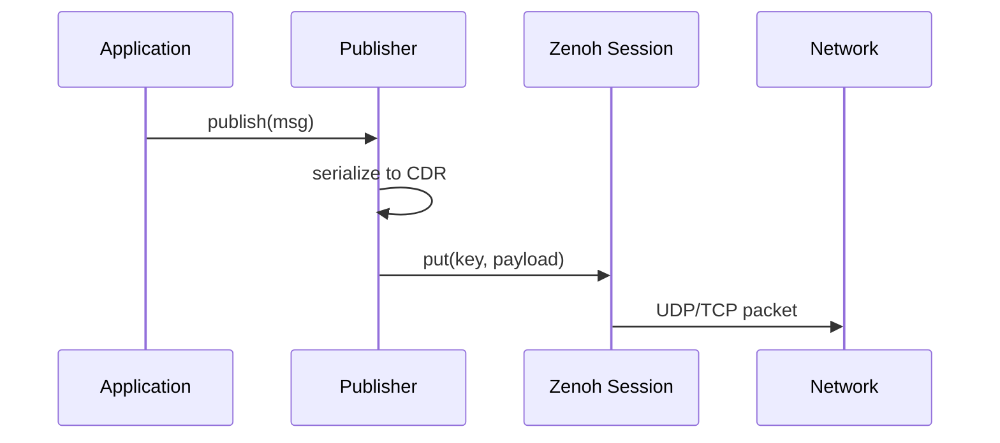

### Subscribing

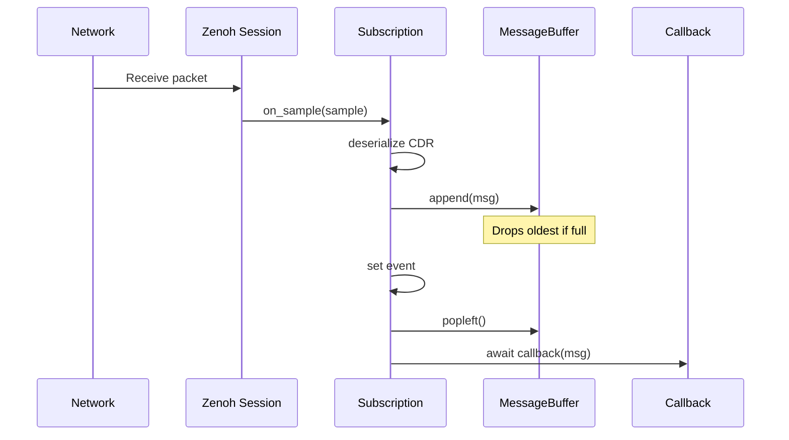

### Service Call

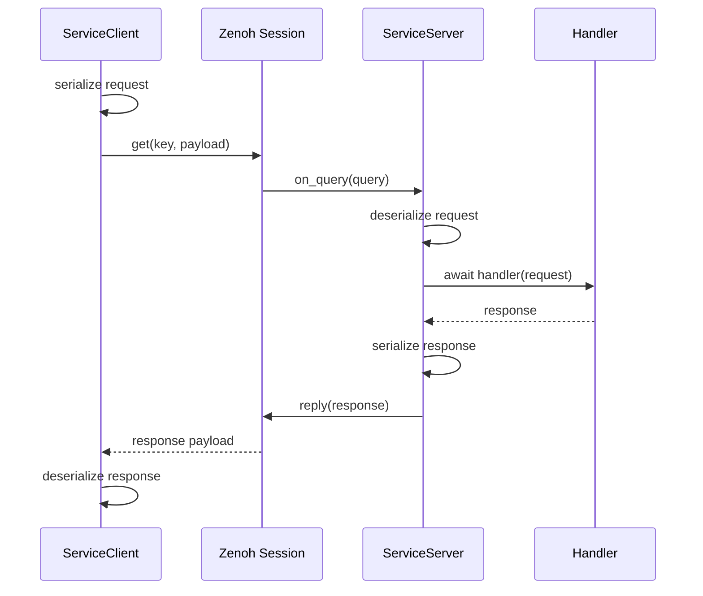

---

## Time Management Architecture

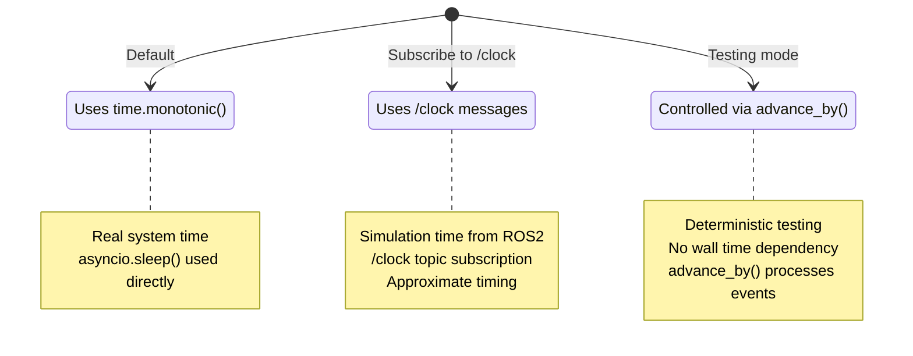

---

## Testing Architecture

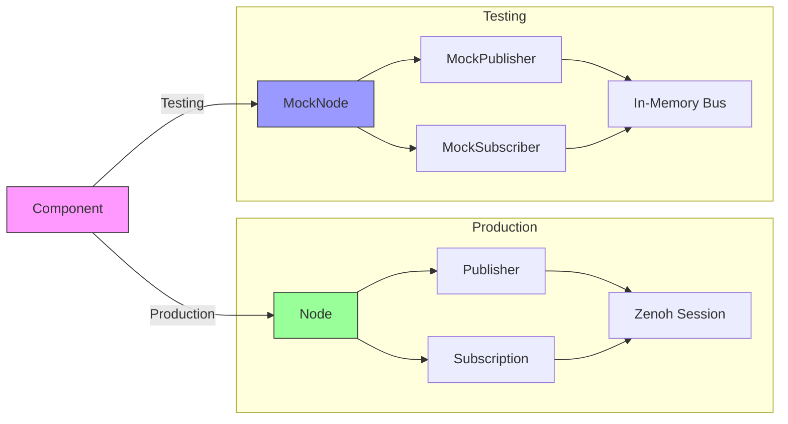

**Key Difference:** MockNode uses in-memory message bus instead of Zenoh, enabling:
- Synchronous message delivery (no network delay)
- Deterministic testing
- Fast execution
- No Zenoh daemon required

---

## Action Architecture

Actions are composed of underlying services and topics:

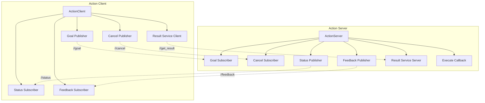

**Topics:**
- `/<action>/goal` - Goal messages
- `/<action>/cancel` - Cancel requests
- `/<action>/status` - Goal status updates
- `/<action>/feedback` - Execution feedback

**Service:**
- `/<action>/get_result` - Retrieve final result

---

## Discovery via Liveliness

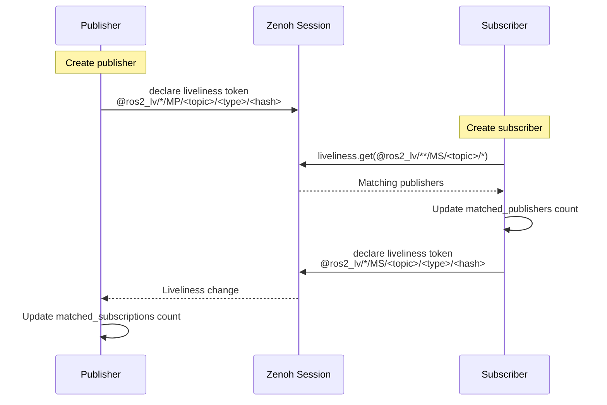

**Key Expression Format:**
- `MP` = Matched Publication (publisher advertising)
- `MS` = Matched Subscription (subscriber advertising)
- `<hash>` = RIHS01 type hash (ensures type compatibility)

---

## State Machines

### Service Client State

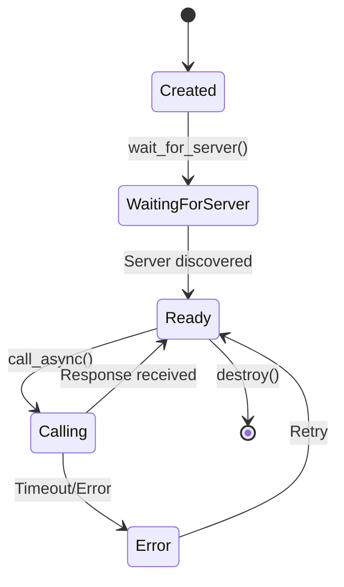

### Action Goal State

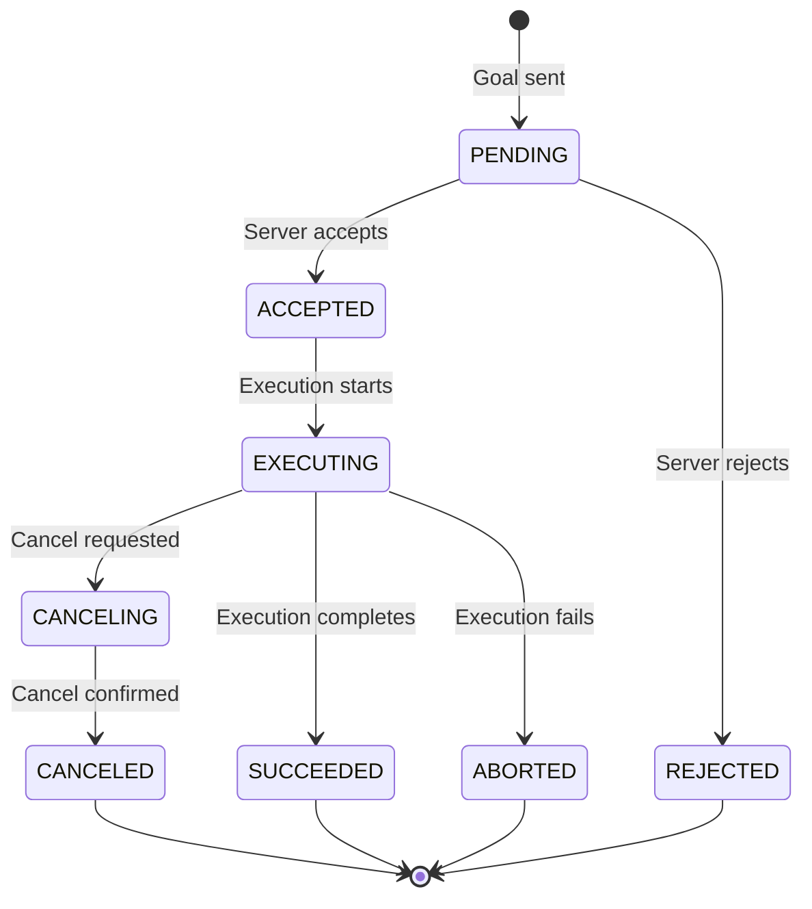

---

## Key Design Patterns

### 1. Dependency Injection

```python
class MyComponent:
    def __init__(self, node: Node, clock: Clock):
        self._node = node  # Injected
        self._clock = clock  # Injected
```

**Benefits:**
- Testability (inject mocks)
- Flexibility (swap implementations)
- Clear dependencies

### 2. Async Context Manager

```python
async with Node("my_node") as node:
    # Use node
    pass  # Automatic cleanup
```

**Benefits:**
- Resource safety
- Exception handling
- Clear lifecycle

### 3. Ring Buffer

```python
self._buffer = deque(maxlen=depth)
```

**Benefits:**
- Bounded memory
- Drop oldest semantics
- O(1) append/pop

### 4. Immutable State

```python
@dataclass(frozen=True)
class State:
    field: int
```

**Benefits:**
- Thread safety
- Predictable behavior
- Clear state transitions

---

## Performance Characteristics

| Operation | Complexity | Notes |
|-----------|------------|-------|
| publish() | O(1) | Serialize + Zenoh put |
| subscribe callback | O(1) | Deserialize + callback |
| buffer append | O(1) | deque append (drop oldest) |
| wait_for_subscribers() | O(n) | Poll liveliness tokens |
| create_publisher() | O(1) | Setup Zenoh publisher |
| create_subscription() | O(1) | Setup Zenoh subscriber |
| Node.destroy() | O(n) | n = number of entities |

---

## Memory Model

```
Node
├── Zenoh Session (1)
│   └── Network buffers (~10MB default)
├── Publishers (n)
│   └── Serialization buffer per publish (~1KB typical)
├── Subscriptions (m)
│   └── Message buffer: depth × message_size
│       (e.g., depth=10, ~1KB msg = ~10KB)
└── Service/Action entities
    └── Per-request buffers (~1KB typical)

Total Memory: ~10MB base + (n+m) × 1KB + Σ(buffer_size)
```

**Typical:** Node with 5 pubs, 5 subs, depth=10 → ~15MB

---

**Document Status:** Living document  
**Last Updated:** 2025-10-23  
**Next Review:** After Phase 1 completion

