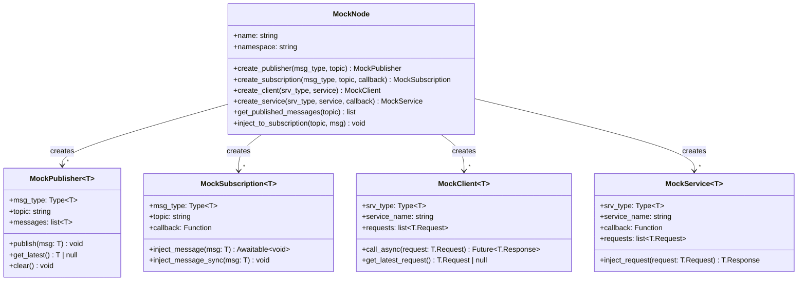

---
# Required fields
classification: internal
llm_processing: allowed
schema_version: "1.0"
type: spec
id: "spec-mocks-core"
title: "Testing Mocks - Core Specification"
summary: "Universal behavior specification for type-safe mock classes for testing"

# Spec-specific fields
status: "proposed"
version: "1.0.0"
component_type: "testing-utility"

# Metadata
tags: ["testing", "mocking", "dependency-injection", "core"]
related_specs: ["Mocks-Python", "Clock-Core", "Publisher", "Subscription"]
related_adrs: ["ADR-001"]
related_patterns: ["dependency-injection", "testable-components"]

# Future-proofing
ros2_zenoh:
  languages: ["python", "rust", "c", "typescript"]
  components: ["testing"]
  phase: "1-python-core"
  test_coverage: null
---

# Testing Mocks - Core Specification

**Language-agnostic behavior specification**

## Purpose

The Testing Mocks module provides type-safe, domain-specific mock classes for testing ROS2 Zenoh components without requiring real Zenoh sessions or ROS2 infrastructure.

**Key responsibilities:**
- Provide mock Node, Publisher, Subscription, Client, Service matching production APIs
- Enable message injection and inspection
- Support dependency injection patterns
- Maintain type safety
- Default to unlimited message depth (with opt-in depth enforcement)

**Design principle:** Explicit, typed mocks over generic mock objects for better developer experience and type safety.

---

## Domain Model



---

## Components

### 1. MockPublisher

**Purpose**: Records all published messages for inspection in tests.

#### State

```yaml
msg_type: Type<T>  # Message type (for validation)
topic: string  # Topic name
messages: list<T>  # All published messages (chronological)
_depth: number | null  # null = unlimited (default), number = ring buffer
```

#### Behavior

```typescript
function publish(msg: T) {
  // Type validation
  if (!is_instance_of(msg, this.msg_type)) {
    throw TypeError(`Expected ${this.msg_type}, got ${typeof msg}`)
  }
  
  if (this._depth === null) {
    // Unlimited (default for testing)
    this.messages.push(msg)
  } else {
    // Ring buffer semantics (drop oldest)
    if (this.messages.length >= this._depth) {
      this.messages.shift()  // Remove oldest
    }
    this.messages.push(msg)
  }
}

function get_latest(): T | null {
  return this.messages.length > 0 
    ? this.messages[this.messages.length - 1] 
    : null
}

function clear() {
  this.messages = []
}

function get_message_count(): number {
  return this.messages.length
}

function filter_messages(predicate: (msg: T) => boolean): list<T> {
  return this.messages.filter(predicate)
}
```

**Key behaviors:**
- Type validation on every publish
- Unlimited depth by default (test-friendly)
- Opt-in depth for testing overflow scenarios
- Ring buffer semantics when depth is set

---

### 2. MockSubscription

**Purpose**: Allows injecting messages to trigger callbacks in tests.

#### State

```yaml
msg_type: Type<T>
topic: string
callback: (msg: T) => void | Promise<void>
_depth: number | null  # For future depth enforcement
injected_count: number  # Statistics
```

#### Behavior

```typescript
async function inject_message(msg: T) {
  // Type validation
  if (!is_instance_of(msg, this.msg_type)) {
    throw TypeError(`Expected ${this.msg_type}, got ${typeof msg}`)
  }
  
  this.injected_count += 1
  
  // Call callback (handle both sync and async)
  if (is_async_function(this.callback)) {
    await this.callback(msg)
  } else {
    this.callback(msg)
  }
}

function inject_message_sync(msg: T) {
  // Only for synchronous callbacks
  if (is_async_function(this.callback)) {
    throw TypeError("Cannot inject_message_sync with async callback, use inject_message()")
  }
  
  this.injected_count += 1
  this.callback(msg)
}
```

**Key behaviors:**
- Type validation on injection
- Supports both sync and async callbacks
- Immediate callback execution (no buffering)
- Statistics tracking

---

### 3. MockClient

**Purpose**: Records service requests and provides mock responses.

#### State

```yaml
srv_type: Type<T>
service_name: string
requests: list<T.Request>  # All requests
_mock_responses: Queue<T.Response>  # Queued responses
_default_response: ((req: T.Request) => T.Response) | null
```

#### Behavior

```typescript
async function call_async(request: T.Request): Promise<T.Response> {
  // Record request
  this.requests.push(request)
  
  // Return response
  if (!this._mock_responses.empty()) {
    return this._mock_responses.dequeue()  // One-time response
  } else if (this._default_response) {
    return this._default_response(request)  // Generated response
  } else {
    throw RuntimeError(
      "No mock response set. Use set_response() or set_default_response()"
    )
  }
}

function set_response(response: T.Response) {
  // Queue one-time response
  this._mock_responses.enqueue(response)
}

function set_default_response(fn: (req: T.Request) => T.Response) {
  // Set response generator
  this._default_response = fn
}

function get_latest_request(): T.Request | null {
  return this.requests.length > 0
    ? this.requests[this.requests.length - 1]
    : null
}
```

**Key behaviors:**
- Records all requests
- One-time responses (queue)
- Default response generator (fallback)
- Error if no response configured

---

### 4. MockService

**Purpose**: Simulates service server for testing service clients.

#### State

```yaml
srv_type: Type<T>
service_name: string
callback: (req: T.Request) => T.Response
requests: list<T.Request>  # History
```

#### Behavior

```typescript
async function inject_request(request: T.Request): Promise<T.Response> {
  // Record request
  this.requests.push(request)
  
  // Call callback to get response
  if (is_async_function(this.callback)) {
    return await this.callback(request)
  } else {
    return this.callback(request)
  }
}

function get_latest_request(): T.Request | null {
  return this.requests.length > 0
    ? this.requests[this.requests.length - 1]
    : null
}
```

**Key behaviors:**
- Records all requests
- Delegates response generation to user callback
- Supports sync and async callbacks

---

### 5. MockNode

**Purpose**: Central hub for creating and managing all mock entities. Mirrors production `Node` API.

#### State

```yaml
name: string
namespace: string
_publishers: Map<string, MockPublisher>  # topic -> publisher
_subscriptions: Map<string, MockSubscription>  # topic -> subscription
_clients: Map<string, MockClient>  # service -> client
_services: Map<string, MockService>  # service -> service
```

#### Behavior

```typescript
function create_publisher<T>(
  msg_type: Type<T>,
  topic: string,
  qos_profile?: object,
  depth?: number | null
): MockPublisher<T> {
  // Resolve topic with namespace
  const resolved_topic = resolve_topic_name(topic, this.namespace)
  
  // Create publisher
  const pub = new MockPublisher(msg_type, resolved_topic, depth)
  this._publishers.set(resolved_topic, pub)
  
  return pub
}

function create_subscription<T>(
  msg_type: Type<T>,
  topic: string,
  callback: (msg: T) => void | Promise<void>,
  qos_profile?: object,
  depth?: number | null
): MockSubscription<T> {
  // Resolve topic with namespace
  const resolved_topic = resolve_topic_name(topic, this.namespace)
  
  // Create subscription
  const sub = new MockSubscription(msg_type, resolved_topic, callback, depth)
  this._subscriptions.set(resolved_topic, sub)
  
  return sub
}

function create_client<T>(
  srv_type: Type<T>,
  service_name: string
): MockClient<T> {
  const resolved_service = resolve_service_name(service_name, this.namespace)
  
  const client = new MockClient(srv_type, resolved_service)
  this._clients.set(resolved_service, client)
  
  return client
}

function create_service<T>(
  srv_type: Type<T>,
  service_name: string,
  callback: (req: T.Request) => T.Response
): MockService<T> {
  const resolved_service = resolve_service_name(service_name, this.namespace)
  
  const service = new MockService(srv_type, resolved_service, callback)
  this._services.set(resolved_service, service)
  
  return service
}

// Convenience methods for testing

function get_published_messages(topic: string): list {
  const resolved_topic = resolve_topic_name(topic, this.namespace)
  
  if (!this._publishers.has(resolved_topic)) {
    throw KeyError(`No publisher for topic: ${topic}`)
  }
  
  return this._publishers.get(resolved_topic).messages
}

async function inject_to_subscription(topic: string, msg: any) {
  const resolved_topic = resolve_topic_name(topic, this.namespace)
  
  if (!this._subscriptions.has(resolved_topic)) {
    throw KeyError(`No subscription for topic: ${topic}`)
  }
  
  await this._subscriptions.get(resolved_topic).inject_message(msg)
}

function get_publisher(topic: string): MockPublisher {
  const resolved_topic = resolve_topic_name(topic, this.namespace)
  
  if (!this._publishers.has(resolved_topic)) {
    throw KeyError(`No publisher for topic: ${topic}`)
  }
  
  return this._publishers.get(resolved_topic)
}

function get_subscription(topic: string): MockSubscription {
  const resolved_topic = resolve_topic_name(topic, this.namespace)
  
  if (!this._subscriptions.has(resolved_topic)) {
    throw KeyError(`No subscription for topic: ${topic}`)
  }
  
  return this._subscriptions.get(resolved_topic)
}
```

**Key behaviors:**
- Topic/service name resolution with namespaces
- Entity registry for inspection
- Convenience methods for common test patterns
- Mirrors production Node API

---

## Quality Attributes

### Type Safety

- **Generic types**: `MockPublisher<String>` has typed `messages: list<String>`
- **Runtime validation**: `publish()` checks type compatibility
- **Static analysis**: Type checkers can verify correctness

### Simplicity

- **No magic**: Explicit record-and-inspect pattern
- **Minimal API**: Only essential methods
- **Clear errors**: Helpful messages when used incorrectly

### Flexibility

- **Unlimited depth by default**: Tests don't hit overflow unless explicitly testing it
- **Opt-in depth**: Can set `depth` to test overflow behavior
- **Sync or async**: Handles both callback styles

### Testability

- **Deterministic**: No timing dependencies
- **Inspectable**: All state accessible for assertions
- **Isolated**: No network, no real resources

---

## Test Requirements

### Universal Test Cases

1. **Type validation**:
   - Publishing wrong type throws error
   - Injecting wrong type throws error

2. **Message recording**:
   - All published messages recorded
   - Order preserved
   - `get_latest()` returns most recent

3. **Depth enforcement**:
   - Unlimited by default
   - Ring buffer when depth set
   - Oldest messages dropped

4. **Callback execution**:
   - Sync callbacks work
   - Async callbacks work
   - Errors propagate correctly

5. **Service mocking**:
   - One-time responses consumed
   - Default response generator works
   - Error if no response configured

6. **Topic resolution**:
   - Namespaces applied correctly
   - Leading slashes handled
   - Relative topics resolved

---

## rmw_zenoh Compatibility

**Status**: ✅ Compatible (no transport-level changes)

- Mocks are test-only utilities
- No interaction with actual Zenoh sessions
- No key formats or protocols involved
- Can test components that will run with rmw_zenoh

---

## Design Principles

1. **Explicit over implicit**: Clear mock classes, not magic
2. **Type-safe**: Leverage language type systems
3. **Domain-specific**: Methods express ROS2 concepts (not generic mock API)
4. **Mirrors production**: Same API as real Node/Publisher/Subscription
5. **Test-friendly defaults**: Unlimited depth, no timeouts
6. **Opt-in strictness**: Can enforce depth/QoS when testing edge cases

---

## Related Components

- **[[Mocks-Python]]**: Python-specific API and implementation details
- **[[Clock-Core]]**: Often used together for time-based testing
- **[[Publisher]]**: Production class that mocks replace
- **[[Subscription]]**: Production class that mocks replace

---

## References

- ADR-001: Custom Mock Classes over unittest.mock
- Dependency Injection pattern: https://en.wikipedia.org/wiki/Dependency_injection


