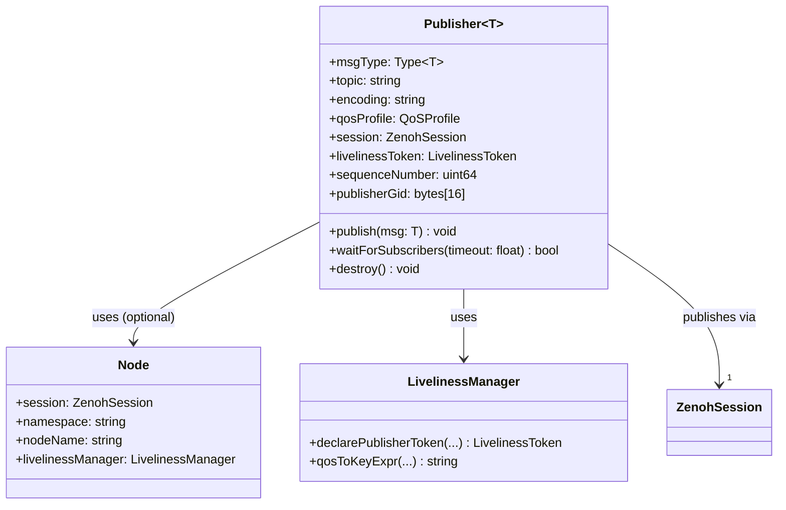

---
# Required fields
classification: internal
llm_processing: allowed
schema_version: "1.0"
type: spec
id: "spec-core-publisher"
title: "Publisher Core Specification"
summary: "Universal specification for ROS2-compatible publisher using Zenoh transport (language-agnostic)"

# Spec-specific fields
status: "implemented"
version: "1.0.0"
component_type: "core-entity"

# Metadata
tags: ["publisher", "zenoh", "ros2", "messaging", "core", "universal"]
related_specs: ["Python/Publisher-Python", "Subscription", "Node"]
related_adrs: []
related_patterns: ["dependency-injection"]

# Future-proofing
ros2_zenoh:
  languages: ["python", "rust", "c", "typescript"]
  components: ["publisher"]
  phase: "1-python-core"
  language_agnostic: true
---

# Publisher Core Specification

**This is a universal, language-agnostic specification.**  
For language-specific implementations, see:
- [[Python/Publisher-Python]] - Python API and idioms
- (Future: Rust, C, TypeScript bindings)

---

## Purpose

The Publisher component enables publishing ROS2 messages using Zenoh as the underlying transport layer. It provides full interoperability with ROS2 nodes using **rmw_zenoh** while leveraging Zenoh's efficient peer-to-peer communication.

> **Important**: This implementation targets **rmw_zenoh compatibility**, not DDS-based RMWs. It is NOT compatible with ROS2 nodes using FastDDS, CycloneDDS, or other DDS implementations unless a bridge is used.

**Key responsibilities:**
- Serialize ROS2 messages using specified encoding (CDR, JSON, MessagePack)
- Publish messages via Zenoh with rmw_zenoh-compatible metadata
- Manage liveliness tokens for ROS2 discovery
- Support QoS profiles matching ROS2 semantics
- Provide discovery helpers (wait for subscribers)

---

## Domain Model



---

## Encoding and Namespace Strategy

> **Design Priority**: This specification prioritizes **rmw_zenoh interoperability** as the default use case.

### Encoding Support

**Primary: CDR (Default)**
- Purpose: rmw_zenoh interoperability (Priority 1)
- Namespace: `0/` (data), `@ros2_lv/` (discovery)
- Compatible with: ROS2 nodes using rmw_zenoh

**Secondary: JSON/MessagePack**
- Purpose: Zenoh-native applications (advanced use case)
- Namespace: `zenoh_{encoding}/` (data), `@zenoh_app/{encoding}/` (discovery)
- Compatible with: Other ros2-zenoh nodes using same encoding
- **NOT compatible with rmw_zenoh**

### Namespace Isolation

To prevent rmw_zenoh from discovering and attempting to deserialize non-CDR messages, each encoding uses a separate Zenoh namespace:

| Encoding | Data Key Prefix | Liveliness Prefix | rmw_zenoh Compatible |
|----------|----------------|-------------------|---------------------|
| `cdr`    | `0/`           | `@ros2_lv/`       | ✅ Yes (default)    |
| `json`   | `zenoh_json/`  | `@zenoh_app/json/`| ❌ No (isolated)    |
| `msgpack`| `zenoh_msgpack/`| `@zenoh_app/msgpack/`| ❌ No (isolated) |

**Why namespace separation?**

Without it, rmw_zenoh would:
1. Discover JSON publisher (same key format)
2. Subscribe to it
3. Receive JSON bytes, expect CDR
4. 💥 Crash or data corruption

With namespace separation:
- rmw_zenoh only queries `0/**` and `@ros2_lv/**`
- JSON publishers use `zenoh_json/**` and `@zenoh_app/json/**`
- No cross-discovery possible → Safe coexistence

---

## State Model

> **Note on IDL Type Names**: ROS2 `.msg` files are converted to OMG IDL (Interface Definition Language) definitions, which are the standard that DDS is based on. The `idlTypeName` is the fully-qualified IDL type name in ROS2 format: `package/msg/MessageName` (slash-separated). This is why Python uses the attribute name `DDS_TYPE_NAME` - DDS is based on the OMG IDL standard.

### Immutable State (Set at Initialization)

```typescript
interface PublisherState<T> {
  // Message type metadata
  msgType: Type<T>
  idlTypeName: string        // e.g., "geometry_msgs/msg/Twist" (OMG IDL format)
  typeHash: string           // RIHS01 hash
  
  // Topic and naming
  topic: string              // Fully qualified (after namespace resolution)
  namespace: string
  nodeName: string
  
  // Encoding and QoS
  encoding: "cdr" | "json" | "msgpack"  // Default: "cdr" (rmw_zenoh compatible)
  qosReliability: 0 | 1      // 0=BEST_EFFORT, 1=RELIABLE
  qosDurability: 1 | 2       // 1=TRANSIENT_LOCAL, 2=VOLATILE
  qosHistory: 1 | 2          // 1=KEEP_LAST, 2=KEEP_ALL
  qosDepth: number
  
  // Zenoh resources
  session: ZenohSession
  livelinessManager: LivelinessManager
  livelinessToken: LivelinessToken
  
  // rmw_zenoh protocol
  zenohDataKey: string       // e.g., "0/cmd_vel/geometry_msgs/msg/Twist/RIHS01_..."
  publisherGid: bytes[16]    // Random, stable for publisher lifetime
  
  // Pre-bound serializer (performance optimization)
  serialize: (msg: T) => bytes
}
```

### Mutable State

```typescript
interface PublisherMutableState {
  sequenceNumber: uint64     // Monotonically increasing, starts at 0
  destroyed: boolean         // Lifecycle flag
}
```

**State invariants:**
- `sequenceNumber` increments on each `publish()` call
- `publisherGid` remains stable for lifetime
- `serialize` is bound once at construction (zero overhead on publish)
- `topic` is fully qualified (namespace already resolved)

---

## Behavior Specification

### 1. Initialization

```typescript
function initialize(
  msgType: Type<T>,
  topic: string,
  node?: Node,
  qosProfile?: QoSProfile,
  encoding: string = "cdr"
): Publisher<T> {
  // 1. Validate message type has required metadata
  // Note: DDS_TYPE_NAME contains the IDL type name (DDS is based on OMG IDL)
  if (!msgType.DDS_TYPE_NAME || !msgType.TYPE_HASH) {
    throw Error("Message type must have DDS_TYPE_NAME and TYPE_HASH")
  }
  
  // 2. Get pre-bound serializer for zero-overhead publish
  const serialize = msgType.getSerializer(encoding)
  
  // 3. Convert QoS profile to ROS2 numeric values
  const qosReliability = qosProfile.reliability === "reliable" ? 1 : 0
  const qosDurability = {
    "transient_local": 1,
    "volatile": 2
  }[qosProfile.durability || "volatile"]
  const qosHistory = qosProfile.history === "keep_last" ? 1 : 2
  const qosDepth = qosProfile.depth || 10
  
  // 4. Use provided node or create own session
  let session: ZenohSession
  let livelinessManager: LivelinessManager
  let nodeName: string
  let namespace: string
  let ownSession: boolean
  
  if (node) {
    session = node.session
    livelinessManager = node.livelinessManager
    nodeName = node.nodeName
    namespace = node.namespace
    ownSession = false
  } else {
    // Legacy mode: create own session
    const config = new ZenohConfig()
    session = Zenoh.open(config)
    livelinessManager = new LivelinessManager(session)
    nodeName = "zenoh_publisher"
    namespace = ""
    ownSession = true
  }
  
  // 5. Resolve topic name with namespace
  const resolvedTopic = resolveTopicName(topic, namespace)
  // Example: topic="/cmd_vel", namespace="/turtle1" -> "/turtle1/cmd_vel"
  
  // 6. Generate stable publisher GID (16 random bytes)
  const publisherGid = randomBytes(16)
  const sequenceNumber = 0
  
  // 7. Create Zenoh data key (encoding-aware namespace)
  const topicPart = resolvedTopic.replace(/^\//, "")  // Remove leading slash
  const idlTypeName = msgType.DDS_TYPE_NAME
  const typeHash = msgType.TYPE_HASH
  
  // Namespace isolation: different prefixes for different encodings
  let zenohDataKey: string
  if (encoding === "cdr") {
    // Standard rmw_zenoh namespace (interoperable)
    zenohDataKey = `0/${topicPart}/${idlTypeName}/${typeHash}`
  } else if (encoding === "json") {
    // Isolated JSON namespace (non-interoperable)
    zenohDataKey = `zenoh_json/${topicPart}/${idlTypeName}/${typeHash}`
  } else if (encoding === "msgpack") {
    // Isolated MessagePack namespace (non-interoperable)
    zenohDataKey = `zenoh_msgpack/${topicPart}/${idlTypeName}/${typeHash}`
  } else {
    throw Error(`Unsupported encoding: ${encoding}`)
  }
  
  // 8. Declare liveliness token for discovery (encoding-aware namespace)
  const qosStr = livelinessManager.qosToKeyExpr(
    qosReliability,
    qosDurability,
    qosHistory,
    qosDepth
  )
  const livelinessToken = livelinessManager.declarePublisherToken({
    topicName: resolvedTopic,
    messageType: idlTypeName,
    typeHash: typeHash,
    nodeName,
    nodeNamespace: namespace,
    qos: qosStr,
    encoding: encoding  // Determines liveliness namespace
  })
  
  // Note: If encoding is "cdr", uses @ros2_lv/ (rmw_zenoh compatible)
  //       If encoding is "json", uses @zenoh_app/json/ (isolated)
  //       If encoding is "msgpack", uses @zenoh_app/msgpack/ (isolated)
  
  return {
    // Immutable state
    msgType,
    idlTypeName: msgType.DDS_TYPE_NAME,
    typeHash: msgType.TYPE_HASH,
    topic: resolvedTopic,
    namespace,
    nodeName,
    encoding,
    qosReliability,
    qosDurability,
    qosHistory,
    qosDepth,
    session,
    livelinessManager,
    livelinessToken,
    zenohDataKey,
    publisherGid,
    serialize,
    ownSession,
    
    // Mutable state
    sequenceNumber: 0,
    destroyed: false
  }
}
```

### 2. Publishing Messages

```typescript
function publish(this: Publisher<T>, msg: T): void {
  // 1. Serialize using pre-bound function (zero overhead!)
  const payload = this.serialize(msg)
  
  // 2. Build attachment (sequence, timestamp, gid)
  const timestampNs = getCurrentTimeNanos()
  const attachment = buildAttachment(this.sequenceNumber, timestampNs, this.publisherGid)
  
  // 3. Increment sequence number
  this.sequenceNumber += 1
  
  // 4. Determine Zenoh encoding field based on serialization
  const zenohEncoding = {
    "cdr": "application/x-cdr",       // rmw_zenoh compatible
    "json": "application/json",       // Zenoh-native only
    "msgpack": "application/msgpack"  // Zenoh-native only
  }[this.encoding]
  
  // 5. Publish via Zenoh (encoding-aware key and encoding field)
  this.session.put({
    key: this.zenohDataKey,  // Namespace-isolated by encoding
    payload: payload,
    encoding: zenohEncoding,  // Tells receiver what format to expect
    attachment: attachment
  })
}
```

**Attachment format (rmw_zenoh_cpp v3):**
```
[sequence: 8 bytes little-endian]
[timestamp_ns: 8 bytes little-endian]
[VarInt(16): 1 byte = 0x10]
[gid: 16 bytes]
```

### 3. Waiting for Subscribers

```typescript
async function waitForSubscribers(this: Publisher<T>, timeout: float): Promise<boolean> {
  const domainId = getEnv("ROS_DOMAIN_ID") || "0"
  const topicEncoded = this.topic.replace(/\//g, "%")
  
  // Query pattern for Matched Subscriptions on this topic
  // Format: @ros2_lv/{domain}/MS/*/*/*/{topic_name}/**
  // Note: rmw_zenoh uses MS (Matched Subscription) for subscribers
  const queryPattern = `@ros2_lv/${domainId}/*/*/*/MS/**/${topicEncoded}/**`
  
  const startTime = now()
  
  while (true) {
    // Query liveliness
    const replies = this.session.liveliness().get(queryPattern)
    
    // Check if we got any replies
    for (const reply of replies) {
      if (reply.ok) {
        // Found at least one subscriber
        return true
      }
    }
    
    // Check timeout
    if (now() - startTime >= timeout) {
      return false
    }
    
    // Wait before retrying
    await sleep(0.1)
  }
}
```

**Note**: rmw_zenoh may have a race between liveliness token availability and data path readiness. Applications should retry publishing if the first message doesn't arrive.

### 4. Cleanup

```typescript
function destroy(this: Publisher<T>): void {
  if (this.destroyed) {
    return  // Already destroyed
  }
  
  // 1. Undeclare liveliness token (notify ROS2 graph)
  this.livelinessToken.undeclare()
  
  // 2. Close session only if we own it
  if (this.ownSession) {
    this.session.close()
  }
  
  this.destroyed = true
}
```

---

## Protocol Details

### Zenoh Data Key Formats

**CDR (rmw_zenoh compatible):**
```
0/{topic}/{idl_type}/{type_hash}
```

**JSON (Zenoh-native, isolated):**
```
zenoh_json/{topic}/{idl_type}/{type_hash}
```

**MessagePack (Zenoh-native, isolated):**
```
zenoh_msgpack/{topic}/{idl_type}/{type_hash}
```

**Examples:**
```
# CDR (rmw_zenoh discovers this)
0/turtle1/cmd_vel/geometry_msgs/msg/Twist/RIHS01_abc123...

# JSON (rmw_zenoh does NOT discover this)
zenoh_json/turtle1/cmd_vel/geometry_msgs/msg/Twist/RIHS01_abc123...

# MessagePack (rmw_zenoh does NOT discover this)
zenoh_msgpack/turtle1/cmd_vel/geometry_msgs/msg/Twist/RIHS01_abc123...
```

### Liveliness Token Formats

See `LivelinessManager` specification for complete token format.

**CDR (rmw_zenoh compatible):**
```
@ros2_lv/{domain_id}/{zid}/{nid}/{id}/MP/{...}/{topic}/{type_name}/{type_hash}/{qos}
```

**JSON (Zenoh-native, isolated):**
```
@zenoh_app/json/{domain_id}/{zid}/{nid}/{id}/MP/{...}/{topic}/{type_name}/{type_hash}/{qos}
```

**MessagePack (Zenoh-native, isolated):**
```
@zenoh_app/msgpack/{domain_id}/{zid}/{nid}/{id}/MP/{...}/{topic}/{type_name}/{type_hash}/{qos}
```

Where `MP` = Matched Publication

**Discovery Queries:**
```typescript
// rmw_zenoh nodes query:
session.liveliness().get("@ros2_lv/0/**/MP/**")
// → Finds only CDR publishers

// Zenoh JSON apps query:
session.liveliness().get("@zenoh_app/json/0/**/MP/**")
// → Finds only JSON publishers

// Zenoh MessagePack apps query:
session.liveliness().get("@zenoh_app/msgpack/0/**/MP/**")
// → Finds only MessagePack publishers
```

### QoS Encoding

ROS2 numeric values:
- **Reliability**: `0` = BEST_EFFORT, `1` = RELIABLE
- **Durability**: `1` = TRANSIENT_LOCAL, `2` = VOLATILE
- **History**: `1` = KEEP_LAST, `2` = KEEP_ALL
- **Depth**: Integer (only applies to KEEP_LAST)

---

## Quality Attributes

### Performance

- **Latency**: < 1ms for small messages (< 1KB) on localhost
- **Throughput**: Limited by Zenoh transport (typically > 1M msg/s for small messages)
- **CPU**: Pre-bound serializer eliminates lookup overhead on every publish
- **Memory**: Constant overhead per publisher (~1KB for metadata)

### Reliability

- **Message delivery**: Depends on QoS
  - `reliable`: Zenoh ensures delivery with retransmissions
  - `best_effort`: Fire-and-forget, no guarantees
- **Discovery**: Liveliness tokens automatically refreshed by Zenoh

### Scalability

- **Many publishers**: Linear scaling (each has independent liveliness token)
- **Large messages**: Zenoh supports streaming (up to GB-sized messages)

### ROS2 Compatibility

- **rmw_zenoh interoperability**: Full compatibility with ROS2 nodes using rmw_zenoh
- **Type system**: RIHS01 type hashing matches ROS2 standard
- **Discovery**: Uses same liveliness mechanism as rmw_zenoh_cpp
- **NOT compatible**: DDS-based RMWs (FastDDS, CycloneDDS) without a bridge

---

## Invariants and Constraints

1. **Sequence monotonicity**: `sequenceNumber` must be strictly increasing
2. **GID stability**: `publisherGid` must not change for publisher lifetime
3. **Topic immutability**: `topic` cannot change after initialization
4. **Single ownership**: If `ownSession` is true, publisher must close session on destroy
5. **Message type validation**: Published messages must match `msgType` (implementation choice: runtime check vs trust)

---

## Test Requirements

### Behavioral Tests

```typescript
// Sequence number increments
test("publish increments sequence number", () => {
  const pub = createPublisher(String, "/test")
  pub.publish({ data: "msg1" })
  assert(pub.sequenceNumber === 1)
  pub.publish({ data: "msg2" })
  assert(pub.sequenceNumber === 2)
})

// Zenoh data key format
test("Zenoh data key format is correct", () => {
  const pub = createPublisher(Twist, "/cmd_vel", { encoding: "cdr" })
  assert(pub.zenohDataKey === "0/cmd_vel/geometry_msgs/msg/Twist/RIHS01_...")
})

// Namespace resolution
test("topic name resolves with namespace", () => {
  const node = createNode({ name: "test", namespace: "/ns1" })
  const pub = createPublisher(String, "/topic", { node })
  assert(pub.topic === "/ns1/topic")
})
```

### Integration Tests

```typescript
// ROS2 interop
test("published messages received by rclpy subscriber", async () => {
  const rclpyNode = createRclpyNode("test_sub")
  const received = []
  const sub = rclpyNode.createSubscription(String, "/test", msg => received.push(msg.data))
  
  const pub = createPublisher(String, "/test")
  await pub.waitForSubscribers(timeout = 5.0)
  
  pub.publish({ data: "Hello ROS2!" })
  
  await sleep(0.5)  // Allow delivery
  
  assert(received === ["Hello ROS2!"])
})
```

---

## Related Specifications

- [[Subscription]] - Receives messages published by this component
- [[Node]] - Provides session, namespace, and liveliness manager
- [[LivelinessManager]] - Manages ROS2 discovery tokens
- [[Python/Publisher-Python]] - Python-specific implementation details

---

## Implementation Status

- ✅ Python: Implemented (`python/ros2_zenoh_python/publisher.py`)
- ⏳ Rust: Not yet implemented
- ⏳ C: Not yet implemented
- ⏳ TypeScript: Not yet implemented

---

## Usage Examples

### Default: CDR for rmw_zenoh Interoperability

```typescript
// Most common use case: rmw_zenoh compatible publisher
const publisher = createPublisher({
  msgType: Twist,
  topic: "/cmd_vel",
  encoding: "cdr"  // Default, rmw_zenoh compatible
})

publisher.publish(twistMsg)

// rmw_zenoh subscriber will discover and receive this
// ✅ Safe for mixed networks with rmw_zenoh nodes
```

### Advanced: JSON for Zenoh-Native Applications

```typescript
// Zenoh-native network (no rmw_zenoh nodes)
const jsonPublisher = createPublisher({
  msgType: SensorData,
  topic: "/sensors",
  encoding: "json"  // Isolated namespace
})

const jsonSubscriber = createSubscription({
  msgType: SensorData,
  topic: "/sensors",
  encoding: "json",  // Must match publisher
  callback: handleSensorData
})

jsonPublisher.publish(sensorMsg)

// ✅ Safe: JSON pub/sub are isolated from rmw_zenoh
// ❌ rmw_zenoh nodes will NOT see this data
```

### Safe Mixed Encoding Network

```typescript
// Same logical network, different encodings - Safe!

// CDR for ROS2 interop
const cdrPub = createPublisher({
  msgType: Twist,
  topic: "/cmd_vel",
  encoding: "cdr"
})
// Key: 0/cmd_vel/geometry_msgs::msg::Twist/...
// Liveliness: @ros2_lv/...

// JSON for web dashboard
const jsonPub = createPublisher({
  msgType: Status,
  topic: "/status", 
  encoding: "json"
})
// Key: zenoh_json/status/my_interfaces::msg::Status/...
// Liveliness: @zenoh_app/json/...

// ✅ Both coexist safely
// ✅ rmw_zenoh sees only CDR publisher
// ✅ JSON dashboard sees only JSON publisher
```

### Unsafe: Mixing Encodings (DON'T DO THIS)

```typescript
// ❌ WRONG: Different encodings on same topic
const pub1 = createPublisher({
  msgType: String,
  topic: "/data",
  encoding: "cdr"
})

const pub2 = createPublisher({
  msgType: String,
  topic: "/data",
  encoding: "json"  // Different encoding, same topic
})

// This is SAFE because of namespace isolation:
// pub1 key: 0/data/...
// pub2 key: zenoh_json/data/...
// They don't interfere!

// But subscribers must know which encoding to use:
const sub = createSubscription({
  msgType: String,
  topic: "/data",
  encoding: "cdr"  // Will only receive from pub1
})
```

---

## Open Questions

1. **Message type validation**: Should `publish()` validate `isinstance(msg, msgType)` at runtime?
   - **Pro**: Catches type errors early
   - **Con**: Performance overhead
   - **Current**: No runtime validation (trust user/type system)

2. **Async publish**: Should `publish()` be async for backpressure support?
   - **Pro**: Can handle flow control
   - **Con**: More complex API, most use cases don't need it
   - **Current**: Synchronous (fire-and-forget)

3. **Congestion control**: Should we expose Zenoh's congestion control settings?
   - **Pro**: Fine-grained control
   - **Con**: More API surface, expert-only feature
   - **Current**: Use Zenoh defaults

4. **Multi-encoding subscription**: Should we support subscribing to multiple encodings?
   - **Pro**: Flexibility for bridge applications
   - **Con**: Complex, error-prone
   - **Current**: v1.0 = single encoding per subscription (strict)

