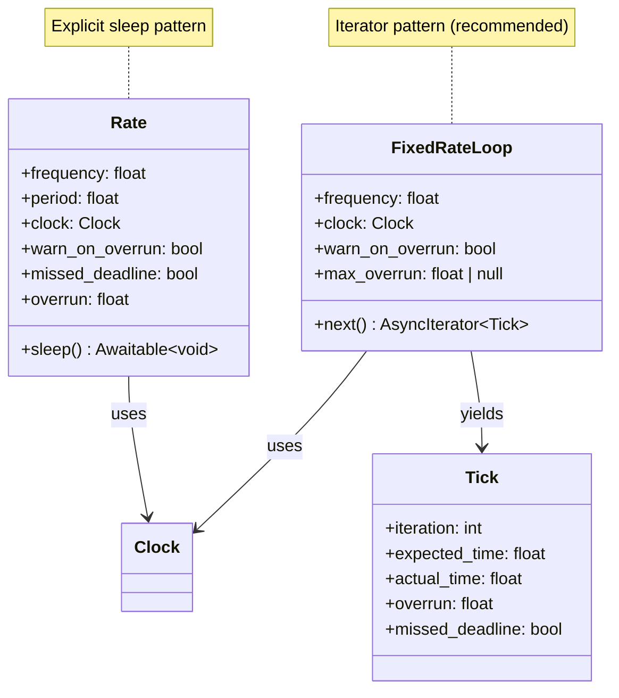

---
# Required fields
classification: internal
llm_processing: allowed
schema_version: "1.0"
type: spec
id: "spec-rate-core"
title: "Rate Component - Core Specification"
summary: "Universal fixed-rate execution patterns with deadline detection and clock integration"

# Spec-specific fields
status: "proposed"
version: "1.0.0"
component_type: "utility"

# Metadata
tags: ["rate", "control-loop", "timing", "core"]
related_specs: ["Rate-Python", "Clock-Core"]
related_adrs: []
related_patterns: ["fixed-rate-loop", "control-loop"]

# Future-proofing
ros2_zenoh:
  languages: ["python", "rust", "c", "typescript"]
  components: ["core"]
  phase: "1.5-patterns"
  test_coverage: null
---

# Rate Component - Core Specification

**Language-agnostic behavior specification**

## Purpose

The Rate component provides fixed-rate execution patterns for periodic tasks like control loops, sensor publishing, and heartbeats.

**Key responsibilities:**
- Maintain consistent execution rate (Hz)
- Detect deadline misses (overruns)
- Integrate with Clock for testability
- Support both explicit (`Rate`) and iterator (`fixed_rate_loop`) patterns

**Design principle:** Simple, deterministic rate control with clear deadline semantics.

---

## Domain Model



---

## Components

### 1. Rate (Explicit Pattern)

**Purpose**: Low-level building block for maintaining fixed rates.

#### State

```yaml
frequency: float        # Target frequency in Hz
period: float           # Derived: 1/frequency
clock: Clock            # For time management
warn_on_overrun: bool   # Log warning on deadline miss
last_tick: float        # Timestamp of last sleep() completion
missed_deadline: bool   # True if last iteration overran
overrun: float          # Duration of overrun (0 if on time)
```

#### Behavior

```typescript
function Rate(
  frequency: float,
  clock: Clock,
  warn_on_overrun: bool = true
) {
  this.frequency = frequency
  this.period = 1.0 / frequency
  this.clock = clock
  this.warn_on_overrun = warn_on_overrun
  this.last_tick = clock.now()
  this.missed_deadline = false
  this.overrun = 0.0
}

async function sleep() {
  /**
   * Sleep for remainder of period to maintain rate.
   * 
   * Behavior:
   * - If on schedule: sleep remaining time
   * - If behind: yield immediately, set missed_deadline=true
   * 
   * Always updates last_tick to current time after sleep.
   */
  const now = this.clock.now()
  const elapsed = now - this.last_tick
  const remaining = this.period - elapsed
  
  if (remaining > 0) {
    // On schedule - sleep remainder
    await this.clock.sleep(remaining)
    this.missed_deadline = false
    this.overrun = 0.0
  } else {
    // Behind schedule - overrun
    this.missed_deadline = true
    this.overrun = -remaining
    
    if (this.warn_on_overrun) {
      log.warning(
        `Rate ${this.frequency} Hz: Missed deadline by ${this.overrun * 1000:.1f}ms`
      )
    }
    
    // Yield to event loop (don't sleep)
    await this.clock.process_pending()
  }
  
  // Update tick time AFTER sleep
  this.last_tick = this.clock.now()
}
```

**Key behaviors:**
- Maintains consistent period, not just consistent delays
- Deadline detection automatic
- Integrates with Clock (testable with SIM_TIME_TEST)
- Skip-if-behind semantics (don't queue missed iterations)

---

### 2. FixedRateLoop (Iterator Pattern - Recommended)

**Purpose**: Pythonic async iterator for fixed-rate loops.

#### State

```yaml
frequency: float           # Target frequency in Hz
period: float              # Derived: 1/frequency
clock: Clock               # For time management
warn_on_overrun: bool      # Log warning on deadline miss
max_overrun: float | null  # Raise exception if exceeded (optional)
iteration: int             # Current iteration count
expected_time: float       # Expected time for next tick
```

#### Behavior

```typescript
async function* fixed_rate_loop(
  frequency: float,
  clock: Clock,
  warn_on_overrun: bool = true,
  max_overrun: float | null = null
): AsyncIterator<Tick> {
  /**
   * Async iterator that yields at fixed rate.
   * 
   * Args:
   *   frequency: Loop frequency in Hz
   *   clock: Clock for time management
   *   warn_on_overrun: Log warning on missed deadlines
   *   max_overrun: Raise exception if overrun exceeds this (optional)
   * 
   * Yields:
   *   Tick: Information about current iteration
   * 
   * Raises:
   *   DeadlineExceededError: If max_overrun is exceeded
   * 
   * Example:
   *   async for tick in fixed_rate_loop(10.0, clock):
   *     process()
   *     if tick.overrun > 0:
   *       print(f"Behind by {tick.overrun}s")
   */
  const period = 1.0 / frequency
  let iteration = 0
  let expected_time = clock.now()
  
  while (true) {
    iteration += 1
    expected_time += period
    const actual_time = clock.now()
    const overrun = Math.max(0, actual_time - expected_time)
    const missed = overrun > 0
    
    // Create tick info
    const tick = new Tick({
      iteration: iteration,
      expected_time: expected_time,
      actual_time: actual_time,
      overrun: overrun,
      missed_deadline: missed
    })
    
    // Yield tick to user
    yield tick
    
    // Handle overrun
    if (missed) {
      if (warn_on_overrun) {
        log.warning(
          `Rate ${frequency} Hz: Iteration ${iteration} missed deadline by ${overrun * 1000:.1f}ms`
        )
      }
      
      if (max_overrun !== null && overrun > max_overrun) {
        throw new DeadlineExceededError(
          `Overrun ${overrun:.3f}s exceeds max ${max_overrun:.3f}s`
        )
      }
    }
    
    // Sleep until next tick
    const now = clock.now()
    const remaining = expected_time - now
    
    if (remaining > 0) {
      await clock.sleep(remaining)
    } else {
      // Already behind, yield immediately
      await clock.process_pending()
    }
  }
}
```

**Key behaviors:**
- Yields `Tick` with detailed timing information
- Expected time tracks cumulative error (prevents drift)
- Skip-if-behind semantics
- Optional hard deadline enforcement (`max_overrun`)
- Infinite loop (user breaks when done)

---

### 3. Tick (Value Object)

**Purpose**: Timing information for a single iteration.

#### Structure

```typescript
interface Tick {
  iteration: int           // Iteration number (starts at 1)
  expected_time: float     // When this tick should have occurred
  actual_time: float       // When this tick actually occurred
  overrun: float           // Positive if behind, 0 if on time
  missed_deadline: bool    // True if overrun > 0
}
```

**Read-only**: Tick is immutable after creation.

---

## Quality Attributes

### Correctness

- **No drift**: Expected time tracks cumulative period (not iterative delays)
- **Deterministic**: Same code produces same timing with SIM_TIME_TEST
- **Skip-if-behind**: Missed iterations are skipped, not queued

### Performance

- **Low overhead**: Single clock check and comparison per iteration
- **Zero CPU when sleeping**: Uses clock.sleep() (platform async)
- **Fast-forward in tests**: SIM_TIME_TEST makes loops instant

### Usability

- **Pythonic**: `async for` pattern is natural
- **Informative**: Tick provides all timing details
- **Configurable**: Warnings and errors are opt-in

---

## Test Requirements

### Universal Test Cases

1. **On-time execution**:
   - Loop at 10 Hz for 1 second
   - No deadline misses
   - 10 iterations complete

2. **Deadline detection**:
   - Loop at 10 Hz with 0.15s processing (> 0.1s period)
   - Deadlines detected and flagged
   - Overrun measured correctly

3. **No drift**:
   - Loop at 10 Hz for 100 iterations
   - Final time = start time + 10.0s (exactly)
   - No cumulative error from iterative delays

4. **Clock integration**:
   - Use SIM_TIME_TEST clock
   - Loop runs instantly (no real delays)
   - Timing is deterministic

5. **Max overrun enforcement**:
   - Set `max_overrun=0.01`
   - Exceed it
   - Exception raised

6. **Edge cases**:
   - Zero-duration processing (always on time)
   - Extremely slow processing (every deadline missed)
   - Very high frequency (microsecond periods)

---

## Usage Patterns

### Pattern 1: Simple Control Loop

```typescript
// Recommended: async iterator
async function control_loop(clock: Clock) {
  async for (const tick of fixed_rate_loop(100.0, clock)) {  // 100 Hz
    const state = read_sensors()
    const command = controller(state)
    actuate(command)
    
    if (tick.overrun > 0.001) {
      // Warn if >1ms behind
      console.warn(`Control loop slow: ${tick.overrun * 1000}ms`)
    }
    
    if (should_stop()) {
      break
    }
  }
}
```

### Pattern 2: Explicit Rate Object

```typescript
// Alternative: explicit Rate
async function heartbeat_loop(clock: Clock) {
  const rate = new Rate(1.0, clock)  // 1 Hz
  
  while (running) {
    send_heartbeat()
    
    if (rate.missed_deadline) {
      console.warn("Heartbeat delayed")
    }
    
    await rate.sleep()
  }
}
```

### Pattern 3: Hard Deadline Enforcement

```typescript
// Raise exception if >5ms behind
async function real_time_loop(clock: Clock) {
  try {
    async for (const tick of fixed_rate_loop(1000.0, clock, true, 0.005)) {
      critical_processing()
    }
  } catch (DeadlineExceededError e) {
    console.error("Real-time constraint violated!")
    emergency_stop()
  }
}
```

### Pattern 4: Testing with Fast-Forward

```typescript
// Test runs instantly
async function test_control_loop() {
  const clock = new Clock(TimeMode.SIM_TIME_TEST, null, 0.0)
  let iterations = 0
  
  async function loop() {
    async for (const tick of fixed_rate_loop(10.0, clock)) {
      iterations++
      if (iterations >= 100) {
        break
      }
    }
  }
  
  const task = asyncio.create_task(loop())
  await clock.advance_by(10.0)  // Instant!
  
  assert(iterations === 100)
  assert(clock.now() === 10.0)
}
```

---

## rmw_zenoh Compatibility

**Status**: ✅ Compatible (no transport-level changes)

- Rate is a pure utility class
- No ROS2 topics/services involved
- Works with any ROS2 node implementation
- Clock integration enables rmw_zenoh + simulation time

---

## Design Decisions

### Why Skip-If-Behind?

**Rationale**: In robotics, processing old data is often worse than skipping it.

**Alternative**: Queue missed iterations
**Rejected**: Causes growing delays and stale data processing

### Why Expected Time Tracking?

**Rationale**: Prevents drift from cumulative delay errors.

```typescript
// BAD: Drift accumulates
for (i in range(100)) {
  process()
  sleep(0.1)  // If process() takes 0.001s, we drift by 0.1s total
}

// GOOD: No drift
expected = now()
for (i in range(100)) {
  expected += 0.1
  process()
  sleep(expected - now())  // Corrects for cumulative error
}
```

### Why No Callback-Based Timer?

**Rationale**: Callbacks are less Pythonic than async iterators.

**Alternative**: `Timer(period, callback)` (ROS2-style)
**Rejected**: Harder to test, less explicit control flow

---

## Related Components

- **[[Rate-Python]]**: Python-specific API and implementation details
- **[[Clock-Core]]**: Time management for rate control
- **[[Node]]**: Context where rate loops typically run

---

## References

- ROS2 Rate: https://github.com/ros2/rclcpp/blob/rolling/rclcpp/include/rclcpp/rate.hpp
- Control loop best practices: "Introduction to Embedded Systems" by Lee & Seshia


