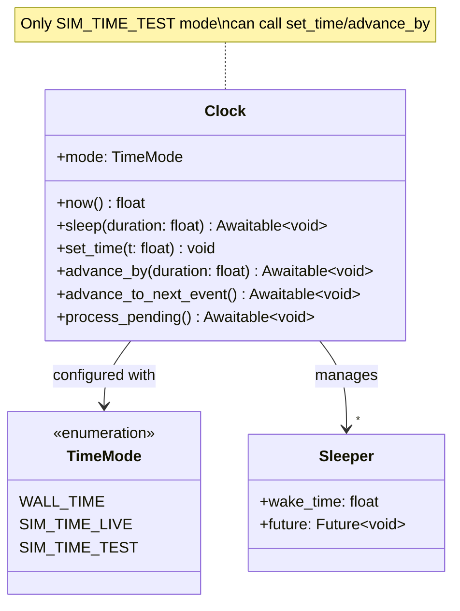

---
# Required fields
classification: internal
llm_processing: allowed
schema_version: "1.0"
type: spec
id: "spec-clock-core"
title: "Clock Component - Core Specification"
summary: "Universal time management with three mutually exclusive modes for production and testing"

# Spec-specific fields
status: "proposed"
version: "1.0.0"
component_type: "testing-utility"

# Metadata
tags: ["testing", "time", "simulation", "clock", "core"]
related_specs: ["Clock-Python", "Mocks-Core"]
related_adrs: ["ADR-002"]
related_patterns: ["clock-injection", "testable-components"]

# Future-proofing
ros2_zenoh:
  languages: ["python", "rust", "c", "typescript"]
  components: ["testing"]
  phase: "1-python-core"
  test_coverage: null
---

# Clock Component - Core Specification

**Language-agnostic behavior specification**

## Purpose

The `Clock` component provides time management across three distinct scenarios:

1. **Production with wall time**: Real system time (`TimeMode.WALL_TIME`)
2. **Production with simulator**: Time driven by `/clock` topic (`TimeMode.SIM_TIME_LIVE`)
3. **Testing**: Manually controlled time for fast, deterministic tests (`TimeMode.SIM_TIME_TEST`)

**Key responsibilities:**
- Provide consistent `now()` and `sleep()` APIs across all modes
- Enable instant, deterministic time advancement in tests
- Process intermediate events when advancing time (multi-step `advance_by`)
- Prevent mode confusion with explicit API restrictions
- Support `/clock` topic integration for simulators (Gazebo, Isaac Sim)

**Design principle:** Three mutually exclusive modes with clear semantics and type safety.

---

## Domain Model



---

## Inputs

### Constructor Parameters

| Parameter | Type | Required | Default | Description |
|-----------|------|----------|---------|-------------|
| `mode` | `TimeMode` | No | `WALL_TIME` | Time management mode (cannot be changed after construction) |
| `node` | `Node \| null` | No | `null` | Required for `SIM_TIME_LIVE` (subscribes to `/clock`) |
| `initial_time` | `float` | No | `0.0` | Starting time for `SIM_TIME_TEST` (ignored in other modes) |

**Mode-specific requirements:**
- `WALL_TIME`: No special requirements
- `SIM_TIME_LIVE`: Must provide `node` (for `/clock` subscription)
- `SIM_TIME_TEST`: Can optionally set `initial_time`

---

## Outputs

### Time Values

- **`now() -> float`**: Returns current time in seconds
  - `WALL_TIME`: System time (UNIX timestamp)
  - `SIM_TIME_LIVE`: Latest `/clock` message timestamp
  - `SIM_TIME_TEST`: Manually set test time

### Synchronization

- **`sleep(duration: float) -> Awaitable<void>`**: Async sleep
  - `WALL_TIME`: Standard async sleep (real time)
  - `SIM_TIME_LIVE`: Waits for `/clock` to advance by `duration`
  - `SIM_TIME_TEST`: Waits for `set_time()` or `advance_by()` to reach wake time

---

## State

### Immutable State (Set at Construction)

```yaml
mode: TimeMode  # Cannot be changed after construction
node: Node | null  # Only for SIM_TIME_LIVE
```

### Mutable State

```yaml
# For SIM_TIME_LIVE
_clock_time: float  # Latest /clock message time
_clock_subscription: Subscription | null

# For SIM_TIME_TEST
_current_time: float  # Manually controlled test time
_sleepers: list<tuple<float, Future>>  # Pending sleep() calls, sorted by wake time

# For WALL_TIME
# (no mutable state - delegates to system time)
```

**State invariants:**
- `_current_time` is monotonically non-decreasing (can jump forward, but not backwards)
- `_sleepers` is sorted by wake time (ascending order)
- In `SIM_TIME_LIVE`, `_clock_time` tracks latest `/clock` message

---

## Behavior

### 1. Initialization

```typescript
function Clock(mode: TimeMode, node?: Node, initial_time: number = 0.0) {
  this.mode = mode
  
  switch (mode) {
    case WALL_TIME:
      // No setup needed
      break
    
    case SIM_TIME_LIVE:
      if (!node) {
        throw new ValueError("SIM_TIME_LIVE requires node parameter for /clock subscription")
      }
      this.node = node
      this._clock_time = 0.0
      
      // Subscribe to /clock topic (rosgraph_msgs/Clock)
      this._clock_subscription = node.create_subscription(
        "rosgraph_msgs/msg/Clock",
        "/clock",
        (msg) => this._on_clock_message(msg)
      )
      break
    
    case SIM_TIME_TEST:
      this._current_time = initial_time
      this._sleepers = []
      break
  }
}

function _on_clock_message(msg: rosgraph_msgs.Clock) {
  // SIM_TIME_LIVE: Update time from /clock
  const secs = msg.clock.sec + msg.clock.nanosec * 1e-9
  this._clock_time = secs
  
  // Wake any sleepers whose wake time has passed
  this._wake_ready_sleepers()
}
```

**Error handling:**
- Constructor throws if `SIM_TIME_LIVE` mode without `node`
- No other failure modes at construction time

---

### 2. Getting Current Time

```typescript
function now(): number {
  switch (this.mode) {
    case WALL_TIME:
      return system_time()  // Platform-specific: time.time(), std::chrono, Date.now()
    
    case SIM_TIME_LIVE:
      return this._clock_time
    
    case SIM_TIME_TEST:
      return this._current_time
  }
}
```

**Performance:** O(1) in all modes

**Thread safety:** Read-only, safe to call from any context

---

### 3. Sleeping

```typescript
async function sleep(duration: number): Promise<void> {
  if (duration <= 0) {
    await this.process_pending()  // Yield to event loop
    return
  }
  
  switch (this.mode) {
    case WALL_TIME:
      await platform_sleep(duration)  // asyncio.sleep, tokio::time::sleep, etc.
      break
    
    case SIM_TIME_LIVE:
      const wake_time = this._clock_time + duration
      const future = new Future<void>()
      this._sleepers.push([wake_time, future])
      this._sleepers.sort((a, b) => a[0] - b[0])  // Keep sorted by wake time
      await future
      break
    
    case SIM_TIME_TEST:
      const wake_time = this._current_time + duration
      const future = new Future<void>()
      this._sleepers.push([wake_time, future])
      this._sleepers.sort((a, b) => a[0] - b[0])  // Keep sorted by wake time
      await future
      break
  }
}

function _wake_ready_sleepers() {
  const current = this.now()
  
  while (this._sleepers.length > 0) {
    const [wake_time, future] = this._sleepers[0]
    
    if (wake_time <= current) {
      this._sleepers.shift()  // Remove first element
      future.resolve()  // Wake the sleeper
    } else {
      break  // Rest are in the future
    }
  }
}
```

**Algorithm complexity:**
- `sleep()`: O(log n) insertion where n = number of pending sleepers
- `_wake_ready_sleepers()`: O(m) where m = number of ready sleepers

---

### 4. Manual Time Control (SIM_TIME_TEST Only)

#### set_time()

```typescript
function set_time(t: number) {
  if (this.mode !== SIM_TIME_TEST) {
    throw new TimeModeError(`set_time() only available in SIM_TIME_TEST, current: ${this.mode}`)
  }
  
  if (t < this._current_time) {
    throw new ValueError("Cannot move time backwards")
  }
  
  this._current_time = t
  this._wake_ready_sleepers()
}
```

**Use case:** Jump directly to a specific time

**Warning:** Only wakes sleepers already registered. New sleepers from awakened tasks won't be processed.

#### advance_by()

```typescript
async function advance_by(duration: number): Promise<void> {
  /**
   * Advance time by duration, processing ALL intermediate events.
   * 
   * Critical for tasks with multiple sleep() calls:
   * 
   *   async function task() {
   *     await clock.sleep(3.0)  // First sleep
   *     console.log("After 3s")
   *     await clock.sleep(5.0)  // Second sleep (not registered yet!)
   *     console.log("After 8s")
   *   }
   * 
   * If we just set_time(10.0), only first sleep wakes!
   * advance_by(10.0) processes both sleeps correctly.
   */
  if (this.mode !== SIM_TIME_TEST) {
    throw new TimeModeError(`advance_by() only available in SIM_TIME_TEST, current: ${this.mode}`)
  }
  
  if (duration < 0) {
    throw new ValueError("Cannot advance time backwards")
  }
  
  const target_time = this._current_time + duration
  
  // Step through each event until we reach target
  while (this._sleepers.length > 0) {
    const next_wake = this._sleepers[0][0]
    
    if (next_wake > target_time) {
      break  // No more events before target
    }
    
    // Step to next event
    this.set_time(next_wake)
    
    // Let tasks continue (may register new sleepers!)
    await this.process_pending()
  }
  
  // Jump to final target time
  this.set_time(target_time)
  await this.process_pending()
}
```

**Key algorithm:** Multi-step loop that:
1. Finds next event
2. Advances time to that event
3. Processes pending tasks (allows new events to be registered)
4. Repeats until target time reached

**Complexity:** O(m * log n) where m = number of events to process, n = max pending sleepers

#### advance_to_next_event()

```typescript
async function advance_to_next_event(): Promise<void> {
  /**
   * Advance time to the next pending event (fine-grained control).
   */
  if (this.mode !== SIM_TIME_TEST) {
    throw new TimeModeError(`advance_to_next_event() only available in SIM_TIME_TEST`)
  }
  
  if (this._sleepers.length === 0) {
    throw new ValueError("No pending events to advance to")
  }
  
  const next_wake = this._sleepers[0][0]
  this.set_time(next_wake)
  await this.process_pending()
}
```

**Use case:** Step-through debugging of time-based logic

#### process_pending()

```typescript
async function process_pending(): Promise<void> {
  /**
   * Drain all ready tasks from event loop.
   * 
   * Implementation varies by platform:
   * - Python: await asyncio.sleep(0) repeatedly
   * - Rust: tokio::task::yield_now() repeatedly  
   * - TypeScript: await Promise.resolve() repeatedly
   */
  for (let i = 0; i < 10; i++) {
    await yield_to_event_loop()
  }
}
```

**Magic number 10:** Empirical value. Tasks with deep call stacks may need multiple yields.

---

## Quality Attributes

### Correctness

- **Monotonicity**: Time never goes backwards (enforced by runtime check)
- **Event ordering**: Events are processed in chronological order
- **Multi-step handling**: `advance_by()` processes intermediate events correctly

### Performance

- **`now()`**: O(1) in all modes
- **`sleep()`**: O(log n) insertion where n = number of pending sleepers
- **`advance_by()`**: O(m * log n) where m = number of events to process
- **Memory**: O(n) where n = number of concurrent sleepers

### Testability

- **Mode isolation**: Each mode can be tested independently
- **Determinism**: `SIM_TIME_TEST` produces identical results on repeated runs
- **Fast execution**: Tests run at maximum speed (zero real delays)

### Safety

- **Mode errors**: Invalid method calls raise `TimeModeError` immediately
- **Type safety**: Static analysis can catch mode misuse
- **No silent failures**: Explicit errors for invalid operations

---

## Test Requirements

### Unit Tests (Universal)

1. **WALL_TIME mode**:
   - `now()` returns system time
   - `sleep()` uses real delays
   - Mode-restricted methods throw errors

2. **SIM_TIME_TEST mode**:
   - `set_time()` updates time correctly
   - `set_time()` throws on backwards time
   - `sleep()` blocks until time advances
   - `advance_by()` processes all intermediate events
   - `advance_to_next_event()` steps one event at a time

3. **SIM_TIME_LIVE mode**:
   - Constructor requires `node`
   - `/clock` subscription updates time
   - `sleep()` waits for `/clock` advancement

4. **Edge cases**:
   - Zero duration sleep (yields immediately)
   - Negative duration sleep (throws error)
   - Multiple concurrent sleepers
   - Sleepers with identical wake times

### Property Tests

1. **Monotonicity**: Time never decreases
2. **Event ordering**: Earlier events always fire before later events
3. **Completeness**: `advance_by(T)` processes all events < T

---

## rmw_zenoh Compatibility

**Status**: ✅ Compatible (no transport-level changes)

- Clock is a pure utility class
- `/clock` topic uses standard `rosgraph_msgs/Clock` message
- No custom key formats or protocols
- Works with any ROS2 node implementation

---

## Related Components

- **[[Clock-Python]]**: Python-specific API and implementation details
- **[[Mocks-Core]]**: Mock classes for testable components
- **[[Node]]**: Provides `/clock` subscription for `SIM_TIME_LIVE`

---

## References

- ROS2 `/clock` topic: https://design.ros2.org/articles/clock_and_time.html
- Simulation time in ROS2: https://design.ros2.org/articles/sim_time.html

